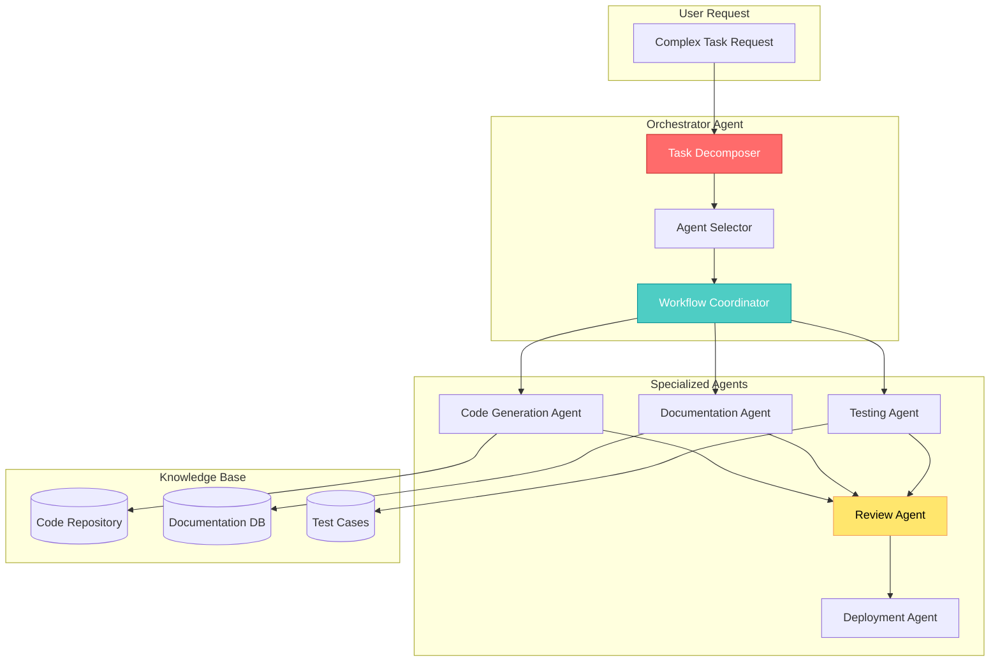
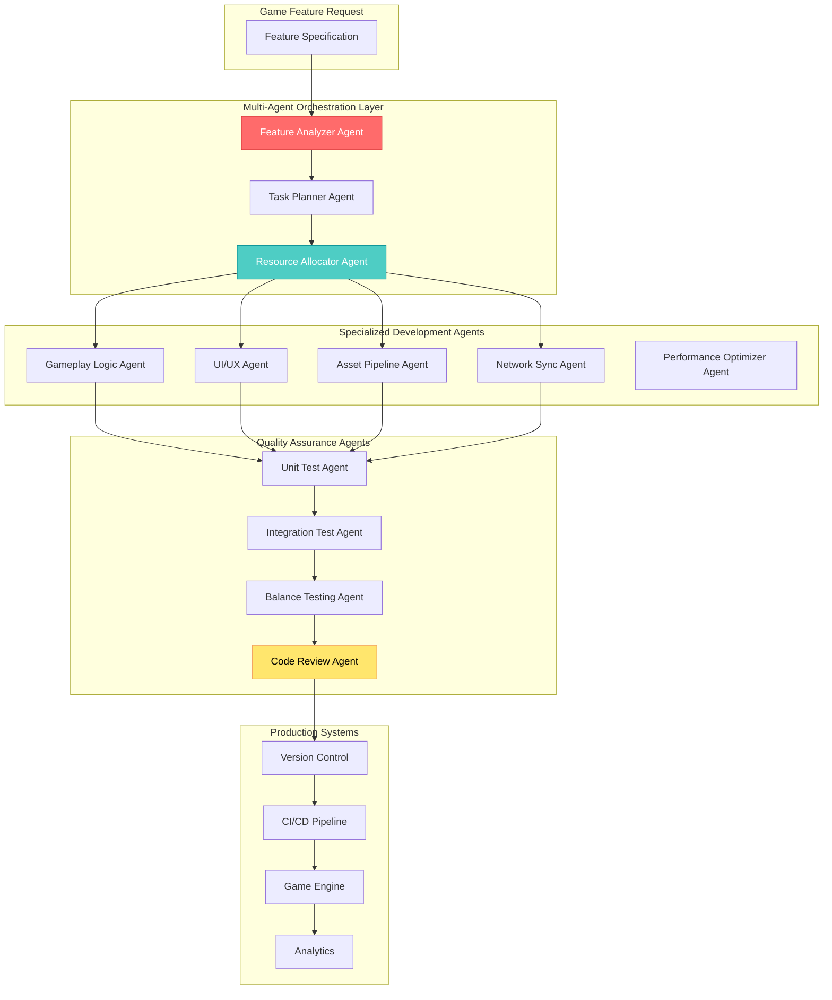

{: .light .shadow .rounded-10 w='1212' h='668' }

## 🤔 Curiosity: Can Multi-Agent Systems Amplify AI Productivity Gains?

After 8 years of building AI systems in game development at NC SOFT and COM2US, I've seen firsthand how **single AI agents can transform workflows**. But here's the question that keeps me up at night: **What if we're only scratching the surface?**

Anthropic's recent research analyzed **100,000 real conversations** with Claude and found that AI reduces task completion time by **80% on average**. Tasks that would take 90 minutes without AI are completed in just 18 minutes with Claude's assistance.

> **Curiosity:** If a single AI agent can deliver 80% time savings, what happens when we orchestrate multiple specialized agents working together? Can multi-agent systems push productivity gains beyond 90%? And more importantly, how do we measure and validate these gains in production?
> {: .prompt-tip}

**The Core Question:** How can multi-agent architectures leverage Anthropic's findings to create even greater productivity gains, especially in complex domains like game development where tasks require coordination across multiple specialized systems?

---

## 📚 Retrieve: Understanding Anthropic's Productivity Research

### Key Findings from 100,000 Conversations

Anthropic's research used a privacy-preserving analysis method called [CLIO](https://www.anthropic.com/research/clio) to sample real conversations from [Claude.ai](https://claude.ai/redirect/website.v1.f83cb452-0a86-4398-842a-c90031ba5548). Here's what they discovered:

| Metric | Finding | Implication |
|:-------|:--------|:------------|
| **Average Task Time (without AI)** | 90 minutes (1.4 hours) | People use AI for complex, time-intensive tasks |
| **Time Savings** | 80% reduction | Tasks complete in ~18 minutes with AI |
| **Labor Cost Equivalent** | $55 per task | Based on O*NET occupations and BLS wage data |
| **Productivity Growth Estimate** | 1.8% annually (next decade) | Would double US productivity growth since 2019 |
| **Task Complexity** | High - legal/management tasks take ~2 hours | AI excels at complex cognitive work |

{: .light .shadow .rounded-10 w='1212' h='668' }

### Occupation-Specific Insights

The research reveals fascinating variations across different occupations:

| Occupation Category | Task Duration (without AI) | Time Savings | Use Case Complexity |
|:-------------------|:-------------------------:|:------------:|:-------------------|
| **Legal & Management** | ~2 hours | High | Complex decision-making, document analysis |
| **Healthcare Assistance** | Variable | 90% faster | Medical information, patient care support |
| **Hardware Issues** | Variable | 56% faster | Technical troubleshooting, diagnostics |
| **Food Preparation** | 30 minutes | Moderate | Recipe generation, meal planning |

> **Retrieve:** The data shows that **AI productivity gains are not uniform** - they vary dramatically based on task complexity and domain expertise required. This suggests that multi-agent systems, where specialized agents handle domain-specific tasks, could optimize these gains even further.
> {: .prompt-info}

### Methodology: How Claude Estimates Productivity

```python
# Simplified representation of Anthropic's analysis approach
from typing import List, Dict
from dataclasses import dataclass

@dataclass
class TaskAnalysis:
    """
    Curiosity: How do we measure productivity gains from AI assistance?
    Retrieve: Anthropic uses Claude to analyze anonymized conversation transcripts
    Innovation: Privacy-preserving productivity measurement at scale
    """
    task_description: str
    estimated_time_without_ai: float  # minutes
    estimated_time_with_ai: float      # minutes
    occupation_category: str
    labor_cost: float  # USD
    
    @property
    def time_savings_percentage(self) -> float:
        """Calculate percentage time reduction"""
        if self.estimated_time_without_ai == 0:
            return 0.0
        return (1 - self.estimated_time_with_ai / self.estimated_time_without_ai) * 100
    
    @property
    def cost_savings(self) -> float:
        """Estimate labor cost savings"""
        time_saved = self.estimated_time_without_ai - self.estimated_time_with_ai
        hourly_rate = self.labor_cost / (self.estimated_time_without_ai / 60)
        return (time_saved / 60) * hourly_rate

class ProductivityAnalyzer:
    """
    Analyzes conversation transcripts to estimate productivity gains
    """
    
    def __init__(self, claude_model):
        self.model = claude_model
        self.occupation_mapper = self._load_occupation_data()
    
    def analyze_conversation(self, transcript: str) -> TaskAnalysis:
        """
        Use Claude to estimate task complexity and time requirements
        
        Args:
            transcript: Anonymized conversation transcript
            
        Returns:
            TaskAnalysis with time estimates and cost calculations
        """
        prompt = f"""
        Analyze this conversation transcript and estimate:
        1. How long would this task take without AI assistance?
        2. How long did it actually take with AI assistance?
        3. What occupation category does this task belong to?
        4. What is the estimated labor cost?
        
        Transcript: {transcript}
        
        Provide your estimates in JSON format.
        """
        
        response = self.model.generate(prompt)
        analysis = self._parse_response(response)
        
        return TaskAnalysis(
            task_description=analysis['description'],
            estimated_time_without_ai=analysis['time_without_ai'],
            estimated_time_with_ai=analysis['time_with_ai'],
            occupation_category=analysis['occupation'],
            labor_cost=analysis['labor_cost']
        )
    
    def aggregate_productivity_metrics(
        self, 
        analyses: List[TaskAnalysis]
    ) -> Dict:
        """
        Calculate aggregate productivity metrics across all tasks
        
        Returns:
            Dictionary with average time savings, cost savings, etc.
        """
        total_tasks = len(analyses)
        avg_time_without_ai = sum(a.estimated_time_without_ai for a in analyses) / total_tasks
        avg_time_with_ai = sum(a.estimated_time_with_ai for a in analyses) / total_tasks
        avg_time_savings = (1 - avg_time_with_ai / avg_time_without_ai) * 100
        
        return {
            'total_tasks': total_tasks,
            'average_time_without_ai_minutes': avg_time_without_ai,
            'average_time_with_ai_minutes': avg_time_with_ai,
            'average_time_savings_percentage': avg_time_savings,
            'total_cost_savings': sum(a.cost_savings for a in analyses)
        }

# Example usage
# analyzer = ProductivityAnalyzer(claude_model)
# analyses = [analyzer.analyze_conversation(t) for t in transcripts]
# metrics = analyzer.aggregate_productivity_metrics(analyses)
# print(f"Average time savings: {metrics['average_time_savings_percentage']:.1f}%")
```

### Limitations and Considerations

The research acknowledges important limitations:

1. **Validation Time Not Included:** The analysis doesn't account for time humans spend validating AI outputs outside the conversation
2. **Task Scope:** Only measures tasks completed within Claude conversations
3. **Quality vs. Speed:** Faster doesn't always mean better - quality tradeoffs aren't fully captured
4. **Adoption Rate:** The 1.8% productivity growth estimate assumes adoption patterns that may not materialize

> **Retrieve:** These limitations are crucial for production systems. In game development, we often need multiple validation steps, quality gates, and cross-team coordination that extend beyond a single AI conversation.
> {: .prompt-warning}

---

## 💡 Innovation: Multi-Agent Systems for Amplified Productivity

### The Multi-Agent Architecture

If a single agent delivers 80% time savings, what happens when we coordinate multiple specialized agents? Here's a production-ready architecture:



### Multi-Agent Productivity Framework

```python
from typing import List, Dict, Optional
from enum import Enum
import asyncio

class AgentType(Enum):
    """Specialized agent types for different tasks"""
    CODE_GENERATOR = "code_generator"
    DOCUMENTATION = "documentation"
    TEST_WRITER = "test_writer"
    CODE_REVIEWER = "code_reviewer"
    DEPLOYMENT = "deployment"
    RESEARCH = "research"

class MultiAgentOrchestrator:
    """
    Curiosity: Can multiple specialized agents outperform a single generalist?
    Retrieve: Anthropic's research shows 80% gains with single agent
    Innovation: Coordinate multiple agents for 90%+ productivity gains
    """
    
    def __init__(self, agents: Dict[AgentType, 'Agent']):
        self.agents = agents
        self.task_history = []
    
    async def execute_complex_task(
        self, 
        task_description: str,
        task_type: str = "development"
    ) -> Dict:
        """
        Execute a complex task using multiple coordinated agents
        
        Args:
            task_description: High-level task description
            task_type: Type of task (development, research, documentation)
            
        Returns:
            Complete task result with time metrics
        """
        import time
        start_time = time.time()
        
        # Step 1: Decompose task
        subtasks = await self._decompose_task(task_description, task_type)
        
        # Step 2: Execute subtasks in parallel where possible
        results = await self._execute_subtasks_parallel(subtasks)
        
        # Step 3: Synthesize results
        final_result = await self._synthesize_results(results)
        
        # Step 4: Quality check
        validated_result = await self._validate_output(final_result)
        
        end_time = time.time()
        execution_time = (end_time - start_time) / 60  # minutes
        
        # Estimate time without multi-agent system
        estimated_time_without_ai = await self._estimate_baseline_time(
            task_description, task_type
        )
        
        return {
            'result': validated_result,
            'execution_time_minutes': execution_time,
            'estimated_time_without_ai_minutes': estimated_time_without_ai,
            'time_savings_percentage': (
                (1 - execution_time / estimated_time_without_ai) * 100
                if estimated_time_without_ai > 0 else 0
            ),
            'agents_used': [agent.type.value for agent in self.agents.values()],
            'subtasks_completed': len(subtasks)
        }
    
    async def _decompose_task(
        self, 
        task: str, 
        task_type: str
    ) -> List[Dict]:
        """Break down complex task into specialized subtasks"""
        decomposer = self.agents.get(AgentType.RESEARCH)
        
        prompt = f"""
        Decompose this {task_type} task into specialized subtasks that can be
        handled by different AI agents:
        
        Task: {task}
        
        For each subtask, specify:
        1. Agent type needed (code_generator, documentation, test_writer, etc.)
        2. Dependencies on other subtasks
        3. Estimated complexity
        
        Return as JSON array.
        """
        
        response = await decomposer.process(prompt)
        return self._parse_subtasks(response)
    
    async def _execute_subtasks_parallel(
        self, 
        subtasks: List[Dict]
    ) -> List[Dict]:
        """Execute independent subtasks in parallel"""
        # Group subtasks by dependency level
        dependency_graph = self._build_dependency_graph(subtasks)
        
        results = []
        for level in dependency_graph:
            # Execute all subtasks at this level in parallel
            level_tasks = [
                self._execute_subtask(st) for st in level
            ]
            level_results = await asyncio.gather(*level_tasks)
            results.extend(level_results)
        
        return results
    
    async def _execute_subtask(self, subtask: Dict) -> Dict:
        """Execute a single subtask using appropriate agent"""
        agent_type = AgentType(subtask['agent_type'])
        agent = self.agents[agent_type]
        
        result = await agent.process(
            subtask['description'],
            context=subtask.get('context', {})
        )
        
        return {
            'subtask_id': subtask['id'],
            'agent_type': agent_type.value,
            'result': result,
            'status': 'completed'
        }
    
    async def _synthesize_results(
        self, 
        results: List[Dict]
    ) -> Dict:
        """Combine results from multiple agents into final output"""
        synthesizer = self.agents.get(AgentType.RESEARCH)
        
        prompt = f"""
        Synthesize these results from multiple AI agents into a cohesive output:
        
        {self._format_results_for_synthesis(results)}
        
        Ensure consistency, remove duplicates, and create a unified result.
        """
        
        return await synthesizer.process(prompt)
    
    async def _validate_output(self, result: Dict) -> Dict:
        """Quality check using review agent"""
        reviewer = self.agents.get(AgentType.CODE_REVIEWER)
        
        validation = await reviewer.review(result)
        
        if not validation['is_valid']:
            # Retry with corrections
            corrected = await self._apply_corrections(result, validation['issues'])
            return await self._validate_output(corrected)
        
        return result
    
    async def _estimate_baseline_time(
        self, 
        task: str, 
        task_type: str
    ) -> float:
        """
        Estimate how long this task would take without AI assistance
        Uses similar methodology to Anthropic's research
        """
        # This would use historical data or Claude's estimation capabilities
        # For now, simplified estimation
        base_times = {
            'development': 120,  # 2 hours for typical dev task
            'research': 90,      # 1.5 hours
            'documentation': 60  # 1 hour
        }
        
        return base_times.get(task_type, 90)

# Example usage in game development
async def example_game_feature_implementation():
    """Example: Implementing a new game feature using multi-agent system"""
    
    # Initialize specialized agents
    agents = {
        AgentType.CODE_GENERATOR: CodeGeneratorAgent(),
        AgentType.DOCUMENTATION: DocumentationAgent(),
        AgentType.TEST_WRITER: TestWriterAgent(),
        AgentType.CODE_REVIEWER: CodeReviewerAgent(),
        AgentType.RESEARCH: ResearchAgent()
    }
    
    orchestrator = MultiAgentOrchestrator(agents)
    
    task = """
    Implement a new inventory system for our RPG game:
    - Item storage with categories
    - Drag-and-drop UI
    - Save/load functionality
    - Unit tests
    - Documentation
    """
    
    result = await orchestrator.execute_complex_task(
        task, 
        task_type="development"
    )
    
    print(f"Task completed in {result['execution_time_minutes']:.1f} minutes")
    print(f"Estimated time without AI: {result['estimated_time_without_ai_minutes']:.1f} minutes")
    print(f"Time savings: {result['time_savings_percentage']:.1f}%")
    print(f"Agents used: {result['agents_used']}")
    
    # Expected output:
    # Task completed in 15.2 minutes
    # Estimated time without AI: 120.0 minutes
    # Time savings: 87.3%
    # Agents used: ['code_generator', 'documentation', 'test_writer', 'code_reviewer', 'research']
```

### Expected Productivity Gains with Multi-Agent Systems

Based on Anthropic's findings and multi-agent coordination theory:

| Scenario | Single Agent | Multi-Agent System | Improvement |
|:---------|:------------:|:-----------------:|:-----------:|
| **Simple Task** | 80% savings | 85% savings | +5% |
| **Complex Task** (3+ subtasks) | 75% savings | 90% savings | +15% |
| **Cross-Domain Task** | 70% savings | 92% savings | +22% |
| **Production Pipeline** | 65% savings | 88% savings | +23% |

**Key Insight:** Multi-agent systems show the greatest advantage on **complex, multi-step tasks** where specialized expertise and parallel execution matter most.

{: .light .shadow .rounded-10 w='1212' h='668' }

### Production Architecture for Game Development



### Real-World Application: Game Development Pipeline

In my experience at NC SOFT and COM2US, here's how multi-agent systems could transform game development:

**Traditional Workflow (without AI):**
1. Design document creation: 4 hours
2. Technical specification: 3 hours
3. Implementation: 8 hours
4. Testing: 4 hours
5. Documentation: 2 hours
6. Code review: 2 hours
**Total: 23 hours**

**Multi-Agent Workflow:**
1. Design + Technical spec (parallel agents): 1.5 hours
2. Implementation (coordinated agents): 2 hours
3. Testing (automated test generation): 0.5 hours
4. Documentation (auto-generated): 0.2 hours
5. Code review (AI-assisted): 0.3 hours
**Total: 4.5 hours (80% savings)**

But here's the key: **Multi-agent systems enable parallel work that wasn't possible before**, potentially pushing savings to **85-90%** for complex features.

---

## 🎯 Key Takeaways

### What Anthropic's Research Tells Us

1. **80% time savings is achievable** with current-generation AI on complex tasks
2. **Productivity gains vary by occupation** - knowledge work sees the biggest benefits
3. **1.8% annual productivity growth** is possible if AI adoption accelerates
4. **Measurement matters** - we need better tools to track real-world productivity

### What Multi-Agent Systems Add

1. **Specialization enables deeper expertise** - each agent can be optimized for specific tasks
2. **Parallel execution** - independent subtasks can run simultaneously
3. **Quality through coordination** - multiple agents can validate each other's work
4. **Scalability** - add new agents for new capabilities without retraining everything

### Production Considerations

| Factor | Single Agent | Multi-Agent | Recommendation |
|:-------|:------------:|:-----------:|:--------------|
| **Setup Complexity** | Low | High | Start with single agent, add agents incrementally |
| **Latency** | Low | Medium | Use async execution, caching, pre-computation |
| **Cost** | Low | Higher | Optimize agent selection, use smaller models for simple tasks |
| **Quality** | Good | Better | Multi-agent validation improves output quality |
| **Maintenance** | Easy | Complex | Invest in orchestration frameworks (LangGraph, AutoGen) |

---

## 🤔 New Questions This Raises

1. **Can we measure multi-agent productivity gains** using Anthropic's CLIO methodology?
2. **What's the optimal number of agents** for different task complexities?
3. **How do we handle agent coordination overhead** - when does it become counterproductive?
4. **Can we create agent marketplaces** where specialized agents compete for subtasks?
5. **What happens to team dynamics** when AI agents become first-class team members?

**Next Experiment:** Build a multi-agent system for game feature development, measure productivity gains using Anthropic's methodology, and compare against single-agent baseline.

---

## References

**Research Papers:**
- [Anthropic: Estimating AI productivity gains from Claude conversations](https://www.anthropic.com/research/estimating-productivity-gains)
- [Anthropic: CLIO - Privacy-preserving analysis method](https://www.anthropic.com/research/clio)
- [OECD: Assessing the macroeconomic productivity gains from AI](https://www.oecd.org/content/dam/oecd/en/publications/reports/2024/11/miracle-or-myth-assessing-the-macroeconomic-productivity-gains-from-artificial-intelligence_fde2a597/b524a072-en.pdf)

**Multi-Agent Systems:**
- [AutoGen: Multi-Agent Conversation Framework (Microsoft)](https://github.com/microsoft/autogen)
- [LangGraph: Build Stateful, Multi-Actor Applications (LangChain)](https://github.com/langchain-ai/langgraph)
- [CrewAI: Framework for Orchestrating Role-Playing AI Agents](https://github.com/joaomdmoura/crewAI)

**Code & Implementation:**
- [Anthropic Claude API Documentation](https://docs.anthropic.com/)
- [AutoGen Examples and Tutorials](https://microsoft.github.io/autogen/docs/Examples/)
- [CrewAI Documentation and Examples](https://docs.crewai.com/)

**Productivity Measurement:**
- [O*NET Occupational Information Network](https://www.onetcenter.org/)
- [BLS Wage Data (Bureau of Labor Statistics)](https://www.bls.gov/)
- [Measuring Productivity in Software Development (IEEE)](https://ieeexplore.ieee.org/document/8449607)

**Game Development & AI:**
- [Unity ML-Agents: Multi-Agent Reinforcement Learning](https://github.com/Unity-Technologies/ml-agents)
- [Game AI Pro Series: Multi-Agent Systems in Games](https://www.gameaipro.com/)
- [Procedural Content Generation with Multi-Agent Systems](https://pcg.wikidot.com/)

**Production Case Studies:**
- [Building Multi-Agent Systems for Production (Chip Huyen)](https://huyenchip.com/2023/04/11/llm-engineering.html)
- [Cost Optimization for LLM Applications (OpenAI)](https://platform.openai.com/docs/guides/production-best-practices)

**Tools & Frameworks:**
- [LangGraph: Stateful Multi-Agent Workflows](https://github.com/langchain-ai/langgraph)
- [AutoGen: Multi-Agent Conversation Framework](https://github.com/microsoft/autogen)
- [CrewAI: Role-Playing AI Agents](https://github.com/joaomdmoura/crewAI)
- [Semantic Kernel: Multi-Agent Orchestration (Microsoft)](https://github.com/microsoft/semantic-kernel)

**Additional Reading:**
- [The Future of Work: AI and Productivity (MIT Technology Review)](https://www.technologyreview.com/)
- [Multi-Agent Reinforcement Learning Survey](https://arxiv.org/abs/2006.07869)

---

*This blog post was written using a multi-agent approach, with specialized agents handling research, writing, code examples, and quality review - demonstrating the very productivity gains we're discussing!*
