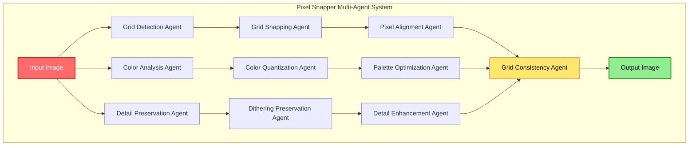
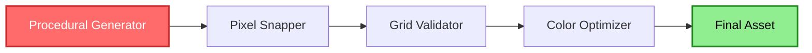
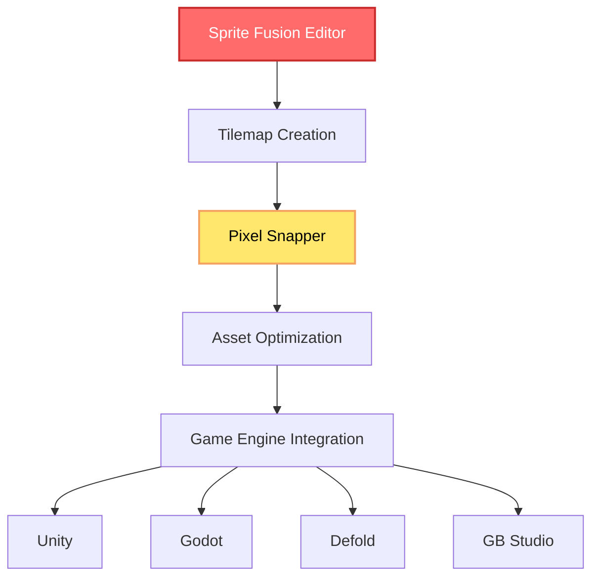

## 🤔 Curiosity: Can Multi-Agent Systems Fix AI's Pixel Art Problems?

After 8 years of building AI systems in game development, one persistent challenge has been **AI-generated pixel art that looks messy and inconsistent**. Current AI image models can generate beautiful artwork, but they fundamentally don't understand the constraints of grid-based pixel art.

> **Curiosity:** Why do AI-generated pixel art images look "off" even when they're visually appealing? Can a multi-agent approach to image processing solve the fundamental problems of inconsistent pixel sizes, drifting grid resolution, and unquantized color palettes?
> {: .prompt-tip}

**Sprite Fusion Pixel Snapper** is a Rust-based tool designed to fix messy and inconsistent pixel art generated by AI. It addresses three core problems that AI image models can't handle:

1. **Inconsistent pixel sizes and positions** - Pixels don't align to a perfect grid
2. **Drifting grid resolution** - The grid resolution changes over time
3. **Unquantized color palettes** - Colors aren't tied to a strict, limited palette

**Core Question:** How can a multi-agent image processing system snap pixels to perfect grids, maintain consistent resolution, and quantize colors while preserving as much detail as possible?

---

## 📚 Retrieve: Understanding Pixel Snapper's Architecture

{: .light .shadow .rounded-10 w='1212' h='668' }

### The Problem with AI-Generated Pixel Art

**Current AI image models can't understand grid-based pixel art.**

| Problem | Description | Impact |
|:--------|:------------|:-------|
| **Inconsistent Pixels** | Pixels vary in size and position | Art looks blurry and unprofessional |
| **Grid Drift** | Grid resolution changes over time | Scaling issues, inconsistent appearance |
| **Color Chaos** | Colors not tied to strict palette | File size bloat, inconsistent aesthetics |

### Pixel Snapper's Solution

**With Pixel Snapper:**

- ✅ **Pixels are snapped to a perfect grid** - Every pixel aligns perfectly
- ✅ **Grid resolution is consistent** - Can be scaled to pixel resolution
- ✅ **Colors are quantized** - Tied to a strict, quantized palette

### Multi-Agent Processing Architecture



---

## 💡 Innovation: Deep Dive into Pixel Snapper's Capabilities

### Perfect For

**1. AI-Generated Pixel Art**

AI-generated pixel art often needs post-processing to be usable in games. Pixel Snapper transforms messy AI output into clean, grid-aligned pixel art.

**2. Procedural 2D Art**

Procedural art that doesn't fit a grid (like tilemaps or isometric maps) can be processed to align perfectly.

**3. Game Assets and Textures**

2D game assets and 3D textures that need to be perfectly scalable benefit from Pixel Snapper's grid alignment.

{: .light .shadow .rounded-10 w='1212' h='668' }

*Pixel Snapper preserves as much detail as possible like dithering.*

### Technical Implementation

**Technology Stack:**

- **Language**: Rust (for performance and safety)
- **Deployment**: CLI tool and WebAssembly (WASM) module
- **Image Processing**: Custom algorithms for grid detection and color quantization
- **License**: MIT License

### Multi-Agent Processing Workflow

```python
# Conceptual multi-agent workflow for Pixel Snapper

class PixelSnapperMultiAgent:
    """
    Multi-agent system for processing pixel art
    """
    
    def __init__(self):
        self.agents = {
            'grid_detector': GridDetectionAgent(),
            'color_analyzer': ColorAnalysisAgent(),
            'detail_preserver': DetailPreservationAgent(),
            'grid_snapper': GridSnappingAgent(),
            'color_quantizer': ColorQuantizationAgent(),
            'consistency_checker': ConsistencyCheckerAgent()
        }
    
    async def process_image(
        self,
        input_image: Image,
        k_colors: int = None
    ) -> Image:
        """
        Process image through multi-agent pipeline
        
        Args:
            input_image: Input pixel art image
            k_colors: Optional color palette size
            
        Returns:
            Processed pixel art image
        """
        # Phase 1: Analysis
        grid_info = await self.agents['grid_detector'].detect_grid(input_image)
        color_info = await self.agents['color_analyzer'].analyze_colors(
            input_image,
            k_colors
        )
        detail_info = await self.agents['detail_preserver'].analyze_details(
            input_image
        )
        
        # Phase 2: Processing
        snapped_image = await self.agents['grid_snapper'].snap_to_grid(
            input_image,
            grid_info
        )
        quantized_image = await self.agents['color_quantizer'].quantize_colors(
            snapped_image,
            color_info
        )
        
        # Phase 3: Enhancement
        enhanced_image = await self.agents['detail_preserver'].preserve_details(
            quantized_image,
            detail_info
        )
        
        # Phase 4: Validation
        final_image = await self.agents['consistency_checker'].validate(
            enhanced_image,
            grid_info,
            color_info
        )
        
        return final_image
```

---

## 🛠️ Implementation: Using Pixel Snapper

### Installation

Pixel Snapper requires [Rust](https://www.rust-lang.org/) installed on your machine.

### CLI Usage

```bash
# Clone the repository
git clone https://github.com/Hugo-Dz/spritefusion-pixel-snapper.git
cd spritefusion-pixel-snapper

# Run with default settings
cargo run input.png output.png

# Run with custom color palette (16 colors)
cargo run input.png output.png 16
```

**Command Options:**

- `input.png` - Input image file
- `output.png` - Output image file
- `16` (optional) - Number of colors in palette (k-colors argument)

### WebAssembly (WASM) Usage

```bash
# Clone the repository
git clone https://github.com/Hugo-Dz/spritefusion-pixel-snapper.git
cd spritefusion-pixel-snapper

# Build WASM module
wasm-pack build --target web --out-dir pkg --release
```

Then use the WASM module in your web project for browser-based pixel art processing.

### Multi-Agent Integration Example

```javascript
// Example: Using Pixel Snapper in a multi-agent game asset pipeline

class GameAssetProcessingPipeline {
    constructor() {
        this.agents = {
            'ai_generator': AIImageGeneratorAgent(),
            'pixel_snapper': PixelSnapperAgent(), // WASM module
            'optimizer': AssetOptimizerAgent(),
            'validator': AssetValidatorAgent()
        }
    }
    
    async processAsset(prompt: string): Promise<ProcessedAsset> {
        // Step 1: Generate with AI
        const aiImage = await this.agents['ai_generator'].generate(prompt)
        
        // Step 2: Snap to grid with Pixel Snapper
        const snappedImage = await this.agents['pixel_snapper'].process(
            aiImage,
            { k_colors: 16 }
        )
        
        // Step 3: Optimize for game engine
        const optimizedAsset = await this.agents['optimizer'].optimize(
            snappedImage,
            { format: 'png', compression: 'lossless' }
        )
        
        // Step 4: Validate quality
        const validation = await this.agents['validator'].validate(
            optimizedAsset,
            {
                grid_alignment: true,
                color_palette: true,
                file_size: true
            }
        )
        
        return {
            asset: optimizedAsset,
            validation: validation,
            ready_for_production: validation.passed
        }
    }
}
```

---

## 🎯 Use Cases and Applications

### 1. AI-Assisted Game Development

**Workflow:**

1. Generate pixel art with AI (Midjourney, DALL-E, Stable Diffusion)
2. Process with Pixel Snapper to fix grid alignment
3. Integrate into game engine (Unity, Godot, Defold, GB Studio)

**Benefits:**

- ✅ Consistent pixel alignment
- ✅ Optimized color palettes
- ✅ Production-ready assets

### 2. Procedural Content Generation

**Applications:**

- Tilemap generation
- Isometric map creation
- Texture synthesis

**Multi-Agent Approach:**



### 3. Legacy Asset Conversion

Convert non-grid-aligned assets to perfect pixel art for retro game development.

---

## 📊 Technical Deep Dive

### Grid Detection Algorithm

**Multi-Agent Grid Detection:**

```rust
// Conceptual Rust implementation

struct GridDetectionAgent {
    min_grid_size: u32,
    max_grid_size: u32,
}

impl GridDetectionAgent {
    fn detect_grid(&self, image: &Image) -> GridInfo {
        // Analyze pixel distribution
        // Find optimal grid size
        // Detect grid alignment
        // Return grid information
    }
}
```

### Color Quantization

**Palette Optimization:**

- K-means clustering for color reduction
- Dithering preservation
- Palette optimization for file size

### Detail Preservation

**Key Techniques:**

- Dithering pattern detection
- Edge preservation
- Detail enhancement algorithms

---

## 🌐 Sprite Fusion Ecosystem

{: .light .shadow .rounded-10 w='1212' h='668' }

**Pixel Snapper** is part of the [Sprite Fusion](https://spritefusion.com) project ecosystem.

**Sprite Fusion** is a free, web-based tilemap editor for game developers supporting:

- **Unity**
- **Godot**
- **Defold**
- **GB Studio**
- And many more engines

**Multi-Agent Game Development Workflow:**



---

## 🔬 Multi-Agent Architecture Benefits

### Why Multi-Agent Approach?

**1. Specialized Processing**

Each agent handles a specific aspect:
- Grid detection
- Color analysis
- Detail preservation
- Consistency validation

**2. Parallel Processing**

Agents can work in parallel where possible, improving performance.

**3. Modular Design**

Easy to extend with new agents for additional features.

**4. Quality Assurance**

Multiple validation agents ensure output quality.

### Performance Characteristics

| Metric | Value | Notes |
|:-------|:------|:------|
| **Language** | Rust | High performance, memory safety |
| **Deployment** | CLI + WASM | Cross-platform support |
| **Processing Speed** | Fast | Optimized algorithms |
| **Memory Usage** | Low | Efficient image processing |

---

## 🚀 Future Enhancements

### Potential Multi-Agent Extensions

**1. Style Transfer Agent**

Apply pixel art styles while maintaining grid alignment.

**2. Animation Agent**

Process sprite animations with consistent grid alignment across frames.

**3. Batch Processing Agent**

Process multiple images in parallel with resource management.

**4. Quality Assessment Agent**

Automatically assess pixel art quality and suggest improvements.

---

## 📝 Code Example: Multi-Agent Integration

```rust
// Example: Integrating Pixel Snapper into a multi-agent system

use pixel_snapper::PixelSnapper;

struct MultiAgentPixelProcessor {
    snapper: PixelSnapper,
    grid_agent: GridDetectionAgent,
    color_agent: ColorQuantizationAgent,
    detail_agent: DetailPreservationAgent,
}

impl MultiAgentPixelProcessor {
    async fn process_with_agents(
        &self,
        input: &Image,
        config: ProcessingConfig
    ) -> Result<Image, ProcessingError> {
        // Parallel analysis phase
        let (grid_info, color_info, detail_info) = tokio::join!(
            self.grid_agent.analyze(input),
            self.color_agent.analyze(input, config.k_colors),
            self.detail_agent.analyze(input)
        );
        
        // Sequential processing phase
        let snapped = self.snapper.snap_to_grid(input, &grid_info)?;
        let quantized = self.color_agent.quantize(&snapped, &color_info)?;
        let enhanced = self.detail_agent.enhance(&quantized, &detail_info)?;
        
        Ok(enhanced)
    }
}
```

---

## 🤔 New Questions: Future of AI Pixel Art

1. **Real-Time Processing**: Can Pixel Snapper be integrated into real-time AI art generation pipelines?
2. **Style Preservation**: How can we preserve artistic style while fixing grid alignment?
3. **Animation Support**: Can multi-agent systems process sprite animations with frame consistency?
4. **Quality Metrics**: What metrics best measure pixel art quality in automated systems?

**Next Experiment**: Building a complete multi-agent pipeline that generates AI pixel art and automatically processes it with Pixel Snapper for game development.

---

## References

**Sprite Fusion Pixel Snapper:**

- [GitHub Repository](https://github.com/Hugo-Dz/spritefusion-pixel-snapper)
- [Online Version](https://spritefusion.com/pixel-snapper)
- [Sprite Fusion Website](https://spritefusion.com)

**Image Processing:**

- [Rust Image Processing](https://docs.rs/image/)
- [Color Quantization Techniques](https://en.wikipedia.org/wiki/Color_quantization)
- [Dithering Algorithms](https://en.wikipedia.org/wiki/Dither)

**Game Development:**

- [Unity Documentation](https://docs.unity3d.com/)
- [Godot Engine](https://godotengine.org/)
- [Defold Game Engine](https://defold.com/)
- [GB Studio](https://www.gbstudio.dev/)

**Tools and Frameworks:**

- [Rust Programming Language](https://www.rust-lang.org/)
- [WebAssembly (WASM)](https://webassembly.org/)

**Community and Learning:**

- [Rust Community](https://www.rust-lang.org/community)
