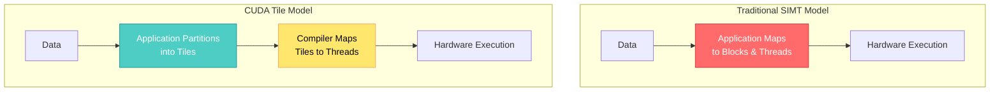
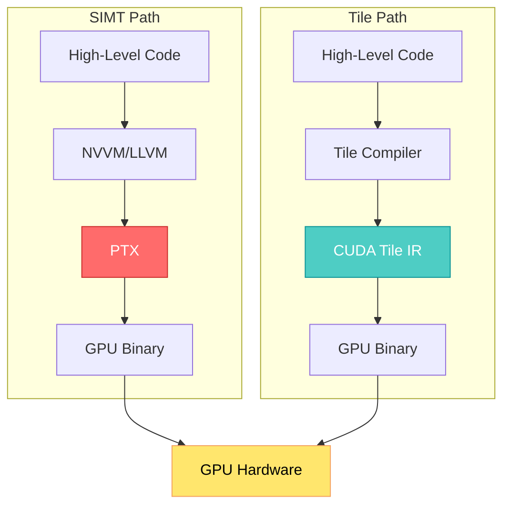

## 🤔 Curiosity: Can We Program GPUs Like We Program NumPy?

After 8 years of building AI systems in game development at NC SOFT and COM2US, I've constantly wrestled with the same tension: **GPUs are incredibly powerful, but programming them efficiently requires deep hardware knowledge that distracts from the actual algorithm.**

CUDA's Single-Instruction, Multiple-Thread (SIMT) model gives us fine-grained control—every thread, every memory access, every warp synchronization. This flexibility is powerful, but it comes at a cost: writing performant CUDA code requires understanding register allocation, shared memory banks, tensor core layouts, and architecture-specific optimizations. What if we could write GPU code the way we write NumPy—specify operations on data chunks, and let the compiler handle the hardware details?

> **Curiosity:** What if we could abstract away tensor cores, memory hierarchies, and thread mappings, focusing purely on partitioning data into tiles and defining computations? Can we achieve NumPy-like simplicity for GPU programming without sacrificing performance?
> {: .prompt-tip}

**The Core Question:** With CUDA 13.1, NVIDIA introduces CUDA Tile—a tile-based programming paradigm that raises the abstraction level. But does this higher-level approach actually deliver on its promise of simplicity without performance compromises?

---

## 📚 Retrieve: Understanding CUDA Tile's Architecture

### The Tile Programming Paradigm

CUDA Tile introduces a fundamental shift in how we think about GPU programming. Instead of mapping data to threads and blocks explicitly, we partition data into **tiles** and let the compiler handle the mapping.

{: .light .w-75 .shadow .rounded-10 w='1212' h='668' }

_Figure 1: The tile model (left) partitions data into blocks, and the compiler maps to threads. SIMT model (right) maps data to both blocks and threads._



**Key Difference:**

| Aspect                 | SIMT Model                             | Tile Model                             |
| :--------------------- | :------------------------------------- | :------------------------------------- |
| **Data Mapping**       | Application maps to blocks AND threads | Application partitions into tiles only |
| **Thread Mapping**     | Explicit thread/block configuration    | Compiler handles thread mapping        |
| **Abstraction Level**  | Low-level hardware control             | High-level algorithmic focus           |
| **Hardware Awareness** | Developer must understand architecture | Compiler abstracts hardware details    |

> **Retrieve:** CUDA Tile shifts the responsibility: developers focus on algorithmic data partitioning, while the compiler handles hardware-specific optimizations like thread mapping, memory hierarchy, and tensor core utilization.
> {: .prompt-info}

### Why Tile Programming Now?

The evolution of GPU workloads, especially in AI, has made tensors a fundamental data type. NVIDIA has responded with specialized hardware:

- **Tensor Cores (TC):** Dedicated units for matrix operations
- **Tensor Memory Accelerators (TMA):** Hardware for efficient tensor data movement

However, programming these specialized units requires deep knowledge of their specific programming models. CUDA Tile abstracts this complexity, making tensor operations accessible without hardware expertise.

**The NumPy Analogy:**

Just as NumPy lets you write:

```python
# NumPy: Specify operations on matrices
C = np.dot(A, B)  # Compiler handles SIMD, cache, etc.
```

CUDA Tile lets you write:

```python
# CUDA Tile: Specify operations on tiles
tile_C = tile_multiply(tile_A, tile_B)  # Compiler handles tensor cores, threads, etc.
```

The compiler handles the hardware details transparently.

---

## 💡 Innovation: CUDA Tile IR - The Foundation

### The Virtual Instruction Set

CUDA Tile IR (Intermediate Representation) is the foundation—a virtual instruction set that enables native tile-based programming. Think of it as PTX for tile programming.

**Software Stack Comparison:**



{: .light .w-75 .shadow .rounded-10 w='1212' h='668' }

_Figure 2: The Tile path of compilation fits into the full software stack, adjacent to the SIMT path._

**Key Insight:** CUDA Tile IR and PTX coexist—they're complementary, not competing. Use SIMT when you need fine-grained control; use Tile when you want hardware abstraction.

### Architecture Comparison

| Feature               | PTX (SIMT)                      | CUDA Tile IR (Tile)           |
| :-------------------- | :------------------------------ | :---------------------------- |
| **Abstraction**       | Thread-level parallelism        | Tile-level parallelism        |
| **Portability**       | Across GPU generations          | Across GPU generations        |
| **Hardware Focus**    | CUDA cores, memory hierarchy    | Tensor cores, TMA             |
| **Use Case**          | General-purpose GPU programming | Tensor/matrix operations      |
| **Developer Control** | Explicit thread/block mapping   | Algorithmic tile partitioning |

### Coexistence, Not Replacement

Importantly, CUDA Tile doesn't replace SIMT—they coexist:

- **SIMT:** When you need explicit control over threads, warps, and memory access patterns
- **Tile:** When you want to leverage tensor cores and focus on algorithmic structure

You can mix both in the same application, choosing the right tool for each kernel.

---

## 🎯 How Developers Use CUDA Tile

### Two Entry Points

#### 1. NVIDIA cuTile Python (Most Developers)

For the vast majority of developers, **cuTile Python** is the interface:

```python
import cutile

# Define tile-based matrix multiplication
@cutile.tile_kernel
def matrix_multiply(A, B, C, M, N, K):
    # Partition matrices into tiles
    tile_A = cutile.load_tile(A, (M, K))
    tile_B = cutile.load_tile(B, (K, N))

    # Compute on tiles - compiler handles tensor cores
    tile_C = cutile.matmul(tile_A, tile_B)

    # Store result
    cutile.store_tile(C, tile_C)

# Usage - transparent hardware optimization
A = cutile.array(shape=(1024, 1024), dtype='float16')
B = cutile.array(shape=(1024, 1024), dtype='float16')
C = cutile.array(shape=(1024, 1024), dtype='float16')

matrix_multiply(A, B, C, 1024, 1024, 1024)
```

**Benefits:**

- Python-friendly API
- Automatic tensor core utilization
- Architecture-agnostic code
- No manual thread/block configuration

#### 2. CUDA Tile IR (Compiler/Library Developers)

For those building DSLs, compilers, or libraries:

```cuda
// CUDA Tile IR example (simplified)
tile.func @matmul_tile(%A: tensor<128x128xf16>,
                       %B: tensor<128x128xf16>) -> tensor<128x128xf16> {
  // Tile IR handles tensor core mapping
  %C = tile.matmul %A, %B : (tensor<128x128xf16>, tensor<128x128xf16>) -> tensor<128x128xf16>
  return %C
}
```

**Use Cases:**

- Building domain-specific languages
- Creating high-level frameworks
- Targeting multiple GPU architectures
- Extending existing PTX-based tools

---

## 📊 Performance Implications

### Theoretical Advantages

| Aspect                | SIMT Approach                     | Tile Approach               |
| :-------------------- | :-------------------------------- | :-------------------------- |
| **Development Time**  | High (manual optimization)        | Low (compiler optimization) |
| **Code Portability**  | Requires per-architecture tuning  | Architecture-agnostic       |
| **Tensor Core Usage** | Manual, error-prone               | Automatic, optimal          |
| **Maintenance**       | High (architecture-specific code) | Low (single codebase)       |

### Real-World Considerations

**When Tile Programming Excels:**

✅ **Tensor Operations:** Matrix multiplication, convolution, attention mechanisms  
✅ **Multi-Architecture Support:** Code that needs to run on Hopper, Ada, Blackwell  
✅ **Rapid Prototyping:** Fast iteration without hardware optimization  
✅ **Team Productivity:** Algorithm-focused developers without CUDA expertise

**When SIMT Still Matters:**

✅ **Custom Memory Patterns:** Non-standard data layouts  
✅ **Fine-Grained Control:** Precise thread synchronization  
✅ **Legacy Codebases:** Existing SIMT kernels  
✅ **Performance-Critical Paths:** Where every cycle counts

> **Innovation:** CUDA Tile doesn't eliminate SIMT—it complements it. Use Tile for tensor operations and rapid development; use SIMT when you need explicit hardware control. The best applications will use both.
> {: .prompt-warning}

---

## 🚀 Production Deployment Patterns

### Pattern 1: Pure Tile Approach (AI/ML Workloads)

For tensor-heavy workloads like neural network inference:

```python
# Entire pipeline in Tile
@cutile.tile_kernel
def attention_layer(Q, K, V, output):
    # Compiler automatically uses tensor cores
    scores = cutile.matmul(Q, K.transpose())
    scores = cutile.softmax(scores)
    output = cutile.matmul(scores, V)
    return output
```

**Result:** Clean, maintainable code that automatically leverages tensor cores across GPU generations.

### Pattern 2: Hybrid Approach (Mixed Workloads)

Combine Tile and SIMT for optimal performance:

```cuda
// SIMT kernel for custom data processing
__global__ void custom_preprocessing(float* data, int N) {
    // Fine-grained control where needed
    int idx = blockIdx.x * blockDim.x + threadIdx.x;
    if (idx < N) {
        data[idx] = custom_transform(data[idx]);
    }
}

// Tile kernel for tensor operations
@cutile.tile_kernel
def tensor_operation(A, B, C):
    C = cutile.matmul(A, B)
    return C
```

**Result:** Best of both worlds—explicit control where needed, abstraction where beneficial.

### Pattern 3: Framework Integration

Build higher-level frameworks on CUDA Tile IR:

```python
# Custom DSL built on Tile IR
class NeuralNetwork:
    def __init__(self):
        self.layers = []

    def add_layer(self, layer_type, **kwargs):
        # Compiles to Tile IR, then to GPU binary
        tile_kernel = compile_to_tile_ir(layer_type, **kwargs)
        self.layers.append(tile_kernel)

    def forward(self, input):
        for layer in self.layers:
            input = layer(input)
        return input
```

**Result:** Domain-specific languages that automatically benefit from tensor core optimizations.

---

## 🎯 Key Takeaways

| Insight                                            | Implication                                 | Next Steps                                             |
| :------------------------------------------------- | :------------------------------------------ | :----------------------------------------------------- |
| **Tile programming abstracts hardware complexity** | Focus on algorithms, not hardware details   | Evaluate existing tensor operations for Tile migration |
| **Tile and SIMT coexist**                          | Use the right tool for each kernel          | Profile workloads to identify Tile vs SIMT candidates  |
| **CUDA Tile IR enables DSLs**                      | Build higher-level frameworks               | Consider Tile IR for new compiler/library projects     |
| **Architecture portability**                       | Write once, run on multiple GPU generations | Migrate multi-architecture codebases to Tile           |
| **Tensor core optimization is automatic**          | No manual tensor core programming needed    | Replace manual tensor core code with Tile kernels      |

---

## 🤔 New Questions This Raises

1. **Performance Comparison:** How does Tile-compiled code compare to hand-optimized SIMT kernels? Are there performance gaps, or does the compiler match expert-level optimizations?

2. **Migration Strategy:** For existing CUDA codebases, what's the migration path? Can we incrementally adopt Tile, or does it require rewriting entire kernels?

3. **Debugging Experience:** How do we debug Tile code when the compiler handles thread mapping? What tools exist for Tile IR inspection?

4. **Framework Integration:** How will PyTorch, TensorFlow, and JAX integrate CUDA Tile? Will it become the default backend for tensor operations?

**Next Experiment:** Benchmark a matrix multiplication kernel written in both SIMT (hand-optimized) and Tile (cuTile Python), measuring performance, development time, and code maintainability across multiple GPU architectures (Hopper, Ada, Blackwell).

---

## References

**Research Papers:**

- [CUDA Programming Guide](https://docs.nvidia.com/cuda/cuda-c-programming-guide/)
- [Tensor Core Programming](https://docs.nvidia.com/cuda/cuda-c-programming-guide/index.html#tensor-memory-accelerator)
- [Tile-Based Parallel Programming Models](https://en.wikipedia.org/wiki/Tile-based_parallel_programming)

**Code & Implementation:**

- [NVIDIA CUDA Tile Documentation](https://developer.nvidia.com/cuda/tile)
- [CUDA Tile IR Specification](https://docs.nvidia.com/cuda/tile-ir/)
- [NVIDIA cuTile Python](https://docs.nvidia.com/cuda/cutile-python)
- [CUDA Toolkit 13.1 Release Notes](https://docs.nvidia.com/cuda/cuda-toolkit-release-notes/index.html)

**Documentation & Tutorials:**

- [CUDA Tile Official Page](https://developer.nvidia.com/cuda/tile)
- [Simplify GPU Programming with NVIDIA CUDA Tile in Python](https://developer.nvidia.com/blog/simplify-gpu-programming-with-nvidia-cuda-tile-in-python)
- [CUDA 13.1 Powers Next-Gen GPU Programming](https://developer.nvidia.com/blog/nvidia-cuda-13-1-powers-next-gen-gpu-programming-with-nvidia-cuda-tile-and-performance-gains)

**Related Projects:**

- [CUTLASS - CUDA Templates for Linear Algebra Subroutines](https://github.com/NVIDIA/cutlass)
- [CuTe - CUDA Template Library](https://github.com/NVIDIA/cutlass/tree/main/cute)
- [NVIDIA CUDA-X Libraries](https://developer.nvidia.com/gpu-accelerated-libraries)

**Learning Resources:**

- [CUDA Programming Best Practices Guide](https://docs.nvidia.com/cuda/cuda-c-best-practices-guide/)
- [NVIDIA Developer Blog](https://developer.nvidia.com/blog)
- [CUDA Toolkit Downloads](https://developer.nvidia.com/cuda-downloads)

**Tools & Frameworks:**

- [NVIDIA Nsight Compute](https://developer.nvidia.com/nsight-compute)
- [NVIDIA Nsight Systems](https://developer.nvidia.com/nsight-systems)
- [CUDA Compiler Driver (nvcc)](https://docs.nvidia.com/cuda/cuda-compiler-driver-nvcc/)

---

<details markdown="1">
<summary style="font-size:20px; font-weight:bold; cursor:pointer;">🔍 Deep Dive: Tile vs SIMT Programming Model</summary>

## Conceptual Comparison

### SIMT Model (Traditional CUDA)

```cuda
// Explicit thread and block mapping
__global__ void matrix_multiply(float* A, float* B, float* C, int N) {
    int row = blockIdx.y * blockDim.y + threadIdx.y;
    int col = blockIdx.x * blockDim.x + threadIdx.x;

    if (row < N && col < N) {
        float sum = 0.0f;
        for (int k = 0; k < N; k++) {
            sum += A[row * N + k] * B[k * N + col];
        }
        C[row * N + col] = sum;
    }
}

// Launch configuration
dim3 blockSize(16, 16);
dim3 gridSize((N + 15) / 16, (N + 15) / 16);
matrix_multiply<<<gridSize, blockSize>>>(A, B, C, N);
```

**Characteristics:**

- Developer specifies thread/block layout
- Explicit memory access patterns
- Full control over execution model
- Requires hardware knowledge

### Tile Model (CUDA Tile)

```python
# Algorithmic focus - no thread/block specification
@cutile.tile_kernel
def matrix_multiply(A, B, C, N):
    # Partition into tiles
    tile_A = cutile.load_tile(A, shape=(N, N))
    tile_B = cutile.load_tile(B, shape=(N, N))

    # Compute - compiler handles threads and tensor cores
    tile_C = cutile.matmul(tile_A, tile_B)

    # Store result
    cutile.store_tile(C, tile_C)

# Usage - no launch configuration needed
matrix_multiply(A, B, C, N)
```

**Characteristics:**

- Developer specifies data partitioning
- Compiler handles thread mapping
- Automatic tensor core utilization
- Hardware-agnostic code

## Mapping Process

**SIMT Mapping:**

```
Data → Application maps to blocks → Application maps to threads → Hardware
```

**Tile Mapping:**

```
Data → Application partitions into tiles → Compiler maps to threads → Hardware
```

The key difference: in Tile programming, the compiler takes responsibility for the thread mapping step, allowing developers to focus on algorithmic structure.

</details>
