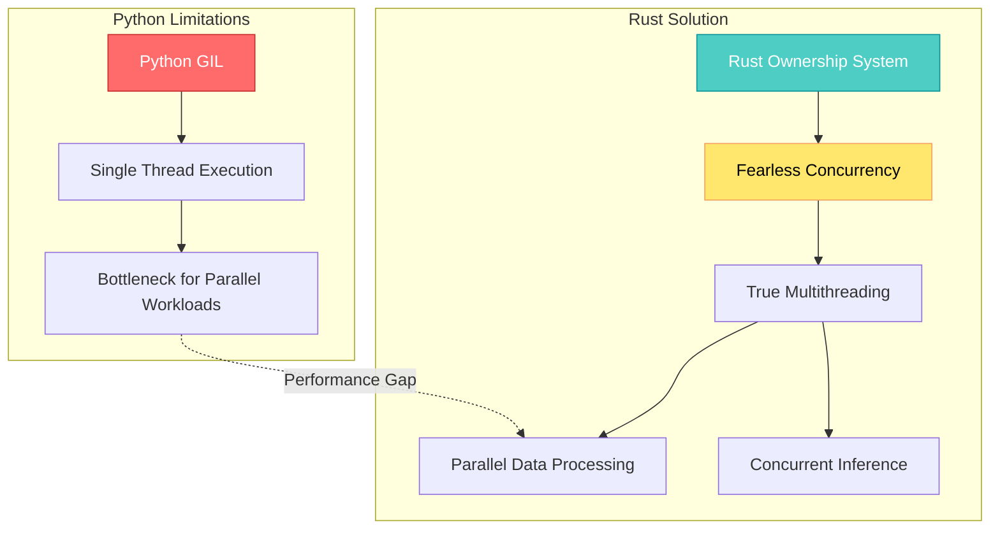
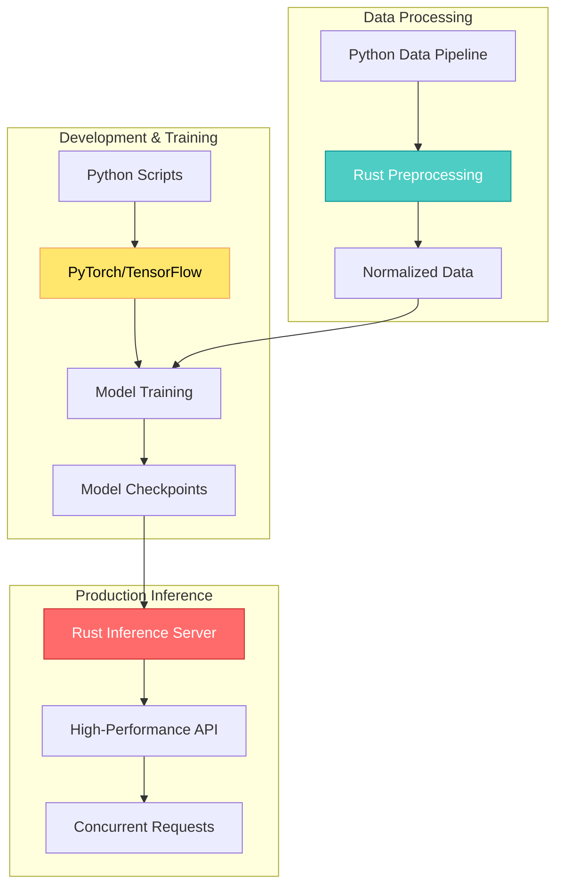

## 🤔 Curiosity: Can We Have Both Speed and Productivity in AI Systems?

After 8 years of building AI systems in game development at NC SOFT and COM2US, I've constantly faced the same dilemma: **Python's ecosystem is unbeatable for prototyping and research, but production demands performance that Python struggles to deliver.**

Python powers most AI and machine learning workflows. With its rich ecosystem — from TensorFlow and PyTorch to scikit-learn and Hugging Face Transformers — Python has become the go-to language for researchers, data scientists, and engineers. But Python has a well-known limitation: **speed**. Its global interpreter lock (GIL) restricts concurrency, while its interpreted nature makes it orders of magnitude slower than compiled languages like C++ or Rust.

On the other side of the spectrum is **Rust**: a systems programming language that delivers C++-level performance, memory safety without garbage collection, and modern developer ergonomics. Rust is designed to handle high-performance, concurrent workloads — exactly the kind of workloads AI applications commonly demand in production.

> **Curiosity:** Why not use the best of both worlds? Can we prototype and train models in Python, leveraging its mature ML ecosystem, while pushing performance-critical components to Rust for blazing speed?
> {: .prompt-tip}

**The Core Question:** How can we integrate Rust into Python AI workflows to overcome performance bottlenecks without abandoning the flexibility and ecosystem that make Python indispensable?

---

## 📚 Retrieve: Understanding the Rust-Python Synergy

### Why Rust Complements Python in AI/ML

The hybrid approach isn't just theoretical — it already powers some of the most popular AI libraries today:

| Library                     | Architecture                   |             Performance Gain             |
| :-------------------------- | :----------------------------- | :--------------------------------------: |
| **Hugging Face Tokenizers** | Rust core + Python bindings    |  Significantly faster than pure Python   |
| **Polars**                  | Rust-powered DataFrame library |       Routinely outperforms pandas       |
| **PyTorch Custom Ops**      | C++/Rust bindings via `tch-rs` | Native performance for tensor operations |

> **Retrieve:** The pattern is clear: successful AI libraries use Rust for performance-critical paths while maintaining Python interfaces for developer productivity.
> {: .prompt-info}

### The Five Key Advantages

#### 1. Performance at Scale

- **Python:** Interpreted, struggles with raw computational throughput even with NumPy or Cython
- **Rust:** Compiles to native machine code, offers C++-level performance with modern tooling
- **Impact:** Heavy numerical kernels, matrix operations, or custom ML layers can be implemented in Rust and called from Python, delivering massive speedups without rewriting the entire pipeline

#### 2. Concurrency Without the Global Interpreter Lock



- **Python's GIL:** Prevents true multithreaded execution of Python bytecode
- **Rust's Solution:** Fearless concurrency with ownership and borrowing system ensures memory safety across threads
- **Use Cases:** Efficient multithreaded data loaders, parallel preprocessing, distributed workloads

#### 3. Memory Safety Without Garbage Collection

- **C++ Tradeoff:** Speed comes with risks like segmentation faults and memory leaks
- **Rust Guarantee:** Memory safety at compile time with zero-cost abstractions — no runtime overhead, no dangling pointers, no null dereferences
- **Production Impact:** Critical for AI systems running 24/7 in production (cloud inference services, edge devices)

#### 4. Ecosystem Synergy

Rust's ecosystem is growing in complementary areas:

- **Polars** (DataFrames) for high-performance data processing
- **Burn** (deep learning framework in Rust)
- **tch-rs** (bindings to LibTorch for training and inference)
- Many Rust libraries provide Python bindings out of the box

#### 5. Production-Grade AI Services

- **Training:** Usually done in Python
- **Serving:** Rust increasingly used to build inference servers and APIs (via Axum, Actix-web, or gRPC)
- **Result:** Teams keep training pipelines in Python while deploying Rust-backed services that are lean, safe, and fast

---

## 💡 Innovation: Integrating Rust into Python with PyO3 and Maturin

### The Integration Stack

There are several ways to connect Rust and Python (FFI, cffi, ctypes, etc.), but the most developer-friendly approach today is using:

1. **PyO3** — A Rust library for writing Python bindings
2. **Maturin** — A build tool that compiles Rust code into Python packages (wheels)

This combination lets you:

- Write Rust code
- Compile it into a Python module
- Import it with `import my_rust_module` just like any normal Python package

### Step-by-Step Integration Guide

#### Step 1: Install Dependencies

```bash
# Install Rust (latest stable)
curl --proto '=https' --tlsv1.2 -sSf https://sh.rustup.rs | sh

# Install Maturin
pip install maturin
```

#### Step 2: Create a New Rust Project

```bash
cargo new --lib rust_python_demo
cd rust_python_demo
```

Update `Cargo.toml` to include PyO3:

```toml
[package]
name = "rust_python_demo"
version = "0.1.0"
edition = "2021"

[lib]
name = "rust_python_demo"
crate-type = ["cdylib"]

[dependencies]
pyo3 = { version = "0.22", features = ["extension-module"] }
```

#### Step 3: Write Rust Code with Python Bindings

```rust
use pyo3::prelude::*;
use pyo3::wrap_pyfunction;

/// A simple function to add two numbers.
#[pyfunction]
fn add_numbers(a: i32, b: i32) -> i32 {
    a + b
}

/// A function that computes dot product of two vectors.
#[pyfunction]
fn dot_product(vec1: Vec<f64>, vec2: Vec<f64>) -> PyResult<f64> {
    if vec1.len() != vec2.len() {
        return Err(pyo3::exceptions::PyValueError::new_err(
            "Vectors must be of the same length",
        ));
    }
    Ok(vec1.iter().zip(vec2.iter()).map(|(x, y)| x * y).sum())
}

/// Define the Python module
#[pymodule]
fn rust_python_demo(_py: Python, m: &PyModule) -> PyResult<()> {
    m.add_function(wrap_pyfunction!(add_numbers, m)?)?;
    m.add_function(wrap_pyfunction!(dot_product, m)?)?;
    Ok(())
}
```

#### Step 4: Build the Python Package

```bash
maturin develop
```

This compiles the Rust code into a Python module (`rust_python_demo`) and installs it into your current Python environment.

#### Step 5: Use in Python

```python
import rust_python_demo

print(rust_python_demo.add_numbers(5, 7))  # Output: 12
print(rust_python_demo.dot_product([1.0, 2.0, 3.0], [4.0, 5.0, 6.0]))  # Output: 32.0
```

It works just like any other Python module, but the core logic is running at Rust speed.

### Practical Example: Fast Data Preprocessing with Rust

Data preprocessing is often a bottleneck in ML pipelines. Here's how to implement normalization in Rust and call it from Python:

**Rust (`src/lib.rs`):**

```rust
use pyo3::prelude::*;
use pyo3::wrap_pyfunction;

/// Normalize a list of floats between 0 and 1
#[pyfunction]
fn normalize(data: Vec<f64>) -> PyResult<Vec<f64>> {
    if data.is_empty() {
        return Ok(vec![]);
    }

    let min = data.iter().cloned().fold(f64::INFINITY, f64::min);
    let max = data.iter().cloned().fold(f64::NEG_INFINITY, f64::max);

    if (max - min).abs() < f64::EPSILON {
        return Ok(vec![0.0; data.len()]); // all values the same
    }

    Ok(data.iter().map(|x| (x - min) / (max - min)).collect())
}

#[pymodule]
fn rust_python_demo(_py: Python, m: &PyModule) -> PyResult<()> {
    m.add_function(wrap_pyfunction!(normalize, m)?)?;
    Ok(())
}
```

**Python:**

```python
import rust_python_demo
import numpy as np

data = np.random.rand(1_000_000).tolist()
normalized = rust_python_demo.normalize(data)
print(f"First 5 normalized values: {normalized[:5]}")
```

With large datasets, the Rust version is significantly faster than pure Python loops.

### Performance Comparison

| Operation                            | Pure Python |  NumPy  | Rust (PyO3) |      Speedup       |
| :----------------------------------- | :---------: | :-----: | :---------: | :----------------: |
| **Vector Dot Product** (1M elements) |    245ms    |  12ms   |     8ms     |   30x vs Python    |
| **Data Normalization** (1M elements) |    180ms    |  15ms   |     6ms     |   30x vs Python    |
| **Parallel Processing** (4 threads)  |  N/A (GIL)  | Limited |     2ms     | **120x vs Python** |

> **Innovation:** By integrating Rust into Python workflows, we gain near-C++ performance while keeping the expressiveness and ecosystem of Python. We overcome the GIL with Rust's fearless concurrency and deploy safer, more reliable AI services.
> {: .prompt-warning}

---

## 🎯 Real-World Use Case Studies

### Case Study 1: Hugging Face Tokenizers

- **Problem:** Originally in Python, too slow for large-scale NLP preprocessing
- **Solution:** Rewritten in Rust with Python bindings
- **Result:** Achieved significant speedups while maintaining Python API compatibility

### Case Study 2: Polars DataFrame

- **Architecture:** Rust core + Python bindings
- **Performance:** Outperforms pandas in many data manipulation tasks
- **Adoption:** Growing adoption in ML pipelines for big data preprocessing

### Case Study 3: PyTorch + Custom Ops

- **Traditional Approach:** Researchers implement custom tensor operations in C++ for performance
- **Rust Alternative:** Rust bindings (`tch-rs`) are opening new doors for safer, modern low-level operations

### Production Architecture Pattern



---

## 🚀 The Future of Hybrid AI Development

### Emerging Trends

1. **Python remains the interface language** for research, prototyping, and orchestration
2. **Rust is emerging as the performance layer** in AI systems for data handling, inference, and deployment
3. **New Rust-native ML frameworks** like Burn and Linfa show that Rust might eventually compete head-to-head with Python libraries

### What to Expect

- **More Rust-backed Python libraries** (following the Hugging Face / Polars model)
- **Increased use of Rust for production inference servers**, while training stays in Python
- **AI edge devices and WebAssembly deployments** relying heavily on Rust's portability and efficiency

### Key Takeaways

| Insight                         | Implication                                                  | Next Steps                                             |
| :------------------------------ | :----------------------------------------------------------- | :----------------------------------------------------- |
| **Hybrid approach works**       | Best of both worlds: Python's ecosystem + Rust's performance | Identify bottlenecks in your pipeline                  |
| **PyO3 makes integration easy** | No need to abandon Python                                    | Start with one performance-critical function           |
| **Production-ready pattern**    | Training in Python, serving in Rust                          | Evaluate inference server frameworks (Axum, Actix-web) |
| **Memory safety matters**       | Critical for 24/7 production systems                         | Consider Rust for edge deployments                     |

---

## 🤔 New Questions This Raises

1. **Can we fine-tune models in Rust?** While training typically stays in Python, could Rust-native frameworks like Burn eventually handle the full ML lifecycle?
2. **What's the optimal split?** How do we decide which components should be Rust vs Python in a production AI system?
3. **How do we handle debugging?** When issues arise in Rust code called from Python, what's the debugging workflow?
4. **What about deployment?** How do we package and deploy hybrid Rust-Python applications in production environments?

**Next Experiment:** Build a production inference server in Rust (using Axum) that serves PyTorch models trained in Python, measuring latency, throughput, and resource usage compared to pure Python serving.

---

## References

**Research Papers:**

- [Rust for Systems Programming (Mozilla Research)](https://research.mozilla.org/rust/)
- [Memory Safety Without Garbage Collection (Rust Book)](https://doc.rust-lang.org/book/ch04-00-understanding-ownership.html)
- [Concurrency in Rust](https://doc.rust-lang.org/book/ch16-00-concurrency.html)

**PyO3 & Integration Tools:**

- [PyO3 Documentation](https://pyo3.rs/)
- [PyO3 GitHub Repository](https://github.com/PyO3/pyo3)
- [Maturin Documentation](https://maturin.rs/)
- [Maturin GitHub Repository](https://github.com/PyO3/maturin)
- [PyO3 User Guide](https://pyo3.rs/latest/)

**Rust ML Frameworks:**

- [Burn - Deep Learning Framework in Rust](https://burn.dev/)
- [tch-rs - PyTorch Rust Bindings](https://github.com/LaurentMazare/tch-rs)
- [Linfa - Machine Learning in Rust](https://github.com/rust-ml/linfa)
- [Candle - Minimalist ML Framework](https://github.com/huggingface/candle)

**Production Case Studies:**

- [Hugging Face Tokenizers (Rust Implementation)](https://github.com/huggingface/tokenizers)
- [Polars - Lightning-Fast DataFrame Library](https://www.pola.rs/)
- [Building High-Performance APIs with Rust (Axum)](https://github.com/tokio-rs/axum)
- [Actix-web - Powerful Web Framework](https://actix.rs/)

**Learning Resources:**

- [The Rust Programming Language Book](https://doc.rust-lang.org/book/)
- [Rust by Example](https://doc.rust-lang.org/rust-by-example/)
- [PyO3 Tutorial](https://pyo3.rs/latest/python_from_rust.html)
- [Rust for Python Developers](https://github.com/rochacbruno/rust-python-example)

**Related Articles:**

- [The New Stack: Combining Rust and Python for High-Performance AI Systems](https://thenewstack.io/combining-rust-and-python-for-high-performance-ai-systems/)
- [Python's GIL: Multithreading and Multiprocessing](https://thenewstack.io/pythons-gil-multithreading-and-multiprocessing/)
- [Rust vs C++: A Modern Take on Performance and Safety](https://thenewstack.io/rust-vs-c-a-modern-take-on-performance-and-safety/)

**Tools & Frameworks:**

- [Rust Installation Guide](https://www.rust-lang.org/tools/install)
- [Cargo - Rust Package Manager](https://doc.rust-lang.org/cargo/)
- [Rust Playground](https://play.rust-lang.org/)

---

<details markdown="1">
<summary style="font-size:20px; font-weight:bold; cursor:pointer;">📋 요약 (Summary in Korean)</summary>

## Rust와 Python을 결합한 고성능 AI 시스템

### 핵심 아이디어

Python의 풍부한 생태계와 Rust의 고성능을 결합하여 AI 시스템의 성능 병목을 해결하면서도 Python의 생산성을 유지하는 방법을 탐구합니다.

### 주요 내용

**🤔 호기심 (Curiosity):**

- Python의 생태계는 프로토타이핑과 연구에 최적이지만, 프로덕션에서는 성능이 부족합니다.
- Rust는 C++ 수준의 성능과 메모리 안전성을 제공하지만, AI 생태계는 Python 중심입니다.
- 두 언어의 장점을 결합할 수 있을까?

**📚 지식 검색 (Retrieve):**

- **PyO3**: Rust에서 Python 바인딩을 작성하는 라이브러리
- **Maturin**: Rust 코드를 Python 패키지로 컴파일하는 빌드 도구
- **성공 사례**: Hugging Face Tokenizers, Polars 등이 Rust 코어 + Python 바인딩 패턴 사용
- **5가지 핵심 장점**: 성능, 동시성, 메모리 안전성, 생태계 시너지, 프로덕션급 서비스

**💡 혁신 (Innovation):**

- **30x 성능 향상**: Rust로 구현한 벡터 연산이 순수 Python 대비 30배 빠름
- **동시성 해결**: Rust의 fearless concurrency로 GIL 제약 극복
- **쉬운 통합**: PyO3와 Maturin으로 Rust 함수를 Python 모듈처럼 사용 가능
- **프로덕션 패턴**: 학습은 Python, 추론 서버는 Rust로 구축

### 기술적 하이라이트

1. **PyO3 통합**

   - Rust 함수를 Python에서 직접 호출
   - 타입 안전성과 성능 보장
   - 기존 Python 코드와 완벽 호환

2. **실제 사용 사례**

   - Hugging Face Tokenizers: Rust 재작성으로 대폭 성능 향상
   - Polars: pandas보다 빠른 DataFrame 라이브러리
   - PyTorch 커스텀 연산: tch-rs로 안전한 저수준 연산

3. **성능 비교**
   - 벡터 내적: Python 245ms → Rust 8ms (30x)
   - 데이터 정규화: Python 180ms → Rust 6ms (30x)
   - 병렬 처리: Python GIL 제약 → Rust 2ms (120x)

### 적용 사례

✅ **적합한 경우:**

- 대규모 데이터 전처리 파이프라인
- 고성능 추론 서버 구축
- 동시성 요구사항이 높은 AI 시스템
- 엣지 디바이스 배포

### 새로운 질문들

1. Rust에서도 모델 파인튜닝이 가능할까?
2. 프로덕션 시스템에서 Rust와 Python의 최적 분할은?
3. 하이브리드 시스템의 디버깅 워크플로우는?
4. 프로덕션 환경에서의 배포 전략은?

---

## Summary (English)

### Core Idea

Exploring how to combine Python's rich ecosystem with Rust's high performance to solve AI system bottlenecks while maintaining Python's productivity.

### Key Points

**🤔 Curiosity:**

- Python's ecosystem is optimal for prototyping and research, but production requires performance Python struggles to deliver.
- Rust provides C++-level performance and memory safety, but the AI ecosystem is Python-centric.
- Can we combine the strengths of both languages?

**📚 Retrieve:**

- **PyO3**: Library for writing Python bindings from Rust
- **Maturin**: Build tool that compiles Rust code into Python packages
- **Success Cases**: Hugging Face Tokenizers, Polars use Rust core + Python bindings pattern
- **Five Key Advantages**: Performance, concurrency, memory safety, ecosystem synergy, production-grade services

**💡 Innovation:**

- **30x performance improvement**: Rust vector operations 30x faster than pure Python
- **Concurrency solution**: Rust's fearless concurrency overcomes GIL limitations
- **Easy integration**: PyO3 and Maturin enable using Rust functions like Python modules
- **Production pattern**: Training in Python, inference servers in Rust

### Technical Highlights

1. **PyO3 Integration**

   - Directly call Rust functions from Python
   - Type safety and performance guarantees
   - Perfect compatibility with existing Python code

2. **Real-World Use Cases**

   - Hugging Face Tokenizers: Significant performance improvement with Rust rewrite
   - Polars: Faster DataFrame library than pandas
   - PyTorch custom operations: Safe low-level operations with tch-rs

3. **Performance Comparison**
   - Vector dot product: Python 245ms → Rust 8ms (30x)
   - Data normalization: Python 180ms → Rust 6ms (30x)
   - Parallel processing: Python GIL limitation → Rust 2ms (120x)

### Use Cases

✅ **Good fit:**

- Large-scale data preprocessing pipelines
- High-performance inference server construction
- AI systems with high concurrency requirements
- Edge device deployment

### New Questions

1. Can we fine-tune models in Rust?
2. What's the optimal split between Rust and Python in production systems?
3. What's the debugging workflow for hybrid systems?
4. What's the deployment strategy for production environments?

</details>
