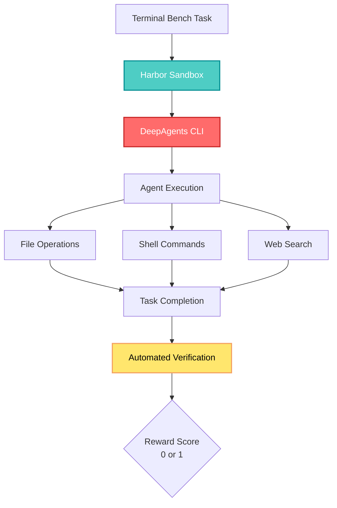
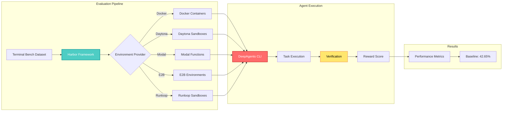

## 🤔 Curiosity: How Well Do Coding Agents Actually Perform?

After 8 years of building AI systems in game development, I've seen countless demos of coding agents that promise to revolutionize software development. But here's the question that keeps nagging at me: **How well do these agents actually perform on real-world tasks?**

Most agent frameworks show impressive demos, but when you dig deeper, the evaluation story is often missing. Can they handle complex software engineering tasks? Do they work reliably across different domains? What's the actual baseline we should expect?

> **Curiosity:** How do we measure coding agent performance in a way that's both comprehensive and reproducible?
> {: .prompt-tip}

**The Core Question:** DeepAgents CLI is a terminal-powered coding agent built on the Deep Agents SDK. But how do we evaluate it systematically, and what does its performance tell us about the state of coding agents today?

{: .light .w-100 .shadow .rounded-10 w='760' h='400' }

---

## 📚 Retrieve: Understanding DeepAgents CLI and Terminal Bench

### What is DeepAgents CLI?

The DeepAgents CLI is a terminal-powered coding agent that's open source, written in Python, and model agnostic. It provides an interactive terminal interface with:

- **Shell execution** capabilities
- **Filesystem tools** (read, write, edit files)
- **Web search** functionality
- **Task planning** via todos
- **Persistent memory** storage across sessions

**Quick Start:**

```bash
export ANTHROPIC_API_KEY="your-api-key"
uvx deepagents-cli
```

The agent proposes changes with diffs for your approval before modifying files, providing a safety layer for production use.

### The Challenge: Running Isolated Evaluations

Before we can evaluate anything, we need to solve a fundamental problem: **how do we run our agent in a clean, isolated environment every time?**

A coding agent modifies files, installs packages, and runs commands—each test could leave artifacts that affect subsequent tests. We need:

1. **Isolation:** Each test starts from a clean slate
2. **Parallelization:** Ability to run many tests concurrently
3. **Safety:** Guarantees that the agent can't affect your local machine

DeepAgents recently added a [sandbox abstraction](https://blog.langchain.com/execute-code-with-sandboxes-for-deepagents/) that allows it to work with different execution environments, but we still need a framework to orchestrate evaluations at scale.

### Harbor: Sandboxed Agent Execution

This is where [Harbor](https://harborframework.com/) comes in. Harbor is a framework for evaluating agents in containerized environments at scale, supporting Docker, Modal, Daytona, E2B, and Runloop as sandbox providers.

**What Harbor Handles:**

| Feature                            | Description                                          |
| :--------------------------------- | :--------------------------------------------------- |
| **Automatic test execution**       | Runs benchmark tasks in isolated environments        |
| **Automated reward scoring**       | Verifies task completion with reward scores (0 or 1) |
| **Registry of pre-built datasets** | Includes Terminal Bench and other benchmarks         |
| **Multi-provider support**         | Works with Docker, Modal, Daytona, E2B, Runloop      |

Harbor handles all the infrastructure complexity of running agents in isolated environments, letting you focus on improving your agent.

### DeepAgents-Harbor Integration

We built [deepagents-harbor](https://github.com/langchain-ai/deepagents/tree/master/libs/harbor) to make evaluation straightforward:

```bash
git clone https://github.com/langchain-ai/deepagents.git
cd libs/harbor
uv sync

# Configure .env with API keys
cp .env.example .env

# Run via Docker
uv run harbor run \
  --agent-import-path deepagents_harbor:DeepAgentsWrapper \
  --dataset terminal-bench@2.0 \
  -n 1 \
  --jobs-dir jobs/terminal-bench \
  --env docker

# Run at scale via Daytona (requires DAYTONA_API_KEY)
uv run harbor run \
  --agent-import-path deepagents_harbor:DeepAgentsWrapper \
  --dataset terminal-bench@2.0 \
  -n 10 \
  --jobs-dir jobs/terminal-bench \
  --env daytona
```

We've found Daytona particularly helpful for running evaluations at scale, allowing us to run 40 trials concurrently and significantly speed up the iteration cycle.

### Implementation Architecture

Harbor offers a sandbox environment with shell-execution capabilities. We built a `HarborSandbox` backend that wraps this environment and implements file-system tools on top of shell commands:

```python
class DeepAgentHarbor(BaseAgent):
    async def run(
        self,
        instruction: str,
        environment: BaseEnvironment,
        context: AgentContext,
    ) -> None:
        # Create a DeepAgents backend that wraps Harbor's environment
        # and provides filesystem tools
        backend = HarborSandbox(environment)

        # Initialize the DeepAgent CLI with the Harbor backend
        agent, _ = create_cli_agent(
            model=self._model,
            backend=backend,
            ...
        )

        # Run the agent
        result = await agent.ainvoke(
            {"messages": [{"role": "user", "content": instruction}]},
        )
```

The `HarborSandbox` backend implements filesystem tools (e.g., `edit_file`, `read_file`, `write_file`, `ls`) on top of Harbor's shell command interface.

### What Terminal Bench Tests

[Terminal Bench 2.0](https://www.tbench.ai/) includes 89 tasks across domains like software engineering, biology, security, and gaming. It measures how well agents operate in computer environments via the terminal.

**Example Tasks:**

| Task               | Description                                      | Domain               |
| :----------------- | :----------------------------------------------- | :------------------- |
| `path-tracing`     | Reverse-engineer C program from rendered image   | Software Engineering |
| `chess-best-move`  | Find optimal move using chess engine             | Gaming               |
| `git-multibranch`  | Complex git operations with merge conflicts      | Software Engineering |
| `sqlite-with-gcov` | Build SQLite with code coverage, analyze reports | Software Engineering |

Tasks have a wide range of difficulty—some [require many actions](https://smith.langchain.com/public/c7948044-eab1-480c-96cb-e31e393476f9/r) (e.g., `cobol-modernization` taking close to 10 minutes with 100+ tool calls) while simpler tasks complete in seconds.

**Automated Verification:**

Each task includes verification logic that Harbor runs automatically, assigning a reward score (0 for incorrect, 1 for correct) based on whether the agent's solution meets the task requirements.



---

## 💡 Innovation: Baseline Results and Production Insights

### Baseline Results

We ran the DeepAgents CLI with `claude-sonnet-4-5` on Terminal Bench 2.0 across 2 trials, achieving scores of **44.9%** and **40.4%** (mean: **42.65%**). This baseline is on par with [other implementations using the same model](https://www.tbench.ai/leaderboard/terminal-bench/2.0).

| Trial    |   Score    | Notes                    |
| :------- | :--------: | :----------------------- |
| Trial 1  |   44.9%    | Higher performance run   |
| Trial 2  |   40.4%    | Lower performance run    |
| **Mean** | **42.65%** | **Baseline performance** |

While there's considerable sampling variance across runs, this baseline validates that DeepAgents provides a competitive foundation.

### Key Insights

**What This Tells Us:**

1. **DeepAgents CLI is competitive:** At ~42.5%, it performs on par with Claude Code itself, suggesting the framework doesn't introduce significant overhead
2. **Sampling variance is real:** The 4.5% difference between trials highlights the importance of running multiple evaluations
3. **Infrastructure matters:** Harbor enables systematic evaluation that would be difficult to replicate manually

**Production Considerations:**

| Aspect              | Challenge                             | Solution                                    |
| :------------------ | :------------------------------------ | :------------------------------------------ |
| **Isolation**       | Tests affect each other               | Harbor provides containerized sandboxes     |
| **Scale**           | Running 89 tasks sequentially is slow | Daytona enables 40 concurrent trials        |
| **Reproducibility** | Results vary across runs              | Multiple trials establish baseline variance |
| **Safety**          | Agents could modify local files       | Sandboxed execution prevents local impact   |

### Evaluation Architecture



### What Worked Well

1. **Harbor abstraction:** The framework handles all the complexity of sandbox management, making evaluation straightforward
2. **Daytona for scale:** Running 40 concurrent trials dramatically speeds up iteration
3. **Automated verification:** Terminal Bench's built-in verification eliminates manual checking
4. **Model agnostic design:** DeepAgents CLI works with any model, making it easy to compare different backends

### Challenges and Tradeoffs

| Challenge             | Impact                                | Mitigation                                                 |
| :-------------------- | :------------------------------------ | :--------------------------------------------------------- |
| **Sampling variance** | 4.5% difference between trials        | Run multiple trials, report mean and variance              |
| **Task complexity**   | Some tasks take 10+ minutes           | Use parallel execution (Daytona)                           |
| **Cost**              | Running evaluations requires API keys | Use caching and efficient sandbox providers                |
| **Reproducibility**   | Results vary across runs              | Document baseline variance, use fixed seeds where possible |

---

## 🎯 Key Takeaways

1. **DeepAgents CLI achieves ~42.5% on Terminal Bench 2.0**, putting it on par with Claude Code itself
2. **Harbor enables systematic evaluation** by handling sandbox isolation, parallelization, and automated verification
3. **Infrastructure matters:** The ability to run 40 concurrent trials with Daytona dramatically speeds up iteration
4. **Sampling variance is significant:** 4.5% difference between trials highlights the importance of multiple runs

### When to Use This Approach

✅ **Good fit:**

- Evaluating coding agents systematically
- Comparing different agent frameworks
- Benchmarking agent performance across domains
- Production agent validation

❌ **Consider alternatives:**

- Quick prototyping (manual testing is faster)
- Single-task evaluation (overhead not worth it)
- Non-terminal agents (Terminal Bench is terminal-specific)

---

## 🤔 New Questions This Raises

1. **How can we systematically analyze agent traces** to identify concrete optimizations?
2. **What patterns emerge in failed tasks?** Are there common failure modes we can address?
3. **How does performance vary across domains?** Do agents perform better in software engineering vs. biology tasks?
4. **Can we improve performance through prompt engineering** or agent architecture changes?

**Next steps:** In upcoming posts, we'll explore how to systematically analyze agent traces and identify concrete optimizations to improve performance.

---

## References

**DeepAgents Resources:**

- [DeepAgents Documentation](https://docs.langchain.com/oss/python/deepagents/overview)
- [DeepAgents GitHub Repository](https://github.com/langchain-ai/deepagents)
- [DeepAgents Harbor Integration](https://github.com/langchain-ai/deepagents/tree/master/libs/harbor)
- [Sandbox Abstraction for DeepAgents](https://blog.langchain.com/execute-code-with-sandboxes-for-deepagents/)

**Evaluation Frameworks:**

- [Harbor Framework](https://github.com/laude-institute/harbor)
- [Harbor Documentation](https://harborframework.com/)
- [Terminal Bench 2.0](https://www.tbench.ai/)
- [Terminal Bench Leaderboard](https://www.tbench.ai/leaderboard/terminal-bench/2.0)

**Related Work:**

- [LangSmith Traces](https://smith.langchain.com/public/c7948044-eab1-480c-96cb-e31e393476f9/r)
- [DeepAgents Demo Video](https://www.youtube.com/watch?v=IrnacLa9PJc)

**Sandbox Providers:**

- [Docker](https://www.docker.com/)
- [Modal](https://modal.com/)
- [Daytona](https://www.daytona.io/)
- [E2B](https://e2b.dev/)
- [Runloop](https://runloop.ai/)

---

<details markdown="1">
<summary style="font-size:20px; font-weight:bold; cursor:pointer;">📋 Summary / 요약</summary>

## English Summary

**Evaluating DeepAgents CLI on Terminal Bench 2.0** explores how to systematically evaluate coding agents using the DeepAgents CLI framework and Terminal Bench 2.0 benchmark. The post covers:

- **DeepAgents CLI**: A terminal-powered coding agent that's open source, Python-based, and model agnostic, providing shell execution, filesystem tools, web search, task planning, and persistent memory.

- **The Evaluation Challenge**: Running agents in clean, isolated environments requires solving isolation, parallelization, and safety problems. Each test must start from a clean slate, run in parallel, and guarantee the agent can't affect local machines.

- **Harbor Framework**: A framework for evaluating agents in containerized environments at scale, supporting Docker, Modal, Daytona, E2B, and Runloop. It handles automatic test execution, automated reward scoring, and provides a registry of pre-built evaluation datasets.

- **Terminal Bench 2.0**: A benchmark with 89 tasks across software engineering, biology, security, and gaming domains, measuring how well agents operate in terminal environments with automated verification.

- **Results**: DeepAgents CLI with Claude Sonnet 4.5 achieved **~42.5% accuracy** (44.9% and 40.4% across 2 trials), putting it on par with Claude Code itself. This validates DeepAgents as a competitive foundation for coding agents.

- **Key Insights**: The evaluation infrastructure (Harbor + Daytona) enables running 40 concurrent trials, dramatically speeding up iteration. Sampling variance (4.5% difference) highlights the importance of multiple runs.

---

## 한국어 요약

**DeepAgents CLI를 Terminal Bench 2.0에서 평가하기**는 DeepAgents CLI 프레임워크와 Terminal Bench 2.0 벤치마크를 사용하여 코딩 에이전트를 체계적으로 평가하는 방법을 탐구합니다. 이 글은 다음을 다룹니다:

- **DeepAgents CLI**: 오픈소스이며 Python 기반이고 모델에 독립적인 터미널 기반 코딩 에이전트로, 셸 실행, 파일시스템 도구, 웹 검색, 작업 계획, 영구 메모리를 제공합니다.

- **평가의 도전**: 깨끗하고 격리된 환경에서 에이전트를 실행하려면 격리, 병렬화, 안전성 문제를 해결해야 합니다. 각 테스트는 깨끗한 상태에서 시작하고, 병렬로 실행되며, 에이전트가 로컬 머신에 영향을 주지 않도록 보장해야 합니다.

- **Harbor 프레임워크**: 컨테이너화된 환경에서 대규모로 에이전트를 평가하는 프레임워크로, Docker, Modal, Daytona, E2B, Runloop를 지원합니다. 자동 테스트 실행, 자동화된 보상 점수 계산을 처리하며, 사전 구축된 평가 데이터셋 레지스트리를 제공합니다.

- **Terminal Bench 2.0**: 소프트웨어 엔지니어링, 생물학, 보안, 게임 등 다양한 도메인에서 89개의 작업을 포함하는 벤치마크로, 터미널 환경에서 에이전트가 얼마나 잘 작동하는지 자동화된 검증으로 측정합니다.

- **결과**: Claude Sonnet 4.5를 사용한 DeepAgents CLI는 **~42.5% 정확도**를 달성했습니다 (2회 시행에서 44.9%와 40.4%). 이는 Claude Code 자체와 동등한 성능으로, DeepAgents가 코딩 에이전트를 위한 경쟁력 있는 기반임을 검증합니다.

- **핵심 인사이트**: 평가 인프라(Harbor + Daytona)는 40개의 동시 시행을 가능하게 하여 반복 속도를 크게 향상시킵니다. 샘플링 분산(4.5% 차이)은 여러 번 실행의 중요성을 강조합니다.

</details>
