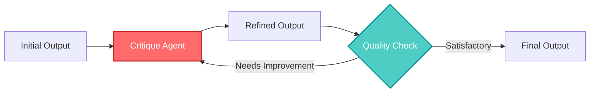
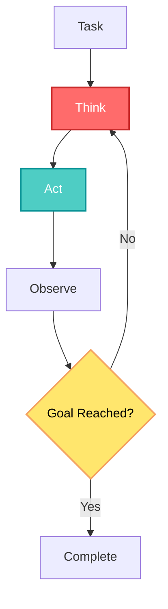
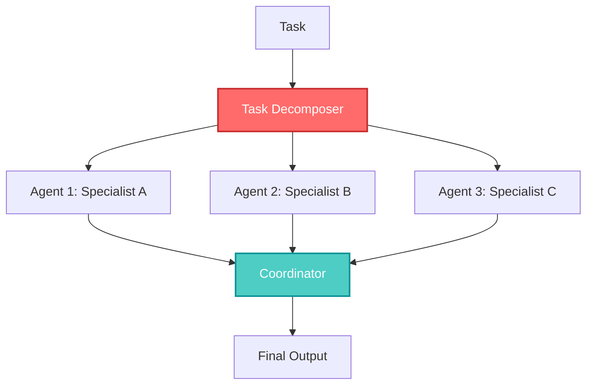
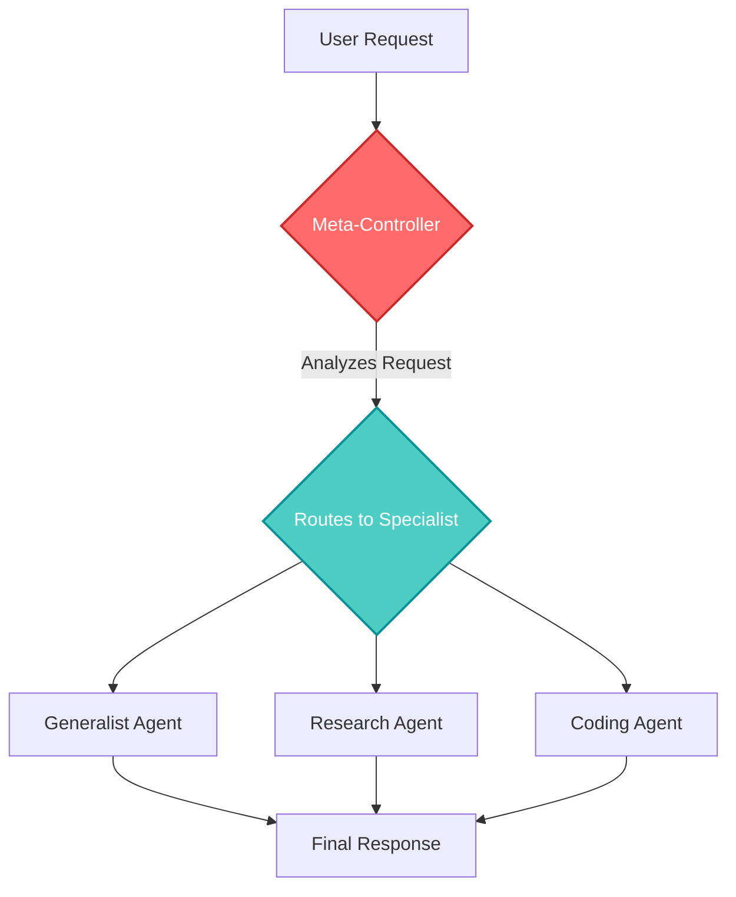
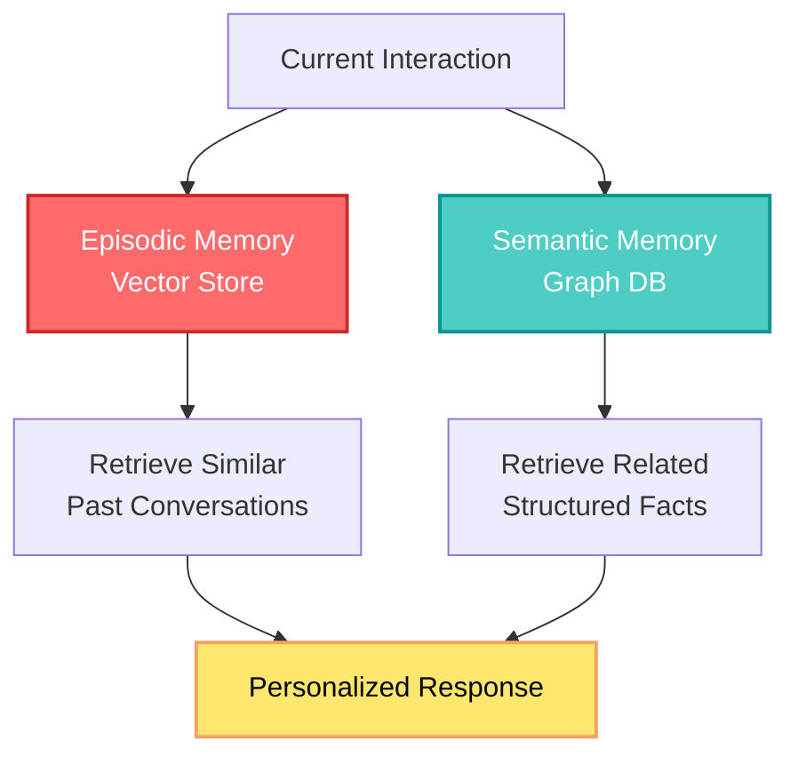
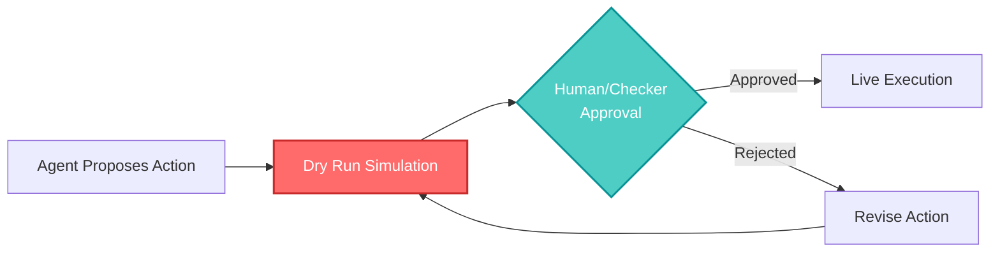
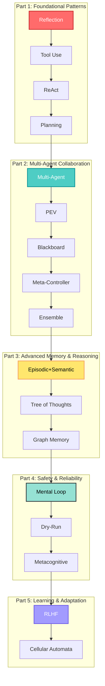

## 🤔 Curiosity: How Do We Build Production-Ready AI Agents?

After 8 years of building AI systems in game development, I've seen countless agent frameworks promise to revolutionize how we build intelligent systems. But here's the question that keeps me up at night: **What are the fundamental architectural patterns that actually work in production?**

Most resources I've encountered are either too abstract (research papers) or too specific (single-use implementations). What if we had a comprehensive, hands-on guide that bridges theory and practice—showing not just what patterns exist, but how to actually implement them?

> **Curiosity:** Can we systematically map out all the major agentic architectures and provide production-ready implementations for each?
> {: .prompt-tip}

**The Core Question:** The [all-agentic-architectures](https://github.com/FareedKhan-dev/all-agentic-architectures) repository claims to contain 17+ state-of-the-art agentic architectures, each implemented end-to-end. But what patterns does it cover? How do they relate to each other? And most importantly, which ones should we use in production?

---

## 📚 Retrieve: Understanding the 17 Agentic Architectures

### Repository Overview

The **all-agentic-architectures** repository is a comprehensive, hands-on masterclass in modern AI agent design. It contains detailed implementations of **17+ state-of-the-art agentic architectures**, built with LangChain and LangGraph. Each architecture is implemented end-to-end in a runnable Jupyter notebook, designed as a living textbook that bridges the gap between theoretical concepts and practical, production-ready code.

**Key Characteristics:**

- **From Theory to Tangible Code:** Each architecture is not just explained but implemented end-to-end
- **Structured Learning Path:** Notebooks are ordered to build concepts progressively
- **Emphasis on Evaluation:** Features robust `LLM-as-a-Judge` patterns for quantitative feedback
- **Real-World Scenarios:** Examples grounded in practical applications (financial analysis, coding, medical triage)
- **Consistent Framework:** Uses LangGraph as the core orchestrator for stateful, cyclical agent design

### Technical Stack

| Component             | Purpose                                                    |
| :-------------------- | :--------------------------------------------------------- |
| **Python 3.10+**      | Core programming language                                  |
| **LangChain**         | Foundational building blocks for LLMs and tools            |
| **LangGraph**         | Orchestration framework for complex, stateful workflows    |
| **Nebius AI Models**  | High-performance LLMs (e.g., Mixtral-8x22B-Instruct-v0.1)  |
| **Jupyter Notebooks** | Interactive development and step-by-step demonstrations    |
| **Pydantic**          | Robust, structured data modeling                           |
| **Tavily Search**     | Search API for research-oriented agents                    |
| **Neo4j**             | Graph database for semantic and world-model memory         |
| **FAISS**             | Vector store for episodic memory through similarity search |

### The 17 Architectures: Complete Breakdown

#### Part 1: Foundational Patterns (Architectures 1-4)

These architectures cover the essential building blocks for making a single agent more powerful.

**01. Reflection**



- **Core Concept:** Moves from a single-pass generator to a deliberate, multi-step reasoner by critiquing and refining its own work
- **Key Use Case:** High-Quality Code Generation, Complex Summarization
- **Production Value:** Improves output quality through self-review, critical for code generation and content creation

**02. Tool Use**

- **Core Concept:** Empowers an agent to overcome knowledge cutoffs and interact with the real world by calling external APIs and functions
- **Key Use Case:** Real-time Research Assistants, Enterprise Bots
- **Production Value:** Enables agents to access real-time data, execute actions, and interact with external systems

**03. ReAct (Reasoning + Acting)**



- **Core Concept:** Dynamically interleaves reasoning ("thought") and action ("tool use") in an adaptive loop to solve complex, multi-step problems
- **Key Use Case:** Multi-hop Q&A, Web Navigation & Research
- **Production Value:** Enables agents to reason about actions before taking them, critical for complex problem-solving

**04. Planning**

- **Core Concept:** Proactively decomposes a complex task into a detailed, step-by-step plan _before_ execution, ensuring a structured and traceable workflow
- **Key Use Case:** Predictable Report Generation, Project Management
- **Production Value:** Adds foresight and structure, making agent behavior predictable and debuggable

#### Part 2: Multi-Agent Collaboration (Architectures 5, 7, 11, 13)

These architectures explore how to make agents work together.

**05. Multi-Agent Systems**



- **Core Concept:** A team of specialized agents collaborates to solve a problem, dividing labor to achieve superior depth, quality, and structure
- **Key Use Case:** Software Dev Pipelines, Creative Brainstorming
- **Production Value:** Enables parallel processing and specialization, dramatically improving quality and speed

**06. PEV (Plan, Execute, Verify)**

- **Core Concept:** A highly robust, self-correcting loop where a Verifier agent checks the outcome of each action, allowing for error detection and dynamic recovery
- **Key Use Case:** High-Stakes Automation, Finance, Unreliable Tools
- **Production Value:** Critical for production systems where errors are costly—automatically detects and recovers from failures

**07. Blackboard Systems**

- **Core Concept:** A flexible multi-agent system where agents collaborate opportunistically via a shared central memory (the "blackboard"), guided by a dynamic controller
- **Key Use Case:** Complex Diagnostics, Dynamic Sense-Making
- **Production Value:** Enables emergent collaboration where agents contribute when they have relevant expertise

**11. Meta-Controller**



- **Core Concept:** A supervisory agent that analyzes incoming tasks and routes them to the most appropriate specialist sub-agent from a pool of experts
- **Key Use Case:** Multi-Service AI Platforms, Adaptive Assistants
- **Production Value:** Acts as a smart router, optimizing task allocation and improving overall system efficiency

**13. Ensemble**

- **Core Concept:** Multiple independent agents analyze a problem from different perspectives, and a final "aggregator" agent synthesizes their outputs for a more robust, less biased conclusion
- **Key Use Case:** High-Stakes Decision Support, Fact-Checking
- **Production Value:** Reduces bias and improves robustness through diverse perspectives

#### Part 3: Advanced Memory & Reasoning (Architectures 8, 9, 12)

These architectures focus on how agents can think more deeply and remember what they've learned.

**08. Episodic + Semantic Memory**



- **Core Concept:** A dual-memory system combining a vector store for past conversations (episodic) and a graph DB for structured facts (semantic) for true long-term personalization
- **Key Use Case:** Long-Term Personal Assistants, Personalized Tutors
- **Production Value:** Enables true personalization by remembering both conversations and learned facts

**09. Tree of Thoughts (ToT)**

- **Core Concept:** Solves problems by exploring multiple reasoning paths in a tree structure, evaluating and pruning branches to systematically find the optimal solution
- **Key Use Case:** Logic Puzzles, Constrained Planning
- **Production Value:** Enables systematic exploration of solution spaces, critical for complex reasoning tasks

**12. Graph (World-Model Memory)**

- **Core Concept:** Stores knowledge as a structured graph of entities and relationships, enabling complex, multi-hop reasoning by traversing connections
- **Key Use Case:** Corporate Intelligence, Advanced Research
- **Production Value:** Enables complex reasoning over interconnected knowledge, perfect for knowledge-intensive applications

#### Part 4: Safety, Reliability, and Real-World Interaction (Architectures 6, 10, 14, 17)

These architectures are critical for building agents that can be trusted in production.

**10. Mental Loop (Simulator)**

- **Core Concept:** An agent tests its actions in an internal "mental model" or simulator to predict outcomes and assess risk before acting in the real world
- **Key Use Case:** Robotics, Financial Trading, Safety-Critical Systems
- **Production Value:** Allows agents to "think before acting," critical for high-stakes applications

**14. Dry-Run Harness**



- **Core Concept:** A safety-critical pattern where an agent's proposed action is first simulated (dry run) and must be approved (by a human or checker) before live execution
- **Key Use Case:** Production Agent Deployment, Debugging
- **Production Value:** Provides crucial human-in-the-loop safety layer for production systems

**17. Reflexive Metacognitive**

- **Core Concept:** An agent with a "self-model" that reasons about its own capabilities and limitations, choosing to act, use a tool, or escalate to a human to ensure safety
- **Key Use Case:** High-Stakes Advisory (Medical, Legal, Finance)
- **Production Value:** Understands its own limitations—key to safe operation in high-stakes domains

#### Part 5: Learning and Adaptation (Architectures 15, 16)

The final section explores how agents can improve over time and solve problems in novel ways.

**15. RLHF (Self-Improvement)**

- **Core Concept:** An agent's output is critiqued by an "editor" agent, and the feedback is used to iteratively revise the work. High-quality outputs are saved to improve future performance
- **Key Use Case:** High-Quality Content Generation, Continual Learning
- **Production Value:** Creates a mechanism for agents to learn from feedback, improving over time

**16. Cellular Automata**

- **Core Concept:** A system of many simple, decentralized grid-based agents whose local interactions produce complex, emergent global behavior like optimal pathfinding
- **Key Use Case:** Spatial Reasoning, Logistics, Complex System Simulation
- **Production Value:** Showcases how complex global behavior can emerge from simple, local rules

### Architecture Comparison Matrix

| Architecture          |     Complexity     | Use Case                | Production Readiness | Key Innovation              |
| :-------------------- | :----------------: | :---------------------- | :------------------: | :-------------------------- |
| **Reflection**        |       ⭐ Low       | Code generation         |       ✅ High        | Self-critique loop          |
| **Tool Use**          |       ⭐ Low       | Research assistants     |       ✅ High        | External API integration    |
| **ReAct**             |    ⭐⭐ Medium     | Multi-step problems     |       ✅ High        | Reasoning + action loop     |
| **Planning**          |    ⭐⭐ Medium     | Project management      |       ✅ High        | Pre-execution planning      |
| **Multi-Agent**       |    ⭐⭐⭐ High     | Software pipelines      |       ✅ High        | Specialized teams           |
| **PEV**               |    ⭐⭐⭐ High     | High-stakes automation  |       ✅ High        | Self-correcting loop        |
| **Blackboard**        |    ⭐⭐⭐ High     | Complex diagnostics     |      ⚠️ Medium       | Opportunistic collaboration |
| **Episodic+Semantic** |    ⭐⭐⭐ High     | Personal assistants     |       ✅ High        | Dual memory system          |
| **Tree of Thoughts**  | ⭐⭐⭐⭐ Very High | Logic puzzles           |      ⚠️ Medium       | Multi-path exploration      |
| **Mental Loop**       |    ⭐⭐⭐ High     | Safety-critical         |       ✅ High        | Internal simulation         |
| **Meta-Controller**   |    ⭐⭐⭐ High     | Multi-service platforms |       ✅ High        | Smart routing               |
| **Graph Memory**      |    ⭐⭐⭐ High     | Knowledge systems       |       ✅ High        | Structured reasoning        |
| **Ensemble**          |    ⭐⭐⭐ High     | Decision support        |       ✅ High        | Multi-perspective analysis  |
| **Dry-Run**           |    ⭐⭐ Medium     | Production deployment   |       ✅ High        | Safety harness              |
| **RLHF**              |    ⭐⭐⭐ High     | Content generation      |      ⚠️ Medium       | Self-improvement            |
| **Cellular Automata** | ⭐⭐⭐⭐ Very High | Spatial reasoning       |      ⚠️ Medium       | Emergent behavior           |
| **Metacognitive**     | ⭐⭐⭐⭐ Very High | High-stakes advisory    |      ⚠️ Medium       | Self-awareness              |

---

## 💡 Innovation: Production Applications and Best Practices

### Learning Path: From Simple to Sophisticated

The repository is structured as a progressive learning journey:



### Production Architecture Selection Guide

**For Code Generation:**

- Start with **Reflection** for quality improvement
- Add **Tool Use** for code execution and testing
- Consider **Multi-Agent** for complex refactoring tasks

**For Research & Information Gathering:**

- Use **ReAct** for multi-hop reasoning
- Add **Tool Use** for web search and API access
- Consider **Graph Memory** for knowledge accumulation

**For High-Stakes Applications:**

- Implement **PEV** for error detection
- Add **Dry-Run Harness** for safety
- Use **Metacognitive** for self-awareness

**For Long-Term Personalization:**

- Implement **Episodic + Semantic Memory**
- Use **Graph Memory** for structured knowledge
- Consider **RLHF** for continuous improvement

### Evaluation Framework: LLM-as-a-Judge

One of the repository's key innovations is the emphasis on evaluation. Most notebooks feature a robust `LLM-as-a-Judge` pattern:

```python
# Simplified LLM-as-a-Judge pattern
class AgentEvaluator:
    """
    Evaluates agent performance using LLM-as-a-Judge
    Provides quantitative, objective feedback
    """

    def evaluate(self, agent_output: str, task: str, criteria: List[str]) -> Dict:
        """
        Evaluates agent output against criteria

        Args:
            agent_output: The agent's generated output
            task: The original task description
            criteria: List of evaluation criteria

        Returns:
            Dictionary with scores and feedback
        """
        prompt = f"""
        Evaluate the following agent output:

        Task: {task}
        Output: {agent_output}

        Criteria:
        {chr(10).join(f"- {c}" for c in criteria)}

        Provide:
        1. Score (0-10) for each criterion
        2. Overall score
        3. Detailed feedback
        """

        evaluation = self.llm.generate(prompt)
        return self._parse_evaluation(evaluation)
```

**Benefits:**

- **Quantitative feedback:** Objective scores instead of subjective assessment
- **Scalable:** Can evaluate thousands of outputs automatically
- **Consistent:** Same criteria applied across all evaluations
- **Production-ready:** Critical skill for production AI systems

### Real-World Application Examples

**Financial Analysis Agent:**

- **Architecture:** Multi-Agent + Planning + PEV
- **Agents:** Data Collector, Analyst, Risk Assessor, Report Generator
- **Safety:** PEV verifies calculations, Dry-Run for trades

**Medical Triage System:**

- **Architecture:** Metacognitive + Dry-Run + Graph Memory
- **Features:** Self-awareness of limitations, human escalation, structured medical knowledge

**Code Refactoring Agent:**

- **Architecture:** Reflection + Multi-Agent + Tool Use
- **Agents:** Code Analyzer, Refactoring Planner, Test Generator, Code Reviewer

**Research Assistant:**

- **Architecture:** ReAct + Tool Use + Episodic Memory
- **Features:** Multi-hop reasoning, web search, conversation history

### Production Considerations

**What Works Well:**

| Aspect                     | Benefit                        | Example                                  |
| :------------------------- | :----------------------------- | :--------------------------------------- |
| **LangGraph Framework**    | Consistent, stateful workflows | All architectures use same orchestration |
| **Evaluation Built-in**    | LLM-as-a-Judge pattern         | Quantitative feedback on performance     |
| **Progressive Complexity** | Structured learning path       | Builds from simple to sophisticated      |
| **Real-World Examples**    | Practical applications         | Financial, medical, coding scenarios     |

**Challenges and Tradeoffs:**

| Challenge              | Impact                                     | Mitigation                          |
| :--------------------- | :----------------------------------------- | :---------------------------------- |
| **Complexity Scaling** | Advanced architectures are harder to debug | Start with foundational patterns    |
| **Cost**               | Multiple agents increase API costs         | Use smaller models for simple tasks |
| **Latency**            | Multi-agent systems slower                 | Parallelize where possible          |
| **State Management**   | LangGraph state can be complex             | Use clear state schemas             |

---

## 🎯 Key Takeaways

1. **17 distinct architectures** cover the full spectrum from foundational patterns to sophisticated multi-agent systems
2. **Progressive learning path** builds from simple (Reflection) to complex (Metacognitive) architectures
3. **Production-ready implementations** with evaluation built-in using LLM-as-a-Judge patterns
4. **LangGraph as unifying framework** provides consistent, stateful orchestration across all architectures
5. **Real-world applications** demonstrate practical use cases in finance, medicine, coding, and research

### Architecture Selection Guide

**Start Here (Foundational):**

- **Reflection:** Improve output quality
- **Tool Use:** Enable real-world interaction
- **ReAct:** Combine reasoning and action

**Scale Up (Multi-Agent):**

- **Multi-Agent Systems:** Parallel processing
- **Meta-Controller:** Smart routing
- **Ensemble:** Diverse perspectives

**Add Safety (Production):**

- **PEV:** Error detection and recovery
- **Dry-Run Harness:** Human-in-the-loop safety
- **Metacognitive:** Self-awareness

**Enable Learning (Advanced):**

- **Episodic + Semantic Memory:** Long-term personalization
- **RLHF:** Continuous improvement
- **Graph Memory:** Structured knowledge

---

## 🤔 New Questions This Raises

1. **How do we combine multiple architectures?** Can we use Reflection + Multi-Agent + PEV together?
2. **What's the performance overhead?** How do these architectures compare in latency and cost?
3. **How do we evaluate multi-agent systems?** What metrics matter beyond LLM-as-a-Judge?
4. **What's the production deployment story?** How do we scale these architectures to handle millions of requests?
5. **Can we fine-tune these patterns?** How do we adapt architectures to specific domains?

**Next steps:** I'm planning to evaluate these architectures on game development tasks (NPC behavior, procedural content generation) and compare their performance in production scenarios.

---

## References

**Repository Resources:**

- [All Agentic Architectures GitHub Repository](https://github.com/FareedKhan-dev/all-agentic-architectures)
- [Repository README](https://github.com/FareedKhan-dev/all-agentic-architectures/blob/main/README.md)

**Framework Documentation:**

- [LangChain Documentation](https://python.langchain.com/)
- [LangGraph Documentation](https://langchain-ai.github.io/langgraph/)
- [LangGraph GitHub Repository](https://github.com/langchain-ai/langgraph)

**Core Technologies:**

- [Nebius AI Models](https://nebius.ai/)
- [Tavily Search API](https://tavily.com/)
- [Neo4j Graph Database](https://neo4j.com/)
- [FAISS Vector Store](https://github.com/facebookresearch/faiss)

**Research Papers & Concepts:**

- [ReAct: Synergizing Reasoning and Acting in Language Models](https://arxiv.org/abs/2210.03629)
- [Tree of Thoughts: Deliberate Problem Solving with Large Language Models](https://arxiv.org/abs/2305.10601)
- [Reflexion: Language Agents with Verbal Reinforcement Learning](https://arxiv.org/abs/2303.11366)
- [Blackboard Systems](https://en.wikipedia.org/wiki/Blackboard_system)
- [Cellular Automata](https://en.wikipedia.org/wiki/Cellular_automaton)

**Related Agent Frameworks:**

- [AutoGen: Multi-Agent Conversation Framework](https://github.com/microsoft/autogen)
- [CrewAI: Framework for Orchestrating Role-Playing AI Agents](https://github.com/joaomdmoura/crewAI)
- [LangGraph Agents](https://langchain-ai.github.io/langgraph/tutorials/agents/)

**Evaluation Resources:**

- [LLM-as-a-Judge Pattern](https://arxiv.org/abs/2306.05685)
- [Agent Evaluation Benchmarks](https://github.com/evalplus/evalplus)

**Production Resources:**

- [LangSmith: Production LLM Observability](https://smith.langchain.com/)
- [Building Production LLM Applications](https://huyenchip.com/2023/04/11/llm-engineering.html)

---

<details markdown="1">
<summary style="font-size:20px; font-weight:bold; cursor:pointer;">📋 Summary / 요약</summary>

## English Summary

**All Agentic Architectures - A Comprehensive Guide** explores the [all-agentic-architectures](https://github.com/FareedKhan-dev/all-agentic-architectures) repository, which contains detailed implementations of 17+ state-of-the-art agentic AI patterns built with LangChain and LangGraph.

**Key Highlights:**

- **17 Architectures Covered:** The repository systematically maps out major agentic patterns from foundational (Reflection, Tool Use, ReAct, Planning) to advanced (Multi-Agent, PEV, Metacognitive, RLHF)

- **Progressive Learning Path:** Architectures are organized into 5 parts: Foundational Patterns → Multi-Agent Collaboration → Advanced Memory & Reasoning → Safety & Reliability → Learning & Adaptation

- **Production-Ready Implementations:** Each architecture is implemented end-to-end in runnable Jupyter notebooks with real-world examples (financial analysis, coding, medical triage, research)

- **Evaluation Built-In:** Most notebooks feature LLM-as-a-Judge patterns for quantitative, objective feedback on agent performance—critical for production AI systems

- **Consistent Framework:** All architectures use LangGraph as the core orchestrator, providing a unified, stateful, cyclical approach to agent design

**Architecture Categories:**

1. **Foundational Patterns (1-4):** Reflection, Tool Use, ReAct, Planning—essential building blocks for single agents
2. **Multi-Agent Collaboration (5, 7, 11, 13):** Multi-Agent Systems, PEV, Blackboard, Meta-Controller, Ensemble—enabling agent teams
3. **Advanced Memory & Reasoning (8, 9, 12):** Episodic+Semantic Memory, Tree of Thoughts, Graph Memory—deep thinking and memory
4. **Safety & Reliability (6, 10, 14, 17):** PEV, Mental Loop, Dry-Run Harness, Metacognitive—production trust and safety
5. **Learning & Adaptation (15, 16):** RLHF, Cellular Automata—continuous improvement and emergent behavior

**Production Applications:**

- **Code Generation:** Reflection + Tool Use + Multi-Agent for quality code generation
- **Research:** ReAct + Tool Use + Episodic Memory for information gathering
- **High-Stakes:** PEV + Dry-Run + Metacognitive for safety-critical applications
- **Personalization:** Episodic+Semantic Memory + Graph Memory for long-term personalization

**Technical Stack:** Python 3.10+, LangChain, LangGraph, Nebius AI Models, Jupyter Notebooks, Pydantic, Tavily Search, Neo4j, FAISS

---

## 한국어 요약

**모든 에이전트 아키텍처 - 종합 가이드**는 LangChain과 LangGraph로 구축된 17개 이상의 최신 에이전트 AI 패턴의 상세 구현을 포함하는 [all-agentic-architectures](https://github.com/FareedKhan-dev/all-agentic-architectures) 저장소를 탐구합니다.

**주요 하이라이트:**

- **17개 아키텍처 포함:** 저장소는 기초 패턴(Reflection, Tool Use, ReAct, Planning)부터 고급 패턴(Multi-Agent, PEV, Metacognitive, RLHF)까지 주요 에이전트 패턴을 체계적으로 매핑

- **점진적 학습 경로:** 아키텍처는 5개 부분으로 구성: 기초 패턴 → 멀티 에이전트 협업 → 고급 메모리 및 추론 → 안전성 및 신뢰성 → 학습 및 적응

- **프로덕션 준비 구현:** 각 아키텍처는 실제 사례(금융 분석, 코딩, 의료 분류, 연구)와 함께 실행 가능한 Jupyter 노트북에서 엔드투엔드로 구현됨

- **평가 내장:** 대부분의 노트북은 에이전트 성능에 대한 정량적이고 객관적인 피드백을 제공하는 LLM-as-a-Judge 패턴을 특징으로 함—프로덕션 AI 시스템에 중요

- **일관된 프레임워크:** 모든 아키텍처는 LangGraph를 핵심 오케스트레이터로 사용하여 통합된 상태 기반 순환 에이전트 설계 접근 방식 제공

**아키텍처 카테고리:**

1. **기초 패턴 (1-4):** Reflection, Tool Use, ReAct, Planning—단일 에이전트를 위한 필수 구성 요소
2. **멀티 에이전트 협업 (5, 7, 11, 13):** Multi-Agent Systems, PEV, Blackboard, Meta-Controller, Ensemble—에이전트 팀 활성화
3. **고급 메모리 및 추론 (8, 9, 12):** Episodic+Semantic Memory, Tree of Thoughts, Graph Memory—깊은 사고와 메모리
4. **안전성 및 신뢰성 (6, 10, 14, 17):** PEV, Mental Loop, Dry-Run Harness, Metacognitive—프로덕션 신뢰 및 안전
5. **학습 및 적응 (15, 16):** RLHF, Cellular Automata—지속적인 개선 및 창발적 행동

**프로덕션 애플리케이션:**

- **코드 생성:** Reflection + Tool Use + Multi-Agent로 고품질 코드 생성
- **연구:** ReAct + Tool Use + Episodic Memory로 정보 수집
- **고위험:** PEV + Dry-Run + Metacognitive로 안전 중요 애플리케이션
- **개인화:** Episodic+Semantic Memory + Graph Memory로 장기 개인화

**기술 스택:** Python 3.10+, LangChain, LangGraph, Nebius AI Models, Jupyter Notebooks, Pydantic, Tavily Search, Neo4j, FAISS

</details>
