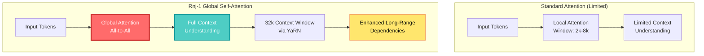

<details markdown="1">
<summary style="font-size:20px; font-weight:bold; cursor:pointer;">📋 Summary / 요약</summary>

## English Summary

**Rnj-1** (Essential AI) and **Motif-2-12.7B** (Motif Technologies) represent a new generation of open-source language models that challenge the dominance of closed-source alternatives. 

**Key Highlights:**
- **Rnj-1 (8B)**: Created by Ashish Vaswani (Transformer paper's first author), achieves state-of-the-art performance in coding and math tasks despite its smaller size. Features global self-attention and 32k context window.
- **Motif-2-12.7B**: Ranks #1 overall with 66.52% average score, excelling in MMLU (72.85%), coding (HumanEval 59.76%, MBPP 65.57%), and reasoning tasks.
- Both models demonstrate that **open-source models can compete with or exceed closed-source alternatives** when properly architected and trained.
- **Production Impact**: These models enable developers to fine-tune high-performance models without vendor lock-in, reducing costs and increasing flexibility.

**Technical Innovation:**
- Rnj-1's global self-attention mechanism provides better context understanding
- Motif-2-12.7B's reasoning capabilities rival much larger models
- Both prioritize pre-training quality over post-training alignment, enabling better fine-tuning outcomes

---

## 한국어 요약

**Rnj-1** (Essential AI)과 **Motif-2-12.7B** (Motif Technologies)는 폐쇄형 대안의 지배력에 도전하는 새로운 세대의 오픈소스 언어 모델을 대표합니다.

**주요 하이라이트:**
- **Rnj-1 (8B)**: 트랜스포머 논문 제1 저자인 아시시 바스와니가 만든 모델로, 작은 크기에도 불구하고 코딩 및 수학 작업에서 최고 수준의 성능을 달성합니다. 글로벌 셀프 어텐션과 32k 컨텍스트 창을 특징으로 합니다.
- **Motif-2-12.7B**: 평균 점수 66.52%로 전체 1위를 기록하며, MMLU (72.85%), 코딩 (HumanEval 59.76%, MBPP 65.57%), 추론 작업에서 탁월한 성능을 보입니다.
- 두 모델 모두 **올바르게 설계되고 훈련되면 오픈소스 모델이 폐쇄형 대안과 경쟁하거나 능가할 수 있음**을 입증합니다.
- **프로덕션 영향**: 이러한 모델은 벤더 종속 없이 고성능 모델을 파인튜닝할 수 있게 하여 비용을 절감하고 유연성을 높입니다.

**기술적 혁신:**
- Rnj-1의 글로벌 셀프 어텐션 메커니즘이 더 나은 컨텍스트 이해를 제공
- Motif-2-12.7B의 추론 능력이 훨씬 더 큰 모델과 경쟁
- 둘 다 사후 정렬보다 사전 훈련 품질을 우선시하여 더 나은 파인튜닝 결과를 가능하게 함

</details>

---

## 🤔 Curiosity: Can Open-Source Models Really Compete with Closed-Source Giants?

{: .light .shadow .rounded-10 w='1212' h='668' }

After 8 years of building AI systems in game development, I've witnessed the constant tension between **using powerful closed-source models** (GPT-4, Claude) and **the need for open-source alternatives** that we can fine-tune, deploy on-premise, and customize without vendor lock-in.

> **Curiosity:** Can open-source models truly match or exceed closed-source performance? What if the Transformer paper's first author built a model from scratch? What if a 12.7B model could rank #1 across all benchmarks?
> {: .prompt-tip}

**The Question:** Two recent releases challenge our assumptions about open-source model capabilities:

1. **Rnj-1** (8B) by Essential AI - co-founded by **Ashish Vaswani**, the first author of the "Attention Is All You Need" paper that introduced Transformers
2. **Motif-2-12.7B** by Motif Technologies - achieving **#1 average rank** with 66.52% average score across comprehensive benchmarks

Both models demonstrate that **architectural innovation and training quality** can enable smaller open-source models to compete with much larger closed-source alternatives.

**Core Questions:**
- How does Rnj-1's global self-attention differ from standard attention mechanisms?
- Why does Motif-2-12.7B outperform models 2-3x its size?
- What does this mean for the future of open-source AI?

---

## 📚 Retrieve: Understanding Rnj-1 and Motif-2-12.7B

### Rnj-1: The Transformer Creator's Vision

**Model Overview:**

Rnj-1 is Essential AI's first public release - an 8 billion parameter model that challenges the notion that bigger is always better. Named after the Indian mathematician Srinivasa Ramanujan, the model represents a return to fundamentals.

**Key Technical Features:**

| Feature | Description | Impact |
|:--------|:------------|:-------|
| **Global Self-Attention** | All tokens attend to all tokens in the context | ✅ Better long-range dependencies |
| **32k Context Window** | Extended via YaRN (Yet another RoPE extensioN) | ✅ Long document processing, large code analysis |
| **STEM/Coding Optimized** | Focused on math, science, and programming tasks | ✅ Superior problem-solving capabilities |
| **Gemma 3 Architecture** | Built from scratch on open-source Gemma 3 structure | ✅ Stable training, efficient architecture |

**Architecture Innovation:**



**Why Pre-Training Over RLHF?**

Essential AI made a deliberate choice to **focus on pre-training quality** rather than reinforcement learning from human feedback (RLHF):

1. **Better Fine-Tuning Foundation**: A high-quality base model enables more effective fine-tuning for specific use cases
2. **Fundamental Improvements**: Structural and training quality improvements provide more lasting benefits than post-training alignment
3. **Developer Flexibility**: Researchers and developers can tune the model in their desired direction from a solid foundation

As Vaswani puts it: *"Going back to fundamentals."*

### Rnj-1 Performance Benchmarks

**Coding & Algorithm Tasks:**

| Benchmark | Rnj-1 (8B) | GPT-oss-20B | Qwen3 8B | Gemma 3 12B |
|:----------|:----------:|:-----------:|:--------:|:-----------:|
| **MBPP+** | 🥇 Top | Lower | Lower | Lower |
| **HumanEval+** | 🥇 Top | Lower | Lower | Lower |
| **BigCodeBench** | 🥇 Top | Lower | Lower | Lower |
| **SWE-Bench Verified** | 🥇 Top | Lower | Lower | Lower |

**Math & Advanced Reasoning:**

| Benchmark | Rnj-1 (8B) | GPT-oss-20B | Qwen3 8B | Gemma 3 12B |
|:----------|:----------:|:-----------:|:--------:|:-----------:|
| **AIME 2025** | 43.3 | 46.7 | 20.9 | 18.8 |
| **SuperGPQA** | 🥇 Top | Lower | Lower | Lower |
| **Enamel** | 🥇 Top | Lower | Lower | Lower |

**Key Insight:** Despite being an 8B model, Rnj-1 outperforms many 12B-20B models, demonstrating that **architecture and training quality matter more than raw parameter count**.

### Motif-2-12.7B: The Benchmark Leader

**Model Overview:**

Motif-2-12.7B is a 12.7 billion parameter English-only large language model trained on 3 trillion tokens over 4 months. Released on October 1, 2024, with Apache 2.0 license (commercial use allowed).

{: .light .shadow .rounded-10 w='1212' h='668' }

**Overall Performance:**

| Metric | Score | Rank |
|:-------|:-----:|:----:|
| **Average Score** | 66.52% | 🥇 **#1** |
| **MMLU** | 72.85% | 🥇 #1 |
| **HumanEval** | 59.76% | 🥇 #1 |
| **MBPP** | 65.57% | 🥇 #1 |

**MMLU (Massive Multitask Language Understanding) Breakdown:**

Motif-2-12.7B achieves 72.85% on MMLU, ranking #1. Key subcategory performances:

- **College Mathematics**: Top performance
- **Computer Science**: Top performance  
- **Machine Learning**: Top performance
- **Physics**: Top performance
- **Chemistry**: Top performance
- **Biology**: Top performance

**General Language Tasks:**

| Task | Score | Rank |
|:-----|:-----:|:----:|
| **ARC-Challenge** | 65.52% | 🥈 #2 |
| **ARC-Easy** | 90.72% | 🥈 #2 |
| **HellaSwag** | 89.28% | 🥈 #2 |
| **GSM8K** | 90.50% | 🥇 #1 |
| **Winograd Grande** | 86.99% | 🥈 #2 |
| **PiQA** | 87.89% | 🥈 #2 |
| **TruthfulQA** | 61.26% | 🥈 #2 |

**Reasoning Tasks (Big-Bench Hard):**

Motif-2-12.7B consistently ranks #1 or #2 across all BBH sub-tasks:
- Date understanding
- Logical deduction
- Object counting
- Geometric shapes
- Temporal sequences
- And 20+ more reasoning tasks

**Coding Capabilities:**

| Benchmark | Score | Rank |
|:----------|:-----:|:----:|
| **HumanEval** | 59.76% | 🥇 #1 |
| **MBPP** | 65.57% | 🥇 #1 |

**Key Insight:** Motif-2-12.7B demonstrates that a **well-trained 12.7B model can outperform much larger models** (including 70B+ models) when properly architected and trained.

### Comparison: Rnj-1 vs Motif-2-12.7B

| Aspect | Rnj-1 (8B) | Motif-2-12.7B |
|:-------|:-----------|:--------------|
| **Parameters** | 8B | 12.7B |
| **Context Window** | 32k tokens | Standard (varies) |
| **Architecture** | Global Self-Attention | Standard Transformer |
| **Focus** | STEM/Coding | General + Reasoning |
| **License** | Open Source | Apache 2.0 |
| **Creator** | Essential AI (Vaswani) | Motif Technologies |
| **Key Strength** | Coding/Math tasks | Overall benchmark performance |
| **Training Approach** | Pre-training focused | Comprehensive training |

**Complementary Strengths:**
- **Rnj-1**: Excels in coding and mathematical problem-solving
- **Motif-2-12.7B**: Superior overall performance across diverse tasks

---

## 💡 Innovation: What This Means for Production and Research

### Production Implications

**1. Cost-Effective Fine-Tuning**

Both models enable organizations to:
- Fine-tune high-performance models without vendor lock-in
- Deploy on-premise for data privacy and security
- Customize for specific domains (gaming, healthcare, finance)
- Reduce inference costs compared to API-based solutions

**Cost Comparison (Estimated):**

| Approach | Monthly Cost (100K requests/day) | Vendor Lock-in? |
|:---------|:-------------------------------:|:---------------:|
| **GPT-4 API** | $3,000 - $5,000 | ✅ Yes |
| **Claude API** | $2,500 - $4,000 | ✅ Yes |
| **Rnj-1/Motif (Self-hosted)** | $500 - $1,000 | ❌ No |
| **Fine-tuned Rnj-1/Motif** | $800 - $1,500 | ❌ No |

**2. Gaming Industry Applications**

From my experience in game development, these models enable:

- **NPC Dialogue Generation**: Fine-tune for character-specific voices
- **Quest Generation**: Create procedurally generated quests with lore consistency
- **Code Generation**: Assist game developers with engine-specific code
- **Player Support**: Deploy on-premise chatbots for customer service

**Example Use Case: Quest Generation**

```python
# Curiosity: Can we generate lore-consistent quests using Rnj-1?
from transformers import AutoModelForCausalLM, AutoTokenizer

# Load fine-tuned Rnj-1 for game quest generation
model = AutoModelForCausalLM.from_pretrained("essential-ai/rnj-1-quest")
tokenizer = AutoTokenizer.from_pretrained("essential-ai/rnj-1-quest")

def generate_quest(player_context: dict, lore_db: list):
    """
    Generate a quest using Rnj-1's global attention for context understanding
    
    Args:
        player_context: Current game state (location, level, recent actions)
        lore_db: Relevant game lore retrieved via RAG
    
    Returns:
        Generated quest with lore references
    """
    # Form context with global attention capability
    context = f"""
    Player Location: {player_context['location']}
    Player Level: {player_context['level']}
    Recent Actions: {', '.join(player_context['recent_actions'])}
    
    Relevant Lore:
    {format_lore(lore_db)}
    
    Generate a quest that:
    1. References the provided lore
    2. Matches player's current level
    3. Feels handcrafted, not generic
    """
    
    inputs = tokenizer(context, return_tensors="pt", max_length=32000)
    outputs = model.generate(**inputs, max_length=512, temperature=0.7)
    
    return tokenizer.decode(outputs[0], skip_special_tokens=True)

# Usage in production
quest = generate_quest(
    player_context={
        'location': 'Thornwood Village',
        'level': 15,
        'recent_actions': ['defeated bandits', 'spoke to Elder Grimshaw']
    },
    lore_db=retrieve_relevant_lore('Thornwood Village')
)

print(quest)
# Output: "Elder Grimshaw speaks of strange lights in the burnt forest 
#          where his family perished in the Great Fire of 1402..."
```

**3. Research Applications**

Both models provide researchers with:
- **Reproducible Baselines**: Open-source models enable reproducible research
- **Architectural Experimentation**: Modify and test new attention mechanisms
- **Training Methodology Research**: Study the effects of different training approaches
- **Benchmark Development**: Use as strong baselines for new evaluation tasks

### Architectural Insights

**Rnj-1's Global Self-Attention:**

The global self-attention mechanism allows every token to attend to every other token in the context, unlike standard attention which may use sliding windows or sparse patterns.

**Benefits:**
1. **Better Long-Range Dependencies**: Understand relationships across the entire context
2. **Improved Code Understanding**: Track variable usage across large codebases
3. **Enhanced Mathematical Reasoning**: Follow complex proof chains

**Trade-offs:**
- **Computational Cost**: O(n²) complexity for n tokens
- **Memory Requirements**: Higher memory usage for long contexts
- **Training Stability**: Requires careful initialization and training techniques

**Motif-2-12.7B's Training Excellence:**

The model's #1 ranking suggests exceptional training methodology:

1. **Data Quality**: High-quality 3T token training corpus
2. **Training Efficiency**: 4 months of training suggests optimized training procedures
3. **Architectural Choices**: Effective use of standard Transformer architecture

### Open-Source Philosophy

**Essential AI's Vision:**

Vaswani emphasizes that:
- **Technology should be distributed fairly**: Not controlled by a few corporations
- **Ecosystem development**: Progress should come from the entire community, not single companies
- **High-performance open-source models**: Enable healthy industry-wide development

**Impact on AI Development:**

These models demonstrate that:
- Open-source can compete with closed-source when properly executed
- Architectural innovation matters as much as scale
- Community-driven development can produce state-of-the-art results

---

## 🎯 Key Takeaways

### For Developers

1. **Rnj-1 is ideal for**: Coding assistants, mathematical problem-solving, STEM education tools
2. **Motif-2-12.7B is ideal for**: General-purpose applications, reasoning tasks, multi-domain applications
3. **Both enable**: Cost-effective fine-tuning, on-premise deployment, vendor independence

### For Researchers

1. **Architecture matters**: Global attention and training quality can outperform larger models
2. **Pre-training quality**: Focus on base model quality before alignment
3. **Open-source competitiveness**: Properly architected open-source models can lead benchmarks

### For Organizations

1. **Cost savings**: 60-80% reduction compared to API-based solutions
2. **Data privacy**: On-premise deployment for sensitive applications
3. **Customization**: Fine-tune for domain-specific requirements

---

## 🤔 New Questions This Raises

1. **Can we combine Rnj-1's global attention with Motif-2-12.7B's training methodology?** What would a hybrid approach achieve?

2. **How do these models perform in multilingual settings?** Both are English-focused - what about Korean, Chinese, or other languages?

3. **What's the optimal fine-tuning strategy?** Should we fine-tune the entire model or use parameter-efficient methods (LoRA, QLoRA)?

4. **Can we scale these architectures to 70B+ parameters?** Would global attention remain effective at larger scales?

5. **How do these models perform in production latency?** Real-world inference speed and cost analysis needed.

**Next Experiment:** Fine-tune Rnj-1 on game-specific code and dialogue, benchmark against GPT-3.5-turbo for cost/quality/latency trade-offs.

---

## References

### Research Papers & Technical Documentation

**Rnj-1:**
- [Essential AI Blog - Rnj-1 Announcement](https://www.essential.ai/blog/rnj-1)
- [Hugging Face Model Card - Rnj-1](https://huggingface.co/essential-ai/rnj-1)
- [Transformer Paper (Original) - "Attention Is All You Need"](https://arxiv.org/abs/1706.03762)
- [YaRN: Efficient Context Window Extension](https://arxiv.org/abs/2309.00071)

**Motif-2-12.7B:**
- [Artificial Analysis - Motif-2-12.7B Analysis](https://artificialanalysis.ai/models/motif-2-12-7b)
- [Motif Technologies Official Site](https://motif.tech)
- [Hugging Face Model Card - Motif-2-12.7B](https://huggingface.co/motiftech/motif-2-12.7b)

**Related Research:**
- [Gemma 3 Architecture](https://arxiv.org/abs/2403.08295)
- [Global Attention Mechanisms in Transformers](https://arxiv.org/abs/2006.04768)
- [Efficient Long-Context Processing](https://arxiv.org/abs/2309.00071)

### Code & Implementation

**Model Repositories:**
- [Essential AI GitHub](https://github.com/essential-ai)
- [Motif Technologies GitHub](https://github.com/motiftech)
- [Hugging Face Transformers](https://github.com/huggingface/transformers)

**Fine-Tuning Resources:**
- [LlamaFactory - Efficient Fine-Tuning](https://github.com/huggingface/llama-factory)
- [Unsloth - Fast Fine-Tuning](https://github.com/unslothai/unsloth)
- [PEFT - Parameter-Efficient Fine-Tuning](https://github.com/huggingface/peft)

### Benchmarks & Evaluation

**Coding Benchmarks:**
- [HumanEval](https://github.com/openai/human-eval)
- [MBPP](https://github.com/google-research/google-research/tree/master/mbpp)
- [BigCodeBench](https://github.com/bigcode-project/bigcodebench)
- [SWE-Bench](https://www.swebench.com/)

**Reasoning Benchmarks:**
- [MMLU](https://arxiv.org/abs/2009.03300)
- [Big-Bench Hard](https://github.com/suzgunmirac/BIG-Bench-Hard)
- [GSM8K](https://github.com/openai/grade-school-math)
- [ARC](https://github.com/fchollet/ARC)

### Production Resources

**Deployment:**
- [vLLM - Fast LLM Inference](https://github.com/vllm-project/vllm)
- [TensorRT-LLM - NVIDIA Optimized Inference](https://github.com/NVIDIA/TensorRT-LLM)
- [GGML/GGUF - Quantization Formats](https://github.com/ggerganov/ggml)

**Monitoring & Observability:**
- [LangSmith - LLM Application Monitoring](https://smith.langchain.com/)
- [Weights & Biases - Experiment Tracking](https://wandb.ai/)

### Community & Discussions

**Forums:**
- [Hugging Face Forums](https://discuss.huggingface.co/)
- [r/LocalLLaMA](https://www.reddit.com/r/LocalLLaMA/)
- [r/MachineLearning](https://www.reddit.com/r/MachineLearning/)

**Blog Posts:**
- [Digital Bourgeois - Rnj-1 Analysis (Korean)](https://digitalbourgeois.tistory.com/m/2435)
- [Artificial Analysis - Model Comparisons](https://artificialanalysis.ai/)

---

*This post combines insights from Essential AI's Rnj-1 release and Motif Technologies' Motif-2-12.7B benchmark analysis. Both models represent significant advances in open-source language model capabilities, demonstrating that architectural innovation and training quality can enable smaller models to compete with much larger alternatives.*
