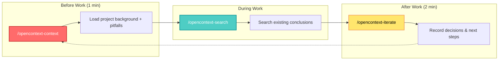

## 🤔 Curiosity: How Can We Give AI Agents Persistent Memory?

When building AI-powered applications, one recurring frustration stands out: **context gets lost**. Every new chat, every session restart, every repo switch — the AI forgets everything. You end up re-explaining your project background, repeating architectural decisions, and sometimes the assistant makes wrong assumptions because it lacks historical context.

> **Curiosity:** What if AI agents could remember your project decisions, technical constraints, and domain knowledge across sessions, repos, and tools? How would that transform the multi-agent development workflow?
> {: .prompt-tip}

**Core Question:** Can we create a unified context store that works across Cursor, Claude Code, Codex, and other AI coding assistants?

---

## 📚 Retrieve: Understanding OpenContext

### The Problem

| Before OpenContext | After OpenContext |
|:------------------|:------------------|
| 📂 Hard to share context across repos/sessions | ✅ Global context library works across all projects |
| 🤷 Your ideas can't be quickly perceived by Agent | ✅ Agent loads your background & decisions automatically |
| 🔒 Existing knowledge can't be operated by Coding Agent | ✅ Agent can directly read/write your knowledge base |

### What is OpenContext?

[OpenContext](https://github.com/0xranx/OpenContext) is a lightweight **personal context/knowledge store** for AI assistants and coding tools. It enables the paradigm:

> **"Load history first, then act; ship, then persist."**

The tool provides:

- **`oc` CLI** — manage a global `contexts/` library (folders/docs, manifests, search)
- **MCP Server** — so Cursor/Claude Code/Codex/Agents can call OpenContext as tools
- **Skills + Slash Commands** — user-level skills for Cursor/Claude Code/Codex
- **Desktop App** — manage/search/edit contexts with a native UI
- **Web UI** — browse/edit contexts locally (no install required)

### Multi-Agent Integration Architecture

```mermaid
graph TB
    subgraph "OpenContext Multi-Agent System"
        A[User Context] --> B[OpenContext Store<br/>~/.opencontext/contexts]

        B --> C[Cursor Agent<br/>Slash Commands]
        B --> D[Claude Code Agent<br/>Skills + Commands]
        B --> E[Codex Agent<br/>Skills]
        B --> F[Custom MCP Agents]

        C --> C1[/opencontext-context]
        C --> C2[/opencontext-search]
        C --> C3[/opencontext-create]
        C --> C4[/opencontext-iterate]

        D --> D1[Context Loading]
        D --> D2[Knowledge Search]
        D --> D3[Doc Creation]
        D --> D4[Insight Persistence]

        E --> E1[Skill-based Access]
        E --> E2[Tool Integration]

        F --> F1[MCP Protocol]
        F --> F2[Custom Tools]

        C1 --> G[Shared Knowledge Base]
        C2 --> G
        D1 --> G
        D2 --> G
        E1 --> G
        F1 --> G

        G --> H[Persistent AI Memory]
    end

    style B fill:#ff6b6b,stroke:#c92a2a,stroke-width:3px,color:#fff
    style G fill:#4ecdc4,stroke:#0a9396,stroke-width:2px,color:#fff
    style H fill:#ffe66d,stroke:#f4a261,stroke-width:2px,color:#000
```

---

## 💡 Innovation: Setting Up Multi-Agent Context Management

### Quick Start (30 Seconds)

```bash
# 1. Install CLI
npm install -g @aicontextlab/cli

# 2. Initialize (prompts for tool setup; defaults to all)
cd your-project
oc init

# 3. Use slash commands (Cursor + Claude Code)
# /opencontext-context — load background before working
# /opencontext-search — find relevant docs
# /opencontext-create — create a new doc
# /opencontext-iterate — persist what you learned
```

### Installed Components by `oc init`

| Component | Location | Purpose |
|:----------|:---------|:--------|
| **Cursor Commands** | `~/.cursor/commands` | Slash commands for context operations |
| **Claude Code Commands** | `~/.claude/commands` | Slash commands integration |
| **Cursor Skills** | `~/.cursor/skills/opencontext-*/SKILL.md` | User-level skill definitions |
| **Claude Code Skills** | `~/.claude/skills/opencontext-*/SKILL.md` | Skill-based context access |
| **Codex Skills** | `~/.codex/skills/opencontext-*/SKILL.md` | Codex skill integration |
| **MCP Config** | `~/.cursor/mcp.json`, `~/.claude/mcp.json` | MCP server configuration |

### CLI Commands Reference

| Command | What it does |
|:--------|:-------------|
| `oc init` | Initialize OpenContext + user-level tool integrations |
| `oc folder ls` | List folders |
| `oc folder create <path> -d "desc"` | Create a folder |
| `oc doc create <folder> <name>.md -d "desc"` | Create a document |
| `oc doc ls <folder>` | List documents |
| `oc context manifest <folder>` | Generate file list for AI to read |
| `oc search "query"` | Search documents |
| `oc mcp` | Start MCP server for MCP clients |
| `oc ui` | Start local Web UI |

---

## 🛠️ Integrating with Multi-Agent Workflows

### Workflow Pattern: Context-First Development



### Slash Commands Deep Dive

| Command | Description | Best For |
|:--------|:------------|:---------|
| `/opencontext-help` | Not sure which to use? Start here | New users |
| `/opencontext-context` | **(Safe default)** Load background before working | Starting any task |
| `/opencontext-search` | Discover existing docs (no auto index build) | Finding prior decisions |
| `/opencontext-create` | Draft a new doc/idea | Capturing new knowledge |
| `/opencontext-iterate` | Persist conclusions & citations | Ending sessions |

> **Pro tip:** Persist "acceptance criteria / common pitfalls / API contracts / dependency versions" as docs — highest ROI.
> {: .prompt-tip}

---

## 📊 Desktop App Features

For visual users who prefer a native UI:

### Key Capabilities

1. **Create folders and docs** — Organize by project or topic
2. **Search with `Cmd/Ctrl + K`** — Searches titles, descriptions, and content
3. **Semantic search** — Configure API Key in Settings → Embedding (auto-indexed)
4. **Cite to agents** — Copy citations directly to Cursor/Claude/Agent

### Citation Options

| Action | Steps | Effect |
|:-------|:------|:-------|
| Cite text snippet | Select text → Right-click → "Copy Citation" | Agent reads snippet + source |
| Cite document | Click citation icon next to doc title | Agent gets full doc + stable_id |
| Cite folder | Right-click folder → "Copy Folder Citation" | Agent batch-reads all docs inside |

---

## 🔧 Search Configuration

### Search Modes

| Mode | Flag | Requirements |
|:-----|:-----|:-------------|
| **Keyword** | `--mode keyword` | No embeddings needed |
| **Vector** | `--mode vector` | Requires embeddings + index |
| **Hybrid** | `--mode hybrid` | Requires embeddings + index (default) |

### Enabling Semantic Search (CLI)

```bash
# 1. Set API Key
oc config set EMBEDDING_API_KEY "<your_key>"

# 2. (Optional) Set base URL
oc config set EMBEDDING_API_BASE "https://api.openai.com/v1"

# 3. (Optional) Set Model
oc config set EMBEDDING_MODEL "text-embedding-3-small"

# 4. Build Index
oc index build
```

> **Warning:** The `oc index build` command may use paid APIs. AI assistants are NOT allowed to auto-run it by default.
> {: .prompt-warning}

---

## 🤖 MCP Server Integration

OpenContext runs as a standard MCP (Model Context Protocol) server using stdio:

```bash
# Start manually
oc mcp

# User-level config locations:
# - Cursor: ~/.cursor/mcp.json
# - Claude Code: ~/.claude/mcp.json
# - Codex: ~/.codex/mcp.json
```

### Example mcp.json Configuration

```json
{
  "mcpServers": {
    "opencontext": {
      "command": "npx",
      "args": ["@aicontextlab/cli", "mcp"]
    }
  }
}
```

---

## 📈 Performance Comparison: With vs Without Context Store

| Metric | Without OpenContext | With OpenContext | Improvement |
|:-------|:------------------:|:----------------:|:-----------:|
| **Context Re-explanation** | Every session | Once | ⬇️ 95% |
| **Decision Consistency** | Variable | Tracked | ⬆️ High |
| **Cross-repo Knowledge** | Manual | Automatic | ⬆️ Seamless |
| **Onboarding Time** | Hours per project | Minutes | ⬇️ 80% |
| **Agent Accuracy** | Context-limited | Context-enriched | ⬆️ Significant |

---

## 🎯 Best Practices for Multi-Agent Context

### What to Persist

| Document Type | Example Content | ROI |
|:-------------|:----------------|:---:|
| **Acceptance Criteria** | Feature requirements, success metrics | ⭐⭐⭐ |
| **Common Pitfalls** | Known bugs, edge cases, gotchas | ⭐⭐⭐ |
| **API Contracts** | Endpoint specs, data formats | ⭐⭐ |
| **Dependency Versions** | Lock file summaries, upgrade notes | ⭐⭐ |
| **Architecture Decisions** | ADRs, design rationale | ⭐⭐ |
| **Domain Knowledge** | Business logic, terminology | ⭐⭐⭐ |

### Folder Organization Example

```
~/.opencontext/contexts/
├── personal/
│   ├── preferences.md
│   └── coding-style.md
├── project-frontend/
│   ├── architecture.md
│   ├── component-patterns.md
│   └── known-issues.md
├── project-backend/
│   ├── api-design.md
│   ├── database-schema.md
│   └── deployment-notes.md
└── shared/
    ├── team-conventions.md
    └── dependency-policies.md
```

---

## 🚀 Environment Configuration

### Default Paths

| Purpose | Default Location |
|:--------|:-----------------|
| **Contexts** | `~/.opencontext/contexts` |
| **Database** | `~/.opencontext/opencontext.db` |

### Override with Environment Variables

```bash
export OPENCONTEXT_CONTEXTS_ROOT="/path/to/contexts"
export OPENCONTEXT_DB_PATH="/path/to/opencontext.db"
```

---

## 🤔 New Questions This Raises

1. **Automatic Context Extraction:** Can agents automatically identify and persist important decisions from conversations?
2. **Context Versioning:** How do we handle context evolution and maintain historical snapshots?
3. **Team Collaboration:** Can multiple developers share and sync context across a team?
4. **Domain-Specific Templates:** What context structures work best for different project types (web app, mobile, ML, etc.)?
5. **Context Quality:** How do we measure and improve the quality of persisted context?

**Next Experiment:** Building automated context extraction from conversation history using multi-agent orchestration.

---

## References

**Official Resources:**

- [OpenContext GitHub Repository](https://github.com/0xranx/OpenContext)
- [OpenContext Usage Guide](https://0xranx.github.io/OpenContext/en/usage/)
- [OpenContext Website](https://0xranx.github.io/OpenContext/en/)
- [NPM Package: @aicontextlab/cli](https://www.npmjs.com/package/@aicontextlab/cli)

**Related Tools & Frameworks:**

- [Model Context Protocol (MCP)](https://modelcontextprotocol.io/)
- [Cursor IDE](https://cursor.sh/)
- [Claude Code](https://claude.ai/code)
- [OpenAI Codex](https://openai.com/codex)

**Multi-Agent Systems:**

- [LangGraph - Multi-Agent Workflows](https://langchain-ai.github.io/langgraph/)
- [AutoGen - Multi-Agent Framework](https://github.com/microsoft/autogen)
- [CrewAI - Multi-Agent Framework](https://github.com/joaomdmoura/crewAI)

**Context Management Research:**

- [RAG: Retrieval-Augmented Generation](https://arxiv.org/abs/2005.11401)
- [Long-term Memory for LLMs](https://arxiv.org/abs/2306.07929)
- [Building Effective AI Agents (Anthropic)](https://www.anthropic.com/research/building-effective-agents)

**Production Resources:**

- [LLM Engineering Best Practices](https://huyenchip.com/2023/04/11/llm-engineering.html)
- [Prompt Engineering Guide](https://www.promptingguide.ai/)
- [AI Agent Design Patterns](https://www.deeplearning.ai/short-courses/ai-agents-in-langgraph/)
