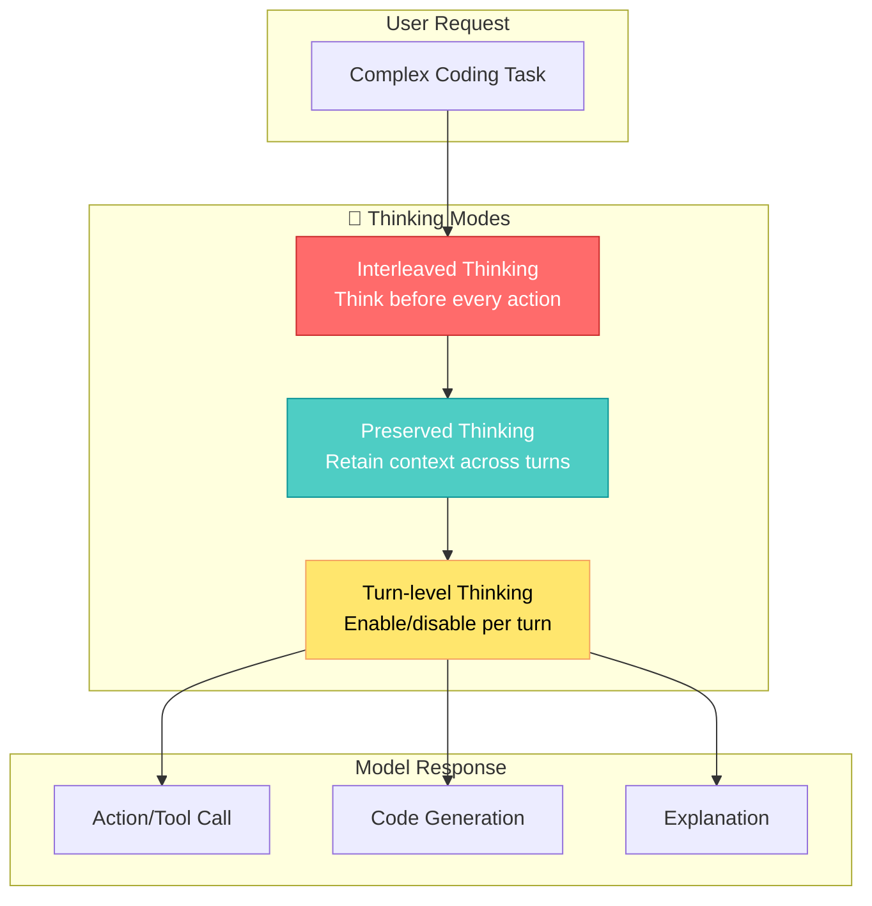
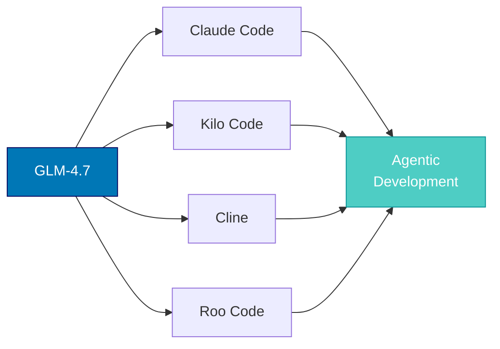

## 🤔 Curiosity: What Makes a Great Coding Agent?

Building AI-powered games at NC SOFT and COM2US, I've always wondered: **Can an AI model truly understand the context of a complex codebase and act autonomously to fix bugs, implement features, or refactor code?**

The answer is increasingly "yes" - and GLM-4.7 from Z.ai is the latest contender pushing the boundaries of what's possible with agentic coding.

> **The question:** How does a 358B parameter MoE model achieve state-of-the-art performance on coding benchmarks while maintaining practical inference speeds?
{: .prompt-tip}

---

## 📚 Retrieve: Understanding GLM-4.7

### What is GLM-4.7?

**GLM-4.7** is Z.ai's latest large language model, designed specifically for agentic coding tasks. It's a 358B parameter Mixture-of-Experts (MoE) model that supports:

- **Text Generation** with multilingual support (English, Chinese)
- **Tool calling** via OpenAI-compatible APIs
- **Interleaved thinking** for complex reasoning

{: .light .w-100 .shadow .rounded-10 }
_GLM-4.7 benchmark comparisons across reasoning, coding, and agent tasks_

### Key Features

| Feature | Description | Impact |
|:--------|:------------|:-------|
| **Core Coding** | Multilingual agentic coding and terminal tasks | 73.8% on SWE-bench (+5.8% vs GLM-4.6) |
| **Vibe Coding** | Improved UI quality for web/slide generation | Cleaner, modern designs |
| **Tool Using** | Enhanced function calling and web browsing | 87.4% on τ²-Bench |
| **Complex Reasoning** | Mathematical and logical reasoning | 42.8% on HLE (+12.4%) |

### Benchmark Results

GLM-4.7 competes head-to-head with the latest models from OpenAI, Anthropic, Google, and others:

| Benchmark | GLM-4.7 | GLM-4.6 | GPT-5-High | GPT-5.1-High | Claude Sonnet 4.5 | Gemini 3.0 Pro |
|:----------|:-------:|:-------:|:----------:|:------------:|:-----------------:|:--------------:|
| **MMLU-Pro** | 84.3 | 83.2 | 87.5 | 87.0 | 88.2 | **90.1** |
| **GPQA-Diamond** | 85.7 | 81.0 | 85.7 | 88.1 | 83.4 | **91.9** |
| **HLE (w/ Tools)** | 42.8 | 30.4 | 35.2 | 42.7 | 32.0 | **45.8** |
| **AIME 2025** | **95.7** | 93.9 | 94.6 | 94.0 | 87.0 | 95.0 |
| **HMMT Feb. 2025** | 97.1 | 89.2 | 88.3 | 96.3 | 79.2 | **97.5** |
| **LiveCodeBench-v6** | 84.9 | 82.8 | 87.0 | 87.0 | 64.0 | **90.7** |
| **SWE-bench Verified** | 73.8 | 68.0 | 74.9 | 76.3 | **77.2** | 76.2 |
| **SWE-bench Multilingual** | 66.7 | 53.8 | 55.3 | - | 68.0 | - |
| **Terminal Bench 2.0** | 41.0 | 24.5 | 35.2 | 47.6 | 42.8 | **54.2** |
| **τ²-Bench** | 87.4 | 75.2 | 82.4 | 82.7 | 87.2 | **90.7** |

> **Key Insight:** GLM-4.7 excels in mathematical reasoning (AIME, HMMT) and agentic tasks (SWE-bench Multilingual), while Gemini 3.0 Pro leads in general knowledge benchmarks.
{: .prompt-info}

### Interleaved Thinking Architecture

What sets GLM-4.7 apart is its **thinking architecture**:

{: .light .w-100 .shadow .rounded-10 }
_Interleaved, Preserved, and Turn-level Thinking modes_



**Three Thinking Modes:**

1. **Interleaved Thinking**: The model thinks before every response and tool call, improving instruction following
2. **Preserved Thinking**: Automatically retains thinking blocks across multi-turn conversations - critical for long-horizon tasks
3. **Turn-level Thinking**: Per-turn control - disable for lightweight requests, enable for complex tasks

---

## 💡 Innovation: Using GLM-4.7 in Production

### Getting Started with vLLM

```bash
# Install vLLM nightly
pip install -U vllm --pre --index-url https://pypi.org/simple \
    --extra-index-url https://wheels.vllm.ai/nightly

# Serve the model
vllm serve zai-org/GLM-4.7-FP8 \
    --tensor-parallel-size 4 \
    --speculative-config.method mtp \
    --speculative-config.num_speculative_tokens 1 \
    --tool-call-parser glm47 \
    --reasoning-parser glm45 \
    --enable-auto-tool-choice \
    --served-model-name glm-4.7-fp8
```

### Using with Transformers

```python
import torch
from transformers import AutoModelForCausalLM, AutoTokenizer

MODEL_PATH = "zai-org/GLM-4.7"

# Initialize tokenizer and model
tokenizer = AutoTokenizer.from_pretrained(MODEL_PATH)
model = AutoModelForCausalLM.from_pretrained(
    MODEL_PATH,
    torch_dtype=torch.bfloat16,
    device_map="auto",
)

# Create messages with thinking enabled
messages = [{"role": "user", "content": "Implement a binary search tree in Python"}]

# Tokenize with chat template
inputs = tokenizer.apply_chat_template(
    messages,
    tokenize=True,
    add_generation_prompt=True,
    return_dict=True,
    return_tensors="pt",
).to(model.device)

# Generate response
generated_ids = model.generate(
    **inputs,
    max_new_tokens=8192,
    do_sample=True,
    temperature=1.0,
    top_p=0.95,
)

output = tokenizer.decode(generated_ids[0][inputs.input_ids.shape[1]:])
print(output)
```

### Preserved Thinking for Agent Tasks

For agentic tasks, enable **Preserved Thinking** mode:

```python
# SGLang configuration for preserved thinking
chat_template_kwargs = {
    "enable_thinking": True,
    "clear_thinking": False  # Keep thinking across turns
}
```

### Integration with Coding Agents

GLM-4.7 works excellently with popular coding agent frameworks:



### Evaluation Parameters

**Default Settings (Most Tasks):**
- `temperature`: 1.0
- `top-p`: 0.95
- `max_new_tokens`: 131072

**Coding Tasks (SWE-bench, Terminal Bench):**
- `temperature`: 0.7
- `top-p`: 1.0
- `max_new_tokens`: 16384

**τ²-Bench (Agent Tasks):**
- `temperature`: 0
- `max_new_tokens`: 16384

---

## 🎯 Key Takeaways

| Insight | Implication | Production Consideration |
|:--------|:------------|:-------------------------|
| **MoE Architecture** | 358B params with efficient routing | Requires multi-GPU setup (TP=4 minimum) |
| **Preserved Thinking** | Better context retention for agents | Enable for long-horizon tasks |
| **Multilingual Coding** | 66.7% on SWE-bench Multilingual | Great for polyglot codebases |
| **MIT License** | Fully open for commercial use | No licensing concerns |

### What I'd Try First

1. **Deploy with vLLM**: Use the FP8 quantized version for faster inference
2. **Enable Preserved Thinking**: Essential for multi-turn agentic tasks
3. **Integrate with existing agent frameworks**: Claude Code, Cline work well
4. **Benchmark on your codebase**: Real-world performance may vary

### When to Use GLM-4.7

**Good fit:**
- Complex debugging across multiple files
- Code refactoring with context awareness
- Multilingual codebase maintenance
- Long-horizon agentic development tasks

**Consider alternatives:**
- Simple code completion (smaller models are faster)
- Real-time IDE suggestions (latency-sensitive)
- Tasks without tool use (simpler models suffice)

---

## 🤔 New Questions This Raises

1. **Fine-tuning potential**: Can we adapt GLM-4.7 for game-specific coding patterns?
2. **Agent orchestration**: How does it compare to multi-agent setups like Claude Code + Sonnet?
3. **Context window utilization**: With 131K tokens, how efficiently does it use long contexts?
4. **Production costs**: What's the inference cost vs. API-based alternatives?

**Next experiment:** Benchmark GLM-4.7 against Claude Opus 4.5 on game development tasks - shader code generation, gameplay balancing scripts, and procedural content generation.

---

## References

**Official Resources:**
- [GLM-4.7 on Hugging Face](https://huggingface.co/zai-org/GLM-4.7)
- [Z.ai Technical Blog](https://z.ai/blog/glm-4.7)
- [GLM-4.7 API Platform](https://docs.z.ai/guides/llm/glm-4.7)
- [GLM-4.7 Chat Interface](https://chat.z.ai)
- [Z.ai Discord Community](https://discord.gg/QR7SARHRxK)

**Research Papers:**
- [GLM-4.5: Agentic, Reasoning, and Coding (ARC) Foundation Models (arXiv:2508.06471)](https://arxiv.org/abs/2508.06471)
- [Thinking Mode Documentation](https://docs.z.ai/guides/capabilities/thinking-mode)
- [Claude Opus 4.5 System Card (τ²-Bench fixes)](https://assets.anthropic.com/m/64823ba7485345a7/Claude-Opus-4-5-System-Card.pdf)

**Code & Implementation:**
- [Official GitHub Repository](https://github.com/zai-org/GLM-4.5)
- [vLLM Nightly Docker](https://hub.docker.com/r/vllm/vllm-openai)
- [SGLang Docker Image](https://hub.docker.com/r/lmsysorg/sglang)

**Model Variants:**
- [GLM-4.7-FP8 (Quantized)](https://huggingface.co/zai-org/GLM-4.7-FP8)
- [GLM-4.7 Collection](https://huggingface.co/collections/zai-org/glm-47)

**Inference Providers:**
- [Novita AI](https://novita.ai/)
- [Cerebras](https://cerebras.ai/)
- [Z.ai API](https://z.ai/)

**Related Benchmarks:**
- [SWE-bench](https://www.swebench.com/)
- [GPQA Dataset](https://huggingface.co/datasets/Idavidrein/gpqa)
- [MMLU-Pro Dataset](https://huggingface.co/datasets/TIGER-Lab/MMLU-Pro)
- [HLE Dataset](https://huggingface.co/datasets/cais/hle)

---

*GLM-4.7 represents a significant step forward in open-source coding agents. With its MIT license and strong benchmark performance, it's a compelling option for production AI-assisted development workflows.*
