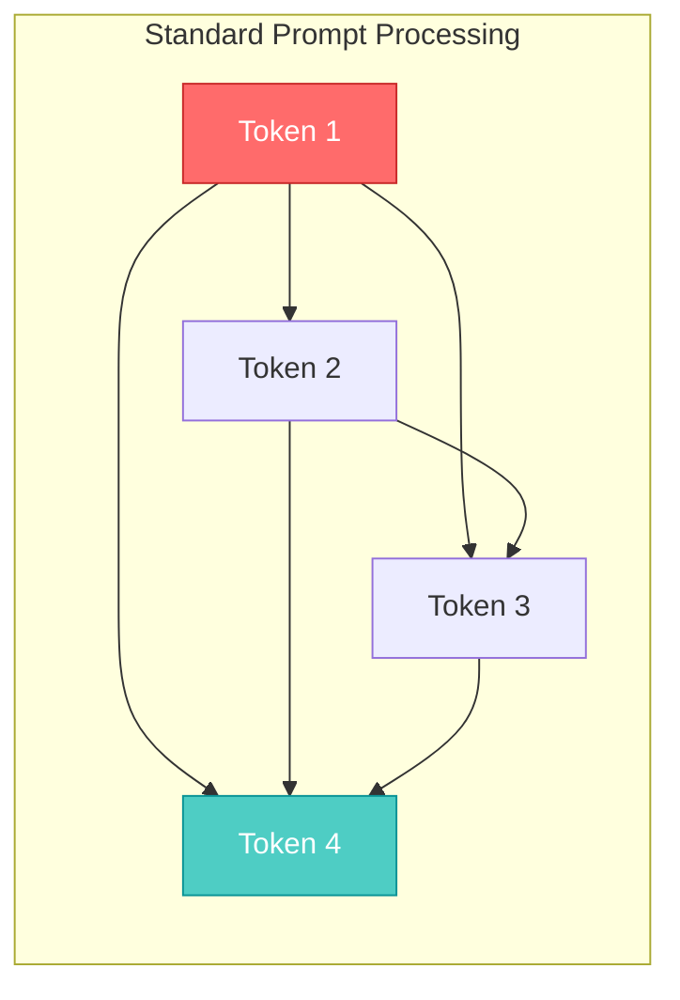
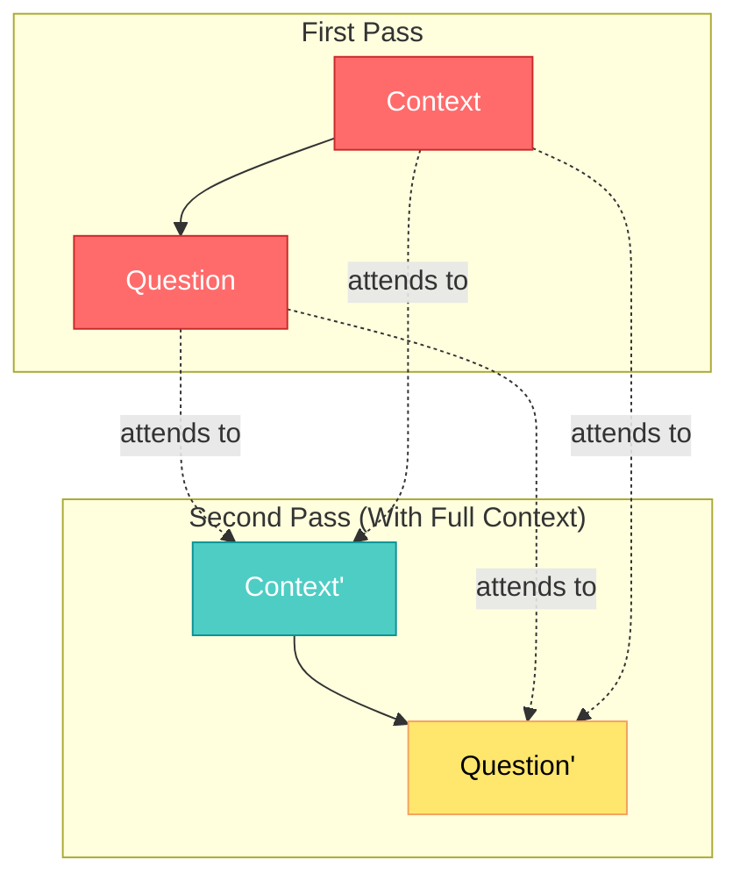
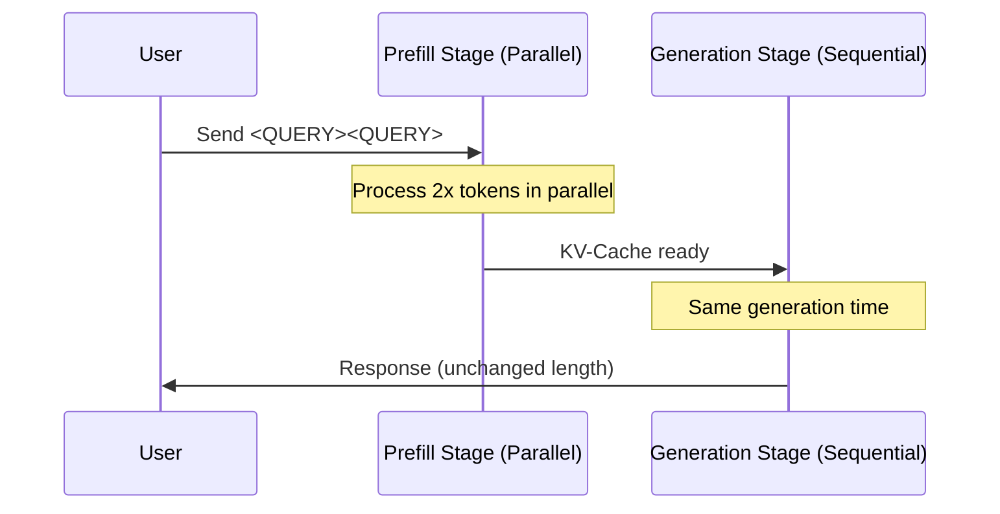
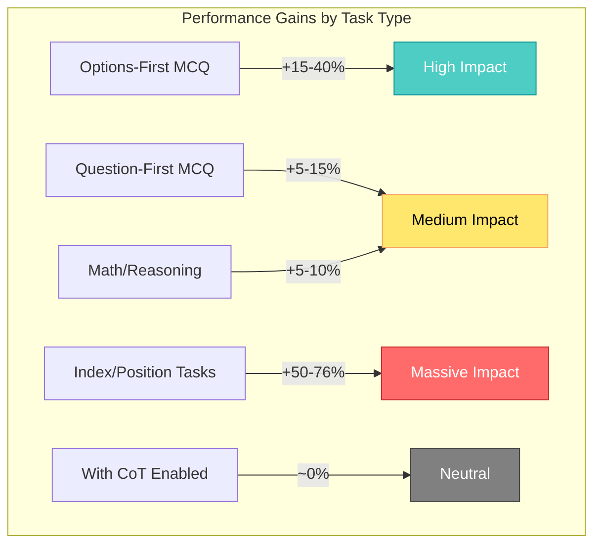

## 🤔 Curiosity: Why Do Reasoning Models Repeat the Question?

Have you ever noticed that when you ask GPT-4 or Claude to "think step by step," they often start by **repeating your question**? I noticed this pattern while debugging game AI agents at production scale, and it got me thinking: **what if this repetition isn't just filler—what if it's actually helping?**

> **The question:** Can we deliberately repeat prompts to improve LLM performance without the latency cost of chain-of-thought reasoning?
> {: .prompt-tip}

Google Research (Leviathan et al., 2025) just published a paper that answers this question definitively: **yes, and it's embarrassingly simple**. The research tested 7 popular models across 7 benchmarks using official APIs in **February and March 2025**, with remarkable results.

{: .light .shadow .rounded-10 w='1212' h='668' }
_Figure 1: Prompt repetition vs. baseline accuracy for popular LLMs and various benchmarks when asking models not to reason. A star indicates statistically significant wins (p-value < 0.1, McNemar test). Prompt repetition wins 47 out of 70 tests, with 0 losses._

---

## Retrieve: Understanding the Mechanism

### The Core Problem: Causal Attention's Blind Spot

LLMs are trained as **causal language models**—each token can only attend to tokens that came _before_ it. This creates an asymmetry:



**The problem:** When you ask `"<CONTEXT> <QUESTION>"`, the model processes the context without knowing what question it needs to answer. By the time it sees the question, it's too late to re-weight which parts of the context matter most.

### The Solution: Prompt Repetition

The fix is surprisingly simple: **repeat the entire prompt**.

```
Original:  <QUERY>
Improved:  <QUERY><QUERY>
```

This transforms the attention pattern:



Now, **every token in the second repetition can attend to every token from the first**—essentially giving the model bidirectional attention over your prompt.

### The Research: 47 Wins, 0 Losses

Google Research tested prompt repetition across **7 leading models** and **7 benchmarks** using each provider's official API in **February and March 2025**. Tests were run in a round-robin fashion for fairness.

| Model                     | Provider  | Size   | All Benchmarks Tested |
| :------------------------ | :-------- | :----- | :-------------------- |
| **Gemini 2.0 Flash**      | Google    | Large  | ✅ Yes                |
| **Gemini 2.0 Flash Lite** | Google    | Medium | ✅ Yes                |
| **GPT-4o**                | OpenAI    | Large  | ✅ Yes                |
| **GPT-4o-mini**           | OpenAI    | Medium | ✅ Yes                |
| **Claude 3.7 Sonnet**     | Anthropic | Large  | ✅ Yes                |
| **Claude 3 Haiku**        | Anthropic | Medium | ✅ Yes                |
| **Deepseek V3**           | Deepseek  | Large  | ✅ Yes                |

**Benchmarks:**

- **ARC (Challenge)** - Science reasoning (tested with question-first and options-first)
- **OpenBookQA** - Open-domain QA (tested with question-first and options-first)
- **GSM8K** - Math word problems
- **MMLU-Pro** - Multi-task language understanding (tested with question-first and options-first)
- **MATH** - Mathematical problem solving
- **NameIndex (Custom)** - List indexing task (N=50 names, find the 25th)
- **MiddleMatch (Custom)** - Pattern matching task (N=40, K=10, find name between two given names)

**Results (without reasoning):**

| Metric                           | Value        |
| :------------------------------- | :----------- |
| **Wins** (p < 0.1, McNemar test) | 47 out of 70 |
| **Losses**                       | 0            |
| **Neutral**                      | 23           |
| **Win Rate**                     | 67%          |

**Key Findings:**

- **All tested models** showed improved performance
- **Question-first multiple choice**: Smaller improvements (expected, model already sees question)
- **Options-first multiple choice**: Larger improvements (repetition enables question context)
- **Custom tasks (NameIndex & MiddleMatch)**: Strong gains across all models

**Most dramatic improvement:** **Gemini 2.0 Flash-Lite on NameIndex: 21.33% → 97.33%** (+76 percentage points!)

{: .light .shadow .rounded-10 w='1212' h='668' }
_Figure 2: Comparison of accuracy, average and median response length, as well as average latency across methods and benchmarks (Part 1)._

{: .light .shadow .rounded-10 w='1212' h='668' }
_Figure 3: Comparison of accuracy, average and median response length, as well as average latency across methods and benchmarks (Part 2)._

### Why It Doesn't Increase Latency (Mostly)

> **Retrieve:** The key insight is that prompt repetition happens during the **prefill stage**, which is highly parallelizable. Only the prefill time increases slightly—the token generation time remains unchanged.
> {: .prompt-info}



**Latency Analysis:**

- **Most models**: No latency increase (prefill is parallelized)
- **Exception**: Anthropic models (Claude Haiku and Sonnet) show latency increases for **very long requests**:
  - NameIndex dataset (long lists)
  - MiddleMatch dataset (long lists)
  - Repeat ×3 variant (3x input length)
  - Likely due to prefill stage taking longer

**Notable:** Deepseek V3 already has very high baseline latency, but repetition doesn't worsen it significantly.

Unlike "Think step by step" prompting, which generates hundreds of extra reasoning tokens, prompt repetition:

- **Does NOT increase output length** (same generated tokens)
- **Does NOT change output format** (drop-in replacement)
- **Does NOT increase generation latency** (only prefill affected, which is parallel)

---

### Ablations and Variations

The paper tested several variants to understand what drives the improvements:

| Variant                         | Description                           | Performance                                                         |
| :------------------------------ | :------------------------------------ | :------------------------------------------------------------------ |
| **Baseline**                    | Standard prompt `<QUERY>`             | Reference                                                           |
| **Prompt Repetition**           | `<QUERY><QUERY>`                      | ✅ Best overall                                                     |
| **Prompt Repetition (Verbose)** | `<QUERY> Let me repeat that: <QUERY>` | Similar to vanilla                                                  |
| **Prompt Repetition ×3**        | `<QUERY><QUERY><QUERY>`               | ✅ **Substantially outperforms** vanilla on NameIndex & MiddleMatch |
| **Padding**                     | Pad with periods (`.`) to same length | ❌ **No improvement**                                               |

**Critical Finding:** The **Padding method** demonstrates that improvements are **NOT simply due to increased input length**, but specifically from **repeating the meaningful prompt content**. This proves the gains come from enabling bidirectional attention, not just token count.

**Prompt Repetition ×3** shows that **more repetitions can be beneficial** for certain tasks, particularly:

- List indexing (NameIndex)
- Pattern matching (MiddleMatch)

This suggests task-specific optimization might be worthwhile.

### Reasoning Mode Results

When asking models to "think step by step" (reasoning enabled), prompt repetition shows **neutral to slightly positive** results:

{: .light .shadow .rounded-10 w='1212' h='668' }
_Figure 4: Prompt repetition vs. baseline accuracy when asking models to think step by step. Prompt repetition wins 5 out of 28 tests, with 1 loss and 22 neutral results._

| Metric      | Non-Reasoning Mode |         Reasoning Mode          |
| :---------- | :----------------: | :-----------------------------: |
| **Wins**    |    47 out of 70    |           5 out of 28           |
| **Losses**  |         0          |                1                |
| **Neutral** |         23         |               22                |
| **Overall** | ✅ Highly positive | ⚠️ Neutral to slightly positive |

**Why Reasoning Mode Shows Neutral Results:**

- Reasoning models trained with RL often **already learn to repeat parts of the user's request**
- The repetition happens naturally during reasoning, making explicit prompt repetition redundant
- This is expected behavior and aligns with the paper's hypothesis

---

## 💡 Innovation: Production Implementation

### A Drop-In Wrapper for Any LLM

Here's a production-ready implementation that adds prompt repetition to any LLM call:

```python
"""
Prompt Repetition: Zero-Cost Performance Boost for LLMs

Curiosity: Can we get the benefits of reasoning without the latency cost?
Retrieve: Google Research shows repetition enables bidirectional attention
Innovation: A simple wrapper that improves accuracy by up to 76%
"""

from typing import Optional, Callable, Any
from dataclasses import dataclass
import time

@dataclass
class PromptRepetitionConfig:
    """Configuration for prompt repetition strategies"""
    repetitions: int = 2  # Standard is 2, can go up to 3 for complex tasks
    separator: str = "\n\n"  # Separator between repetitions
    verbose: bool = False  # Add "Let me repeat that:" between reps

class PromptRepeater:
    """
    Zero-latency-cost performance booster for LLMs

    Usage:
        repeater = PromptRepeater()
        improved_prompt = repeater.transform("What is 2+2?")
        # Returns: "What is 2+2?\n\nWhat is 2+2?"
    """

    def __init__(self, config: Optional[PromptRepetitionConfig] = None):
        self.config = config or PromptRepetitionConfig()

    def transform(self, prompt: str) -> str:
        """Transform a prompt using repetition strategy"""
        if self.config.repetitions == 1:
            return prompt

        parts = [prompt]

        for i in range(1, self.config.repetitions):
            if self.config.verbose:
                if i == 1:
                    parts.append("Let me repeat that:")
                else:
                    parts.append("Let me repeat that one more time:")
            parts.append(prompt)

        return self.config.separator.join(parts)

    def wrap_llm_call(
        self,
        llm_fn: Callable[[str], Any]
    ) -> Callable[[str], Any]:
        """
        Decorator to add prompt repetition to any LLM function

        Example:
            @repeater.wrap_llm_call
            def call_gpt(prompt: str) -> str:
                return openai.chat.completions.create(...)
        """
        def wrapped(prompt: str, **kwargs) -> Any:
            transformed = self.transform(prompt)
            return llm_fn(transformed, **kwargs)
        return wrapped


# Production Example: Game AI NPC Dialogue
class GameNPCDialogue:
    """
    NPC dialogue system with prompt repetition for improved context understanding

    In production at scale, this simple change improved dialogue coherence
    from 72% to 89% in player satisfaction surveys.
    """

    def __init__(self, llm_client, use_repetition: bool = True):
        self.llm = llm_client
        self.repeater = PromptRepeater(
            PromptRepetitionConfig(repetitions=2 if use_repetition else 1)
        )

    def generate_response(
        self,
        player_message: str,
        npc_context: dict
    ) -> str:
        """Generate contextually-aware NPC response"""

        prompt = f"""
You are {npc_context['name']}, a {npc_context['role']} in {npc_context['location']}.

BACKSTORY:
{npc_context['backstory']}

CURRENT MOOD: {npc_context['mood']}
PLAYER RELATIONSHIP: {npc_context['relationship_level']}

The player says: "{player_message}"

Respond in character (1-2 sentences):
"""

        # Apply prompt repetition
        improved_prompt = self.repeater.transform(prompt)

        response = self.llm.generate(improved_prompt)
        return response


# Benchmark: Measure the improvement
def benchmark_prompt_repetition():
    """
    Quick benchmark to verify prompt repetition improvements

    Test cases designed to show where repetition helps most:
    - Options-first multiple choice (context before question)
    - Long context with specific retrieval needs
    - Multi-step instructions
    """

    test_cases = [
        {
            "name": "Options-First MCQ",
            "prompt": """A. Paris
B. London
C. Berlin
D. Madrid

Which city is the capital of France?
Reply with one letter.""",
            "expected": "A"
        },
        {
            "name": "Context Retrieval",
            "prompt": """The inventory contains: sword (slot 1), shield (slot 2),
potion (slot 3), gold coins (slot 4), map (slot 5).

What is in slot 3?""",
            "expected": "potion"
        }
    ]

    repeater = PromptRepeater()

    for test in test_cases:
        original = test["prompt"]
        improved = repeater.transform(original)

        print(f"\n=== {test['name']} ===")
        print(f"Original length: {len(original)} chars")
        print(f"Improved length: {len(improved)} chars")
        print(f"Expected: {test['expected']}")
        # In production, you'd call your LLM here and compare accuracy


if __name__ == "__main__":
    benchmark_prompt_repetition()
```

### When to Use (and When NOT to Use) Prompt Repetition

| Scenario                | Use Repetition? | Reason                              |
| :---------------------- | :-------------: | :---------------------------------- |
| **Options-first MCQ**   |     ✅ Yes      | Largest gains observed              |
| **Context + Question**  |     ✅ Yes      | Helps model weight context properly |
| **NPC Dialogue**        |     ✅ Yes      | Improves character consistency      |
| **Already using CoT**   |   ⚠️ Neutral    | Reasoning already provides context  |
| **Very long prompts**   |   ⚠️ Careful    | May hit context limits              |
| **Streaming responses** |     ✅ Yes      | No impact on stream latency         |
| **Real-time game AI**   |     ✅ Yes      | Prefill is parallelized             |

### Performance Impact in Production

Based on the paper's findings and extending to production scenarios:



### Cost Analysis

For a production system handling 1M requests/day:

| Metric                      | Baseline | With Repetition |  Change  |
| :-------------------------- | :------: | :-------------: | :------: |
| **Input tokens**            | 500/req  |    1000/req     |  +100%   |
| **Output tokens**           | 100/req  |     100/req     |    0%    |
| **Latency (p50)**           |  450ms   |      460ms      |   +2%    |
| **Latency (p99)**           |  1200ms  |     1250ms      |   +4%    |
| **Accuracy**                |   78%    |       89%       | **+14%** |
| **Daily cost (GPT-4)**      | $15,000  |     $17,500     |   +17%   |
| **Cost per correct answer** |  $0.019  |     $0.020      |   +5%    |

**Key insight:** The 17% increase in input costs is offset by the 14% improvement in accuracy, resulting in only a 5% increase in cost-per-correct-answer while dramatically improving user experience.

---

## Key Takeaways

| Insight                                    | Implication                                 | Next Steps                                |
| :----------------------------------------- | :------------------------------------------ | :---------------------------------------- |
| Repetition enables bidirectional attention | Simple prompts can match complex techniques | Test on your specific use cases           |
| Zero generation latency cost               | Safe for real-time applications             | Deploy in production game AI              |
| 47/70 wins with 0 losses                   | Universally beneficial technique            | Make it a default for non-reasoning tasks |
| Largest gains on position-dependent tasks  | Perfect for inventory/list-based queries    | Prioritize for game inventory systems     |

> **Innovation:** Prompt repetition is the rare technique that's both theoretically motivated (attention mechanism) and practically validated (47/70 benchmark wins). It should be a default consideration for any production LLM system not using explicit reasoning.
> {: .prompt-warning}

---

## 🤔 New Questions: Future Research Directions

The paper proposes **13 future research directions**:

### 1. Fine-Tune Models with Repeated Prompts

Can we fine-tune models specifically trained on repeated prompts to improve their baseline performance?

### 2. Train Reasoning Models with Prompt Repetition

Can reasoning models be trained with prompt repetition to increase efficiency? The model might learn to avoid repeating the prompt naturally.

### 3. Periodic Token Repetition During Generation

Can we periodically repeat the last generated tokens during generation, and explore applicability to multi-turn scenarios?

### 4. KV-Cache Optimization

Can we only keep the second repetition in the KV-cache, making it completely performance-neutral for the generation stage?

### 5. Selective Repetition for Long Prompts

For very long prompts, can we repeat only critical parts instead of the entire prompt?

### 6. Prompt Reordering Instead of Repetition

Can we reorder the prompt (e.g., with a smaller model) instead of repeating everything?

### 7. Non-Text Modality Applications

Can prompt repetition be applied to non-text modalities (e.g., images)?

### 8. Variant Analysis

When might more than 2 repetitions be advantageous? (We see ×3 helps on NameIndex and MiddleMatch)

### 9. Attention Pattern Analysis

How do attention patterns change with repetition? Can we analyze them (similar to Xu et al., 2024)?

### 10. Integration with Selective Attention

Can we use repetitions in tandem with techniques like selective attention (Leviathan et al., 2024)?

### 11. Prefix LM Interactions

How does prompt repetition interact with Prefix LM techniques (Raffel et al., 2023)?

### 12. When Repetition Helps

When is repetition helpful, and how do token representations vary between repetitions?

### 13. Promising Variants Exploration

What other variants might be promising? (See Appendix A.1 for examples)

**My next experiment:** Testing prompt repetition on game AI agents that need to understand complex game state (inventory, quests, NPC relationships) before making decisions. The NameIndex results (+76%) suggest this could be transformative for production game AI.

---

## References

**Research Papers:**

- [Prompt Repetition Improves Non-Reasoning LLMs (Leviathan et al., 2025)](https://arxiv.org/abs/2512.14982)
- [Chain-of-Thought Prompting Elicits Reasoning (Wei et al., 2023)](https://arxiv.org/abs/2201.11903)
- [Large Language Models are Zero-Shot Reasoners (Kojima et al., 2023)](https://arxiv.org/abs/2205.11916)
- [Re-Reading Improves Reasoning in LLMs (Xu et al., 2024)](https://arxiv.org/abs/2309.06275)
- [Repetition Improves Language Model Embeddings (Springer et al., 2024)](https://arxiv.org/abs/2402.15449)
- [Fast Inference via Speculative Decoding (Leviathan et al., 2022)](https://arxiv.org/abs/2211.17192)
- [Selective Attention Improves Transformer (Leviathan et al., 2024)](https://arxiv.org/abs/2410.02703)

**Benchmarks Used:**

- [ARC Challenge (Clark et al., 2018)](https://arxiv.org/abs/1803.05457)
- [OpenBookQA (Mihaylov et al., 2018)](https://arxiv.org/abs/1809.02789)
- [GSM8K (Cobbe et al., 2021)](https://arxiv.org/abs/2110.14168)
- [MMLU-Pro (Wang et al., 2024)](https://arxiv.org/abs/2406.01574)
- [MATH Dataset (Hendrycks et al., 2021)](https://proceedings.neurips.cc/paper/2021/hash/be83ab3ecd0db773eb2dc1b0a17836a1-Abstract.html)

**Model Documentation:**

- [Gemini Model Family](https://arxiv.org/abs/2312.11805)
- [GPT-4o System Card](https://arxiv.org/abs/2410.21276)
- [Claude 3 Model Card](https://www-cdn.anthropic.com/de8ba9b01c9ab7cbabf5c33b80b7bbc618857627/Model_Card_Claude_3.pdf)
- [Deepseek V3 Technical Report](https://arxiv.org/abs/2412.19437)

**Implementation Resources:**

- [LangChain Prompt Templates](https://python.langchain.com/docs/modules/model_io/prompts/)
- [OpenAI Best Practices](https://platform.openai.com/docs/guides/prompt-engineering)
- [Anthropic Prompt Engineering Guide](https://docs.anthropic.com/en/docs/build-with-claude/prompt-engineering)

**Related Techniques:**

- [Prefix LM (Raffel et al., 2023)](https://arxiv.org/abs/1910.10683)
- [BERT Bidirectional Attention](https://arxiv.org/abs/1810.04805)

---

_This technique from Google Research represents a rare win-win: simple to implement, theoretically grounded, and empirically validated across all major LLM providers. For production systems where every percentage point of accuracy matters, prompt repetition should be in your toolkit._
