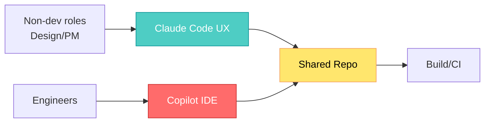

## 🤔 Curiosity: Why would Microsoft push Claude Code internally?

I’ve shipped AI features across multiple game teams, and one pattern always shows up: **the tool that wins isn’t the one with the most features—it’s the one that teams actually use**. The Verge report says Microsoft is encouraging *non‑developers* to try Claude Code, and that engineers are being asked to compare Claude Code with GitHub Copilot. That’s not a small experiment. That’s a signal.

**Question:** If Microsoft is comfortable letting designers and PMs commit code with AI, what does that mean for how we build and ship games?

---

## 📚 Retrieve: What the report says (and what it implies)

**Key points from the article:**
- Microsoft is broadly piloting **Claude Code** across engineering teams, including non‑technical staff.
- Teams are asked to compare **Claude Code vs GitHub Copilot**.
- Microsoft remains tied to OpenAI, but is **expanding Anthropic usage** (models + tools).
- Claude Code’s ease‑of‑use is positioned as the differentiator.

### What’s happening structurally
Microsoft’s approach looks like a **toolchain diversification strategy**. It’s not choosing *one* model. It’s betting on **multiple model families** and **multiple UX surfaces** to unlock different workflows.



### Why this matters for games
Game teams already juggle **designer tools + engine scripts + backend services**. An AI coding tool that non‑devs can use effectively turns **design intent into executable prototypes** faster, without waiting on engineering bandwidth.

### Comparative lens (from a production standpoint)

| Tool | Strength | Risk | Best Use in Game Teams |
|:--|:--|:--|:--|
| Claude Code | Low friction, natural workflows | Over‑trust by non‑devs | Rapid prototyping, scripting, docs‑to‑code |
| GitHub Copilot | IDE‑native, strong code completion | Local optimization bias | Day‑to‑day engineering throughput |
| Mixed Toolchain | Flexibility, role‑fit | Governance complexity | Full‑pipeline acceleration |

---

## 💡 Innovation: What I’d build next in a game studio

### 1) **AI‑First Prototype Loop**
Let designers create “first‑draft” gameplay scripts, then engineers review for performance & architecture.

```python
# Example: designer‑authored tuning script
# Curiosity: can a designer adjust difficulty without opening Unity?
from dataclasses import dataclass

@dataclass
class EnemyTuning:
    hp: int
    speed: float
    spawn_rate: float

# AI suggests default parameters
DEFAULT_TUNING = EnemyTuning(hp=120, speed=3.2, spawn_rate=0.85)

# Engineer review layer
def clamp_tuning(t: EnemyTuning):
    return EnemyTuning(
        hp=max(50, min(t.hp, 300)),
        speed=max(1.0, min(t.speed, 6.0)),
        spawn_rate=max(0.2, min(t.spawn_rate, 1.5))
    )
```

### 2) **Copilot vs Claude A/B for team roles**
Run role‑based experiments:
- Designers / PMs → Claude Code
- Engineers → Copilot IDE
- Compare **cycle time, bug rate, adoption**

### 3) **Governance & guardrails**
If non‑devs commit code, you need:
- Automated linting / tests
- Safety checks for performance and security
- Clear rollback conventions

### Key Takeaways

| Insight | Implication | Next Steps |
|---|---|---|
| Ease‑of‑use beats raw capability | Tools spread fastest when non‑devs can ship | Pilot AI coding in design teams |
| Mixed toolchains are normal now | One model won’t serve all roles | Define “role‑fit” tooling guidelines |
| AI coding expands the contributor base | More commits ≠ more quality | Add guardrails + review gates |

### New Questions
- What’s the **right review model** when non‑devs commit code?
- Can we design AI tools that **understand game constraints** (frame budget, memory, UX)?
- How do we **protect junior roles** while still accelerating production?

---

## References
- The Verge: https://www.theverge.com/tech/865689/microsoft-claude-code-anthropic-partnership-notepad
