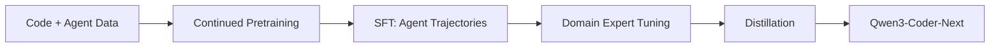

## 🤔 Curiosity: What if *agentic training signals* matter more than raw scale?

In production, bigger models don’t always win. The real bottleneck is **long‑horizon execution**: planning, tool use, and recovering from mistakes. Qwen3‑Coder‑Next claims a different lever—**scale the agentic training signal** rather than just parameter count.

**Question:** Can a smaller, hybrid‑attention MoE model reliably outperform larger open models on agentic coding tasks by learning from *executable environments*?

---

## 📚 Retrieve: What the Qwen team actually shipped

From the official report page:

- **Base model:** Qwen3‑Next‑80B‑A3B‑Base (hybrid attention + MoE)
- **Training focus:** executable task synthesis, environment interaction, and RL
- **Goal:** better long‑horizon reasoning, tool use, and recovery from failures

### Agentic training recipe (condensed)
1) **Continued pretraining** on code‑ and agent‑centric data
2) **SFT** on high‑quality agent trajectories
3) **Domain‑expert tuning** (SE, QA, web/UX)
4) **Expert distillation** into a deployment‑ready model

### Reported benchmark takeaways
- **SWE‑Bench Verified >70%** with SWE‑Agent scaffold
- Competitive results on **SWE‑Bench Pro** and **TerminalBench 2.0**
- **Pareto efficiency:** comparable performance with *10–20× fewer active parameters*
- Performance improves when **agent turns scale**, signaling strong long‑horizon behavior

---

## 💡 Innovation: How I’d apply this in game production

### 1) **Agent‑first QA harness**
Use Qwen3‑Coder‑Next to run game QA scripts end‑to‑end, where the agent learns from **environment feedback** (crashes, perf regressions, build errors), not just static prompts.

### 2) **“Cheap‑turns” strategy**
If the model stays strong while adding turns, we can structure workflows as **many cheap iterations**:
- small steps
- frequent tool checks
- automated recovery

### 3) **Hybrid pipeline: small model + orchestration**
Pair Qwen3‑Coder‑Next with a CLI harness (Copilot CLI / OpenCode) and let the **orchestrator handle context**, while the model handles execution.

### Key Takeaways

| Insight | Implication | Next Steps |
|---|---|---|
| Agentic training signals scale better than params | Smaller models can win on real tasks | Build evals around executable loops |
| Long‑horizon performance grows with turns | Multi‑step workflows should be default | Design “turn‑rich” pipelines |
| Pareto efficiency is the new moat | Cost‑effective agents will spread fastest | Optimize for active params, not total |

### New Questions
- How do we **measure recovery quality** (not just final pass rate)?
- What is the optimal **turn budget** for real production tasks?
- Can we fine‑tune agentic behavior on **game‑specific toolchains**?

---

## References
- Qwen blog: https://qwen.ai/blog?id=qwen3-coder-next
- Qwen3‑Coder repo: https://github.com/QwenLM/Qwen3-Coder
- Qwen Code (CLI): https://github.com/QwenLM/qwen-code
