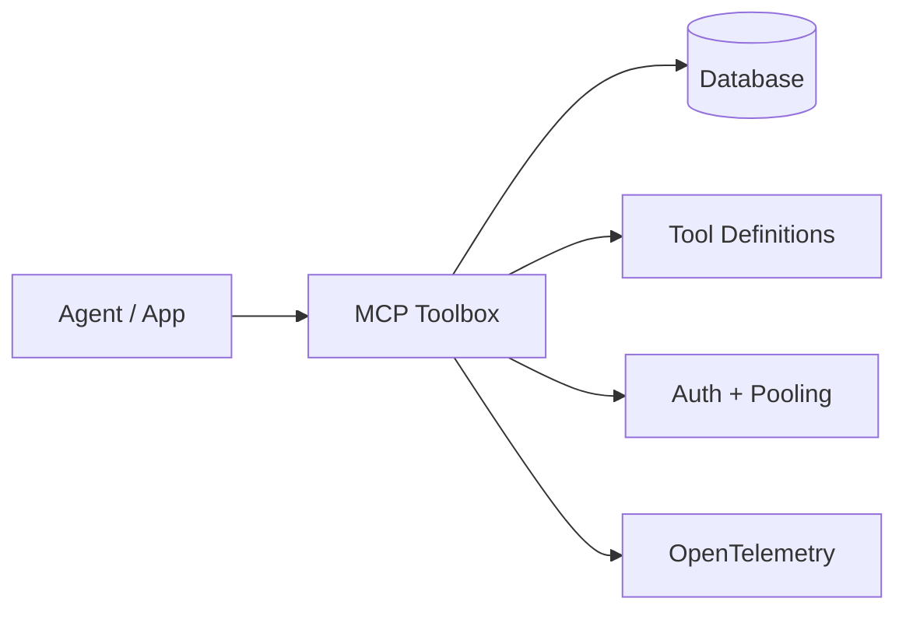

## 🤔 Curiosity: Why do database tools for agents need a *backend*?

In production, database access isn’t just SQL—it’s **auth, pooling, schema context, and safety**. Agents are great at generating queries, but *bad* at consistently enforcing security and observability. Google’s **MCP Toolbox for Databases** takes a strong stance: **centralize the hard parts** so agents can focus on intent.

**Question:** Can a single MCP backend become the standard “control plane” for safe, schema‑aware agentic SQL?

---

## 📚 Retrieve: What the repo and docs actually ship

### What it is
- **Open‑source MCP server for databases**
- Handles connection pooling, authentication, and schema‑aware tool execution
- Built for **AI agents** and compatible across **Python, JS, Go**, and popular frameworks
- **Beta** (expect breaking changes before v1.0)

### Why Toolbox (from the docs)
- **<10 LOC** to define tools (declarative)
- **Performance**: pooling + fast queries by default
- **Security**: integrated auth
- **Observability**: built‑in OpenTelemetry tracing
- **DB support**: Postgres, MySQL, Cloud SQL, and more

### General architecture
Toolbox sits between your orchestration layer and your database as a **control plane**:



### Quickstart (non‑production)
```bash
npx @toolbox-sdk/server --tools-file tools.yaml
```

### Running from binary
```bash
./toolbox --tools-file "tools.yaml"
```

### SDKs (examples)
**Python core**
```python
from toolbox_core import ToolboxClient

async with ToolboxClient("http://127.0.0.1:5000") as client:
    tools = await client.load_toolset("toolset_name")
```

**JavaScript core**
```js
import { ToolboxClient } from '@toolbox-sdk/core';

const client = new ToolboxClient('http://127.0.0.1:5000');
const tools = await client.loadToolset('toolsetName');
```

---

## 💡 Innovation: How I’d use this in a game pipeline

### 1) **Safe live‑ops queries for non‑engineers**
Let PMs and analysts ask natural‑language questions, while Toolbox ensures:
- read‑only access
- consistent pooling
- audit trail + tracing

### 2) **Schema‑aware tooling for agents**
Toolbox can keep agents aligned with *real schemas*, reducing hallucinated table names.

### 3) **Observability by default**
With OTel built‑in, we get:
- per‑query tracing
- cost visibility
- incident forensics

### Example: A “Live‑Ops Health” toolset
```yaml
# tools.yaml

toolsets:
  liveops_health:
    - name: active_players
      description: "Daily active users by region"
      query: "SELECT region, COUNT(DISTINCT user_id) AS dau FROM sessions WHERE date = CURRENT_DATE GROUP BY region;"
    - name: purchase_errors
      description: "Payment error counts"
      query: "SELECT error_code, COUNT(*) FROM payments WHERE status='error' GROUP BY error_code;"
```

### Key Takeaways

| Insight | Implication | Next Steps |
|---|---|---|
| Central control plane simplifies agent SQL | Safer access with less boilerplate | Define standard toolsets |
| Schema‑aware tools reduce hallucination | Higher trust in agent outputs | Connect Toolbox to IDEs |
| Observability is built‑in | Debugging becomes first‑class | Adopt OTel dashboards |

### New Questions
- How do we **benchmark agent SQL quality** across models?
- What’s the right **governance model** for toolset changes?
- Can we layer **cost budgets** per toolset?

---

## References
- Repo: https://github.com/googleapis/genai-toolbox
- Docs: https://googleapis.github.io/genai-toolbox/getting-started/introduction/
- Release notes: https://github.com/googleapis/genai-toolbox/releases
