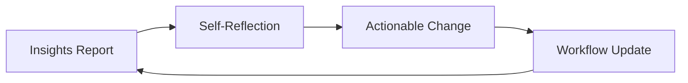

## 🤔 Curiosity: What happens when the tool starts evaluating the developer?

I’ve spent years building AI systems that evaluate players—difficulty, engagement, churn risk. But when a **developer tool evaluates *me***, the emotional texture changes. It’s not just telemetry anymore. It’s feedback. Sometimes it feels like a manager. Sometimes it feels like a mirror.

**Question:** If /insights can assess my workflow, how do I use that evaluation to ship better—without letting it misread the context?

---

## 📚 Retrieve: What /insights actually does (and how it feels)

The post describes real usage of **Claude Code’s `/insights` command**—a report generated from your recent history. It doesn’t just show counts; it **interprets patterns**:

- what you do most often
- where you repeat actions
- what seems inefficient
- what you abandon halfway

That interpretation can feel **strikingly human**. It’s not “you used tool X 52 times,” it’s “you tend to start workflows but don’t close the loop.” That’s new territory for a dev tool.

### 1) “Human‑like evaluation” is both powerful and unsettling
The author’s reaction is consistent with what I’ve seen in production analytics: a narrative summary makes people *feel* judged, even when the data is neutral. Here, /insights feels like getting performance feedback.

> **Retrieve:** AI feedback shifts from descriptive to interpretive. That’s high‑leverage—but it also increases friction.
{: .prompt-info}

### 2) Misclassification happens when context is missing
Claude classified the author as a “browser automation expert” because of long, heavy Chrome sessions. That was *true in behavior* but not necessarily in intent. This is the classic **telemetry vs. intent gap**.

If we treat /insights as ground truth, we will over‑optimize for the wrong label.

### 3) “Soft” negative feedback on conversation drop‑offs
The report noted unfinished conversations. The author admits this is sometimes due to mis‑configured tools, sometimes because quick experiments were done and abandoned—especially after adopting fast, Codex‑like workflows.

This is a critical insight: **the system doesn’t know why you stopped.** It only sees that you did.

### 4) /insights is not just reporting—it's nudging
The report includes **actionable suggestions** (skills, agents, hooks), suggesting how to structure repeated work. That’s closer to **workflow coaching** than usage analytics.

---

## 💡 Innovation: Turning AI evaluation into a production advantage

Here’s how I’d integrate /insights into a real studio workflow without letting it become noise.

### 1) Treat /insights like a playtest—valuable, not authoritative
If player telemetry says “Level 3 is too hard,” we don’t immediately nerf the boss. We **triangulate**: feedback + retention + completion rate. /insights is the same.

**Rule:** Use it as a signal, never as a verdict.

### 2) Add “intent tags” to reduce misclassification
The post highlights how behavior gets mislabeled. We can fix this by **adding lightweight intent metadata** in our process:

- prefix experimental sessions with “EXP:”
- tag automation runs with “BENCH:”
- keep a scratchpad explaining why you started a long run

This way, when /insights summarizes, the context is already inside the data.

### 3) Build a feedback loop: report → reflection → action
Here’s a minimal loop that makes /insights useful instead of anxiety‑inducing:



### 4) Use /insights to drive tooling, not ego
The post notes that /insights recommends **Skills / Agents / Hooks**. That’s a hint: it wants you to **encode your patterns**.

If you see “frequent repetitive browser automation,” then:
- create a reusable agent task
- wrap it in a CLI shortcut
- keep the report focused on higher‑level decision‑making

### 5) Make the “stop condition” explicit
A recurring issue is unfinished chats. I’d formalize **stop states** in my toolchain:

- `STOP: experiment done, results captured`
- `STOP: blocked on external input`
- `STOP: deprioritized`

This turns ambiguous dropout into explicit state.

---

## 🧪 Practical Example: A tiny helper for intent tagging

```python
# Simple helper to tag sessions for cleaner /insights reports
from datetime import datetime

def tag_session(intent: str, summary: str) -> str:
    ts = datetime.now().strftime("%Y-%m-%d %H:%M")
    return f"[{ts}] INTENT={intent} :: {summary}"

print(tag_session("EXP", "Prototype agent‑based QA workflow"))
# Output: [2026-02-06 22:40] INTENT=EXP :: Prototype agent‑based QA workflow
```

This can live in your scratchpad, commit notes, or even your agent prompts. The goal: **give the evaluator context** it can’t infer.

---

## Key Takeaways

| Insight | Implication | Next Steps |
|---|---|---|
| /insights feels like human feedback | It will trigger emotion, not just analytics | Use reflection, not reaction |
| Context gaps cause mislabels | Behavioral signals ≠ intent | Add lightweight intent tags |
| Drop‑offs are ambiguous | Tool can’t infer “why” | Explicit stop states |
| Recommendations are tooling hints | Encode patterns into Skills/Agents | Operationalize feedback |

### New Questions
- How do we design **AI feedback that is candid but not demotivating**?
- Can we build “intention-aware telemetry” so insights are less biased?
- What’s the right cadence for AI feedback so it feels helpful, not invasive?

---

## References
- Source post: https://digitalbourgeois.tistory.com/m/2716
- Claude Code docs: https://code.claude.com/docs/en
- X thread (feature announcement): https://x.com/i/status/2019173731042750509
