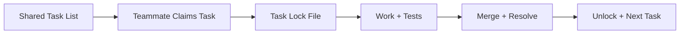

## 🤔 Curiosity: What happens when a smarter model meets a multi‑agent harness?

When a new model lands and the harness changes at the same time, it’s not an incremental update—it’s a **workflow reset**. Opus 4.6 raises the ceiling on reasoning and agentic execution, and Claude Code **Agent Teams** makes parallelism first‑class.

**Question:** Do we need to redesign our build/test/review loops to keep up with a model that can think deeper *and* collaborate in parallel?

---

## 📚 Retrieve: The three must‑read drops

### 1) Claude Opus 4.6
From Anthropic’s release:
- **Coding + reasoning + agentic capability upgrades**
- **Adaptive Thinking**: model decides when to think deeply vs answer fast
- **Effort controls**: low / medium / high / max
- **1M token context (beta)**
- **Long‑context benchmark ~76%**

The headline: Opus 4.6 isn’t just “smarter.” It’s **more self‑aware about how it thinks**.

### 2) Claude Code Agent Teams
From the docs:
- **Multiple Claude Code instances** with independent contexts
- **Team lead + teammates**
- **Shared task list** with self‑coordination
- Teammates **message each other directly** (not just report back)
- Settings flag to enable:
```json
{
  "env": { "CLAUDE_CODE_EXPERIMENTAL_AGENT_TEAMS": "1" }
}
```

Use cases are explicit: parallel review, competing hypotheses, cross‑layer work.

### 3) The C Compiler experiment (16 agents)
From Anthropic Engineering:
- **16 agents** built a **100k‑line Rust C compiler**
- ~2,000 sessions, **$20K** cost
- Compiles Linux kernel, QEMU, FFmpeg, SQLite, Postgres, Redis
- GCC test suite **99% pass**; Doom runs
- Harness: Docker isolation, Git sync, **task locks**, autonomous merge conflict resolution

This is the strongest real‑world proof that **agent teams can ship serious artifacts**.

---

## 💡 Innovation: How I’d change the workflow now

### 1) “Effort‑aware” task routing
If the model can self‑select depth, then the pipeline should route tasks by difficulty:

| Task Type | Effort Level | Tooling Policy |
|---|---|---|
| Simple refactor / rename | low | auto‑approve |
| Test fixes / flaky suites | medium | diff‑review |
| Architecture / security | high | human gate |
| Release‑critical | max | multi‑review + lock |

### 2) Agent Team roles for code review
My first real use: **three‑perspective review**.
- Security teammate
- Performance teammate
- Test coverage teammate

This consistently catches issues that a single agent (or single human) misses.

### 3) Shared task list + task locks
Borrow directly from the compiler experiment:



### 4) “Long‑context staging”
With 1M context, the bottleneck becomes **signal quality**.
- Stage raw logs → summarize → feed to Opus
- Keep context lean, not just large

---

## 🧪 Example: Agent Team setup for a game repo

**Prompt to lead agent:**
> “Create a team of 4. Roles: security review, performance review, test coverage, and UX regression. Each teammate should review the same PR from their lens and report blocking issues. Use plan‑approval for any file edits.”

**Expected outcome:**
- Parallel audit of a single PR
- Fewer regressions at merge
- Consistent “coverage” across risk domains

---

## Key Takeaways

| Insight | Implication | Next Steps |
|---|---|---|
| Opus 4.6 is depth‑aware | We should route tasks by effort | Add effort‑based policies |
| Agent Teams enable real parallelism | Reviews & fixes should be multi‑agent | Use team review by default |
| Harness matters more than model | Strong orchestration beats raw IQ | Adopt task locks + shared lists |

### New Questions
- What’s the right **cost/perf** trade for agent teams?
- Where do we draw the line between **autonomy and governance**?
- Can we build **model‑agnostic orchestration** that survives future upgrades?

---

## References
- Opus 4.6: https://www.anthropic.com/news/claude-opus-4-6
- Agent Teams docs: https://code.claude.com/docs/en/agent-teams
- C Compiler experiment: https://www.anthropic.com/engineering/building-c-compiler
