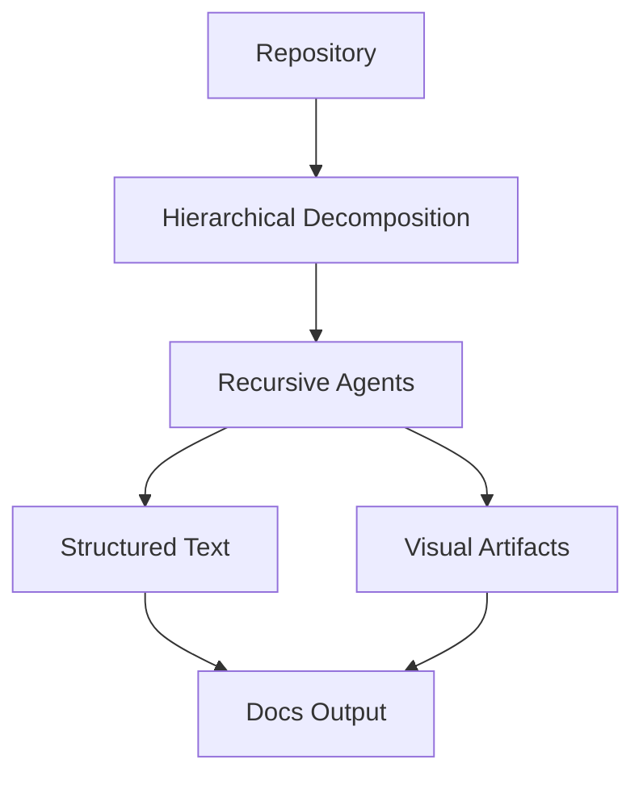

## 🤔 Curiosity: Why does repo‑level documentation still feel impossible?

In production, documentation isn’t about functions—it’s about **systems**. The bigger the repo gets, the less useful traditional doc generators become. New engineers need architecture context, not just API signatures.

**Question:** Can an AI system generate documentation that understands an entire repository the way a senior engineer does?

---

## 📚 Retrieve: What CodeWiki actually is

**CodeWiki** is an open‑source framework for **holistic repository documentation** across **7 languages** (Python, Java, JS, TS, C, C++, C#). The intent is not “summarize files,” but **explain cross‑module and system‑level interactions**.

From the project and the linked write‑up, the core ideas are:

### 1) Hierarchical decomposition (architecture‑aware)
Instead of flattening a codebase, CodeWiki **decomposes it into modules** while preserving architectural context.

- Tested on ~**86K to 1.4M LOC**
- Handles arbitrary repo size by splitting into coherent layers

### 2) Recursive multi‑agent processing
CodeWiki is **agentic**: work is delegated by module, and sub‑agents recursively handle deeper slices.

- Scales analysis without losing quality
- Maintains global context while dividing labor

### 3) Multi‑modal synthesis
Docs aren’t just text. CodeWiki generates:

- Architecture diagrams (Mermaid)
- Dependency graphs
- Data‑flow and sequence diagrams
- Structured module overviews

This is the difference between a doc you read and a doc you **orient your team with**.

---

## 🧪 Quick Start (from the repo)

```bash
# Install from source
pip install git+https://github.com/FSoft-AI4Code/CodeWiki.git

# Verify
codewiki --version

# Configure (OpenAI‑compatible layer)
codewiki config set \
  --api-key YOUR_API_KEY \
  --base-url https://api.anthropic.com \
  --main-model claude-sonnet-4 \
  --cluster-model claude-sonnet-4 \
  --fallback-model glm-4p5

# Generate docs
cd /path/to/your/project
codewiki generate

# Add GitHub Pages viewer + branch
codewiki generate --github-pages --create-branch
```

---

## How CodeWiki’s pipeline works (simplified)



---

## What it outputs (and why it matters)

| Output | Why it’s useful | Who benefits |
|---|---|---|
| Overview.md | Fast architecture onboarding | New engineers |
| Module docs | API + dependency understanding | Maintainers |
| module_tree.json | Structural map for tooling | Tooling/QA |
| Diagrams | Visual mental model | PM/Design/Engineering |
| HTML viewer | Shareable docs | Cross‑team collaboration |

In game development, I’d use this on:
- **engine repos** (where architecture is everything)
- **live‑service backends** (complex cross‑module data flow)
- **tooling repos** (low doc coverage but high churn)

---

## 💡 Innovation: Why this is a real step forward

### 1) It treats documentation as a system‑level artifact
Most doc generators are still file‑level. CodeWiki is **architecture‑level**. That’s what actually reduces onboarding time.

### 2) It scales without collapsing
By splitting work recursively, it avoids the “LLM context ceiling” problem in giant repos.

### 3) It’s model‑agnostic
The OpenAI‑compatible layer means you can swap models based on cost/quality.

---

## Practical constraints & tradeoffs

| Constraint | Impact | Mitigation |
|---|---|---|
| Token limits on huge repos | Partial coverage | Tune `--max-depth`, `--max-tokens` |
| Model cost | Expensive on million‑line repos | Use cheaper cluster/fallback models |
| Diagram accuracy | Can over‑simplify | Add `--instructions` for key flows |

---

## Key Takeaways

| Insight | Implication | Next Steps |
|---|---|---|
| Repo‑level docs require architecture context | File‑level docs aren’t enough | Use hierarchical decomposition |
| Multi‑agent scaling is the unlock | One model won’t handle 1M LOC | Recursive delegation |
| Visual artifacts matter | Text alone isn’t enough | Ship diagrams by default |

### New Questions
- Can we validate doc quality automatically (tests for docs)?
- Should architecture docs live in CI as a “living artifact”?
- What happens when doc generation becomes continuous?

---

## References
- CodeWiki repo: https://github.com/FSoft-AI4Code/CodeWiki
- CodeWiki write‑up: https://digitalbourgeois.tistory.com/m/2717
- Paper: https://arxiv.org/abs/2510.24428
- Demo: https://fsoft-ai4code.github.io/codewiki-demo/
