## 🤔 Curiosity: Can a codebase “drive itself” without collapsing?

I’ve seen plenty of agent demos that solve one task well—but the real test is **long‑horizon autonomy**: can the system keep working without constant human nudges? Cursor’s *Self‑Driving Codebases* research is one of the clearest attempts to push that boundary. Their result is not “magic”—it’s a **harness design** that makes thousands of agents useful instead of chaotic.

**Question:** What design patterns actually let autonomous agent swarms build real software without falling apart?

---

## 📚 Retrieve: What Cursor built (and why it changed)

### 1) The original bottleneck: single‑agent fragility
A single agent could write good code in small pieces, but **lost the thread** on large problems (a browser engine). It would stop early, claim success too soon, or get stuck in complexity. The work had to be broken into many subtasks.

### 2) Naive multi‑agent coordination failed
Cursor tried a **shared coordination file** so agents could self‑organize. It failed:
- Agents held locks too long or forgot to release them
- Lock contention crushed throughput (20 agents → 1–3 effective)
- Agents avoided big, risky work

### 3) Structure and roles improved outcomes
They introduced **planner → executor → worker** roles. This fixed coordination but created rigidity: the slowest worker bottlenecked the system, and static plans became stale.

### 4) Continuous executor: dynamic but overloaded
Removing the planner helped flexibility, but overloading the executor caused **pathological behaviors** (sleeping, low delegation, premature completion).

### 5) Final design: recursive planners + isolated workers
The successful pattern:
- **Root planner** owns the global goal (no coding)
- **Sub‑planners** recursively decompose scope
- **Workers** do isolated tasks, then hand off results
- **Handoffs** include notes, concerns, and deviations

This preserves global ownership while enabling massive parallelism without global lock contention.

```mermaid
graph TB
  A[Root Planner] --> B[Sub‑Planner]
  B --> C[Worker]
  B --> D[Worker]
  C --> E[Handoff]
  D --> E[Handoff]
  E --> B
```

### 6) Throughput vs correctness tradeoffs
Their system hit ~**1,000 commits/hour** over a week. But absolute correctness per‑commit created bottlenecks. They accepted a small, constant error rate and used periodic “green branch” fix‑ups.

---

## 💡 Innovation: How I’d apply this to real game pipelines

### 1) Treat the harness as the product
The model is replaceable; **the orchestration layer is the moat**. If you want stable automation, invest in:
- task decomposition
- role ownership
- handoff protocols

### 2) Use recursive planners for large content systems
Large game features (quests, UI systems, network refactors) map naturally to recursive decomposition. Planners should never touch code—only scope and re‑scope work.

### 3) Accept “controlled error rates”
Zero‑error gating at every step kills throughput. Better:
- allow local errors
- enforce periodic “green” checkpoints

### 4) Observability is non‑negotiable
Cursor logged everything with timestamps, then analyzed the logs using Cursor itself. That is the right pattern:
- log all agent actions
- replay and post‑mortem quickly
- feed results back into prompt design

---

## 🧪 Example: A “Self‑Driving Build” flow for a game repo

**Goal:** Keep the build green and improve test coverage over a week.

1) Root planner defines a weekly goal: “stabilize build + raise coverage 10%.”
2) Sub‑planners split by domain: gameplay, UI, backend, tooling.
3) Workers claim failing tests, fix, and handoff with context.
4) Nightly green pass merges only validated fixes.

---

## Key Takeaways

| Insight | Implication | Next Steps |
|---|---|---|
| Coordination beats raw model IQ | Orchestration is the real unlock | Build planner/worker roles |
| Shared lock state doesn’t scale | Global locks kill throughput | Use isolated workers + handoffs |
| Error‑tolerant loops scale | Perfect correctness blocks progress | Adopt green‑branch checkpoints |

### New Questions
- Can we design **task quality metrics** to rank agent outputs?
- How do we prevent **planner tunnel vision** at scale?
- What’s the right **human oversight cadence**?

---

## References
- Cursor blog: https://cursor.com/blog/self-driving-codebases
- Long‑running agents: https://cursor.com/blog/scaling-agents
