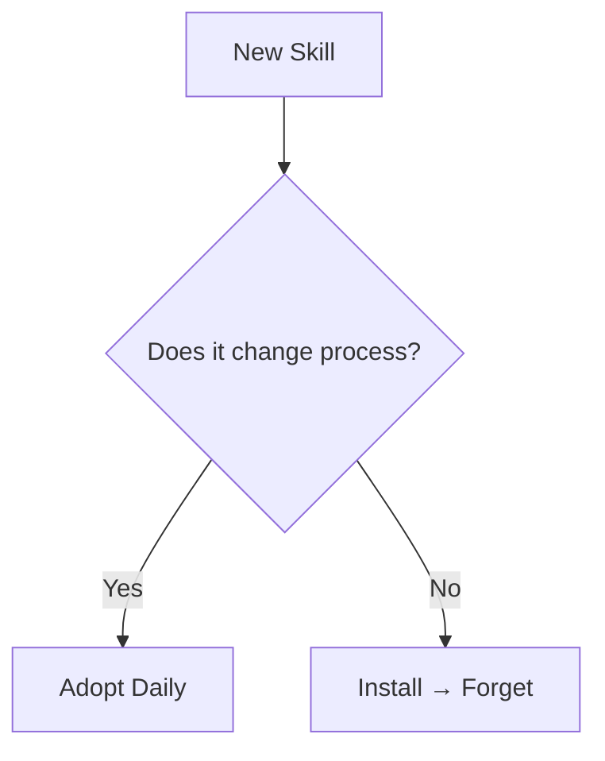

## 🤔 Curiosity: Why do 90% of skills die after install?

Every day, hundreds of new AI‑agent skills land on GitHub. There are **100k+ open‑source skills** now. I’ve installed the shiny ones too—only to realize **most never get used again**.

So I spent a weekend auditing my own workflow. Which skills do I actually open **every day**? I found four.

These aren’t just “nice‑to‑have” tools. They **change the process** of how agents work, how text reads, and how UI gets designed.

---

## 📚 Retrieve: The four that survived

### 1) Superpowers — agents stop coding *before* they plan
**Repo:** https://github.com/obra/superpowers

Why it survives:
- Forces the agent to **ask what we’re building** before writing code
- Enforces a **7‑step workflow** (brainstorm → plan → TDD → review → worktrees)
- Splits work into **2–5 minute chunks** with sub‑agents + double review

**My takeaway:** This is the rare skill that makes long‑running agent work *stable*. Claude Code stops drifting because the process is embedded.

---

### 2) Humanizer — 24 AI‑writing tells, detected and fixed
**Repo:** https://github.com/blader/humanizer

Built from Wikipedia’s “Signs of AI writing,” it flags:
- AI‑vocabulary ("testament", "landscape", "showcasing")
- Em‑dash overload, emoji spam, rule‑of‑three clichés
- Inflated claims, vague attributions, overly polished conclusions

**My takeaway:** It turns “statistically common” phrasing into **human‑sounding prose**. But if you write in Korean, you’ll still need local tuning.

---

### 3) UI/UX Pro Max — design intelligence, not templates
**Repo:** https://github.com/nextlevelbuilder/ui-ux-pro-max-skill

Why it survives:
- **67 UI styles**, **96 palettes**, **57 font pairings**
- Industry‑specific reasoning rules (100+ categories)
- Produces **anti‑pattern lists** (e.g., “avoid AI purple/pink gradients”)

**My takeaway:** The anti‑pattern detection is what makes AI UI feel *real* instead of “template‑y.”

---

### 4) Vercel Skills CLI — managing the explosion
**Repo:** https://github.com/vercel-labs/skills

Why it survives:
- `npx skills find` for discovery
- `npx skills add` for instant install
- `npx skills update` for fleet‑wide upkeep

When you’re managing dozens of skills, **this becomes the workflow.**

Discover more at https://skills.sh/

---

## 💡 Innovation: A survival rule for skills

A skill survives if it **changes the system**, not just the output.



### Quick “survival test” (I now run this on every new skill)

| Test | If it fails | Why it dies |
|---|---|---|
| Changes my workflow | Only adds output | Feels optional |
| Saves daily time | Saved minutes < friction | Never re‑opened |
| Scales with more tasks | Only works on one niche case | Not worth upkeep |
| Plays well with other skills | Conflicts or overlaps | Gets removed |

---

## 🧪 Installation (common)

```bash
npx skills add obra/superpowers
npx skills add blader/humanizer
npx skills add nextlevelbuilder/ui-ux-pro-max-skill
npx skills add vercel-labs/skills
```

---

## The meta‑lesson

I saw a photo from OpenClaw’s founder Peter: **four monitors, multiple terminals, agents running in parallel.** That’s not flexing—it’s the new **solo‑unicorn operating mode**. One agent codes, one designs, another writes docs. You orchestrate.

In that world, **skill curation is leverage**. A weekend spent setting up the right skill stack can erase **hundreds of hours** of repetitive work later.

---

## Key Takeaways

| Insight | Implication | Next Steps |
|---|---|---|
| 100k+ skills doesn’t matter | Only a few change your process | Ruthless curation |
| Workflow skills beat output skills | They shape how agents behave | Prioritize system‑level tools |
| Management tooling is essential | Skills scale only if they’re maintained | Use `npx skills` CLI |

### New Questions
- Can we create a **unit test suite for skills** to measure usefulness?
- What if skills could **rank themselves** by actual usage?
- How far can one person push multi‑agent workflows before needing a team?

---

## References
- Superpowers: https://github.com/obra/superpowers
- Humanizer: https://github.com/blader/humanizer
- UI/UX Pro Max: https://github.com/nextlevelbuilder/ui-ux-pro-max-skill
- Vercel Skills CLI: https://github.com/vercel-labs/skills
- Skills directory: https://skills.sh/
