## 🤔 Curiosity: Can RAG keep context **and** stay fast?

Classic RAG flattens knowledge into chunks + embeddings. It’s fast, but it forgets **structure**—the relationships that turn documents into a system. LightRAG asks a sharper question:

**What if we index knowledge as a graph, then retrieve at both low‑level and high‑level so responses keep context without slowing down?**

---

## 📚 Retrieve: What LightRAG is (from the site + repo)

LightRAG is a **graph‑enhanced RAG system** that builds a knowledge graph from documents, then performs **dual‑level retrieval** to answer both specific and abstract queries.

### 1) Graph‑enhanced indexing
LightRAG uses an LLM to extract **entities and relationships**, then builds a graph of those nodes/edges. It also generates **key‑value summaries** per node/edge to speed up retrieval.

Core steps:
- **Entity & relation extraction** from chunks
- **Profiling** to generate key‑value summaries
- **Deduplication** to merge identical entities/relations

Why it matters: the graph captures **multi‑hop relationships**, so the system can answer questions that require global context (not just a single chunk).

### 2) Dual‑level retrieval
Instead of one retrieval mode, LightRAG runs two:

- **Low‑level retrieval:** precise facts about specific entities/relations
- **High‑level retrieval:** broader themes across multiple hops

This combination helps answer **both exact questions and conceptual ones**—the system doesn’t collapse into detail‑only or summary‑only behavior.

### 3) Incremental updates
LightRAG can **merge new documents into the existing graph** without rebuilding everything. That matters for living knowledge bases (live‑ops docs, evolving product specs, patch notes).

---

## Architecture sketch (simplified)

```mermaid
graph TB
  A[Documents] --> B[Chunking]
  B --> C[Entity/Relation Extraction]
  C --> D[Graph + KV Index]
  D --> E[Low‑Level Retrieval]
  D --> F[High‑Level Retrieval]
  E --> G[Answer Synthesis]
  F --> G
```



---

## ⚙️ Quick Start (from the repo)

```bash
# Install (core)
uv pip install lightrag-hku
# or
pip install lightrag-hku

# Server + Web UI
uv tool install "lightrag-hku[api]"

# Run demo
export OPENAI_API_KEY="sk-..."
python examples/lightrag_openai_demo.py
```

The repo also supports Docker, local WebUI builds, and multiple storage backends.

---

## 💡 Innovation: Why this matters in production

### 1) Graphs fix the “flat‑chunk” blind spot
For large codebases or game lore, **relationships** matter as much as facts. LightRAG turns “documents” into **connected structure**, so reasoning becomes more coherent.

### 2) Dual‑level retrieval keeps answers balanced
In production Q&A systems, we need **precision** *and* **coverage**. Low‑level retrieval keeps details accurate, while high‑level retrieval keeps context intact.

### 3) Incremental updates enable living knowledge
For live‑service games and evolving docs, rebuild‑everything pipelines are too slow. LightRAG’s **graph merge** keeps latency low without sacrificing freshness.

---

## Practical tradeoffs (honest table)

| Tradeoff | Impact | Mitigation |
|---|---|---|
| LLM cost for extraction | Graph building is expensive | Use smaller LLMs for indexing |
| Graph quality | Bad extraction → bad retrieval | Add validation + rerankers |
| Storage complexity | Graph + vectors + KV | Use supported DBs (Neo4j/Postgres/MongoDB) |

---

## Where I’d use it in games

- **Lore retrieval** for narrative agents (quests, NPC memory)
- **Design docs** for large Unity/Unreal repos
- **Player support** knowledge bases with many cross‑links

---

## Key Takeaways

| Insight | Implication | Next Steps |
|---|---|---|
| Graph structure fixes RAG context gaps | Better answers for complex queries | Use graph‑based indexing |
| Dual‑level retrieval balances breadth & depth | Less brittle responses | Combine low + high retrieval |
| Incremental updates keep knowledge fresh | Works for live systems | Merge‑based refreshes |

### New Questions
- Can we auto‑evaluate graph quality before serving answers?
- What’s the right balance between graph precision and embedding recall?
- How far can dual‑level retrieval push response quality without higher latency?

---

## References
- Project site: https://lightrag.github.io/
- GitHub repo: https://github.com/HKUDS/LightRAG
- Paper: https://arxiv.org/abs/2410.05779
