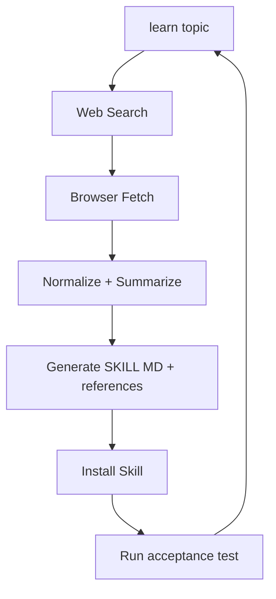

## 🤔 Curiosity: What if a skill could *create itself*?

When I ship AI features, the slowest step isn’t model quality—it’s **knowledge ingestion**. Every new API or framework forces us to re‑learn, re‑document, and re‑encode workflows. So I asked a sharper question:

**What if a Skill could autonomously learn a new technology from the web and install itself into my workflow?**

This post is built from three real sources:
- **Self‑Learning Skill** (philschmid/self-learning-skill)
- **Gemini API SKILL** (Gist with Gemini 3 examples)
- **My own “Antigravity.Google” skill** pattern (inspired by Hyperbrowser, for auto‑teaching Gemini about new tech)

---

## 📚 Retrieve: How the Self‑Learning Skill works

### 1) The idea: `/learn <topic>`
The **Self‑Learning Skill** is a minimal harness that turns a single command into a structured pipeline:

- Discover authoritative sources via **web search**
- Extract documentation by **browsing**
- Synthesize a new **SKILL.md** + references
- Save the generated skill into your workspace

From the repo:

> “Autonomous skill generator that enables AI agents to learn new technologies from the web.”

Installation is simple and unopinionated—copy the SKILL.md into your skills directory.

**Repo:** https://github.com/philschmid/self-learning-skill

### 2) Gemini API SKILL as a concrete target
The Gemini SKILL gist provides a complete base skill with:

- Installation for **Python / JS / Go**
- Quick start for **Gemini 3 Flash / Pro**
- Examples of **system instructions** and **function calling**

**SKILL:** https://gist.github.com/philschmid/b0cd874480d05ba1a7e02816687e07ae

This is the perfect specimen for “self‑learning” to regenerate on demand.

### 3) Web search + browsing are mandatory
The key promise is not “just summarize.” It’s **self‑learning**:

- **Search** finds canonical docs (official API pages, SDKs, specs)
- **Browsing** extracts the details (install, examples, pitfalls)
- The system **synthesizes** into reusable structure

I use this pattern to teach Gemini about new technologies using a custom skill I call **Antigravity.Google**.

---

## 💡 Innovation: A fully autonomous Skill creation loop

Here is the production‑grade loop I recommend.



### Example: `/learn gemini api with gemini 3 models`
We can define a Skill template and auto‑populate it using the Gemini docs + SDK examples.

**Auto‑generated sections should include:**
- Quick reference links
- Installation for multiple languages
- Minimal usage examples
- Function calling schema
- Streaming snippet
- Model table (3‑flash, 3‑pro, 2.5‑flash, etc.)

### Example generated snippet (Python)
```python
from google import genai
from google.genai.types import GenerateContentConfig, Tool

client = genai.Client()
response = client.models.generate_content(
    model="gemini-3-flash-preview",
    contents="Summarize the latest gameplay patch notes",
    config=GenerateContentConfig(
        system_instruction="You are a build‑ready game assistant."
    )
)
print(response.text)
```

### Function calling pattern (minimal)
```python
set_light_values = {
  "name": "set_light_values",
  "description": "Sets brightness and color temperature.",
  "parameters": {
    "type": "object",
    "properties": {
      "brightness": {"type": "integer"},
      "color_temp": {"type": "string", "enum": ["daylight", "cool", "warm"]}
    },
    "required": ["brightness", "color_temp"]
  }
}

response = client.models.generate_content(
  model="gemini-3-flash-preview",
  contents="Set warm light at 50%",
  config=GenerateContentConfig(tools=[Tool(function_declarations=[set_light_values])])
)
```

---

## 🧪 Mini‑pipeline: installing a new self‑learning skill

**Goal:** Add a self‑learning skill via `npx`, then teach it Gemini 3.

```bash
# 1) Install skill (example)
npx skills add philschmid/self-learning-skill

# 2) Trigger self‑learning
/learn gemini api with gemini 3 models
```

This gives you a freshly synthesized **Gemini API SKILL** without manual research.

---

## Tradeoffs & production lessons

| Challenge | Why it happens | Mitigation |
|---|---|---|
| Inaccurate sources | Search can rank blogs above docs | Enforce allow‑list domains |
| Drift over time | APIs change quickly | Schedule `/learn` refreshes |
| Over‑summarization | Skills become too shallow | Keep examples + links |
| Non‑determinism | Different runs yield different structure | Use a strict template |

**Lesson:** The harness matters more than the model. A “self‑learning” system needs guardrails.

---

## Key Takeaways

| Insight | Implication | Next Steps |
|---|---|---|
| Search + browsing is enough to bootstrap skills | No human doc‑writing needed | Automate your tech onboarding |
| Skills can be regenerated | Docs stay fresh | Set a refresh cadence |
| Gemini 3 is a strong target | Great for function calling + long context | Build native Gemini skills |

### New Questions
- How do we validate learned skills automatically?
- Can we score skill quality with unit tests + doc coverage?
- What happens when **skills teach other skills**?

---

## References
- Self‑Learning Skill repo: https://github.com/philschmid/self-learning-skill
- Gemini API SKILL (Gist): https://gist.github.com/philschmid/b0cd874480d05ba1a7e02816687e07ae
- Gemini API docs: https://ai.google.dev/gemini-api/docs
- Function calling guide: https://ai.google.dev/gemini-api/docs/function-calling
- Structured output: https://ai.google.dev/gemini-api/docs/structured-output
