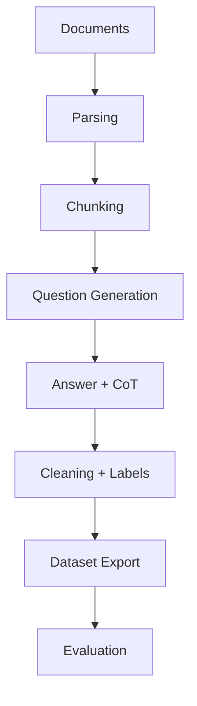

## 🤔 Curiosity: Why is dataset building still the bottleneck?

In production, most LLM failures aren’t model problems—they’re **data problems**. We need clean, structured, task‑specific datasets for fine‑tuning, RAG, and evaluation. But the pipeline is messy: parse documents, chunk text, generate Q/A, clean noise, label data, and then evaluate model quality.

**Question:** What if a single tool could cover that entire pipeline, end‑to‑end?

---

## 📚 Retrieve: What Easy Dataset actually does

**Easy Dataset** is a dataset construction platform built specifically for LLM workflows. It focuses on **document‑to‑dataset** transformation with built‑in evaluation and export.

### 1) Document processing + smart chunking
Supports PDF, Markdown, DOCX, TXT, EPUB and more. Chunking isn’t one‑size‑fits‑all—it offers:
- Markdown‑structure splitting
- Recursive separators
- Fixed‑length splits
- Code‑aware chunking

### 2) Question/Answer generation at scale
- Auto‑extracts relevant questions from text
- Uses templates + batch generation
- Generates answers + **Chain‑of‑Thought**
- Cleans and optimizes responses automatically

### 3) Multiple dataset formats
- Single‑turn QA
- Multi‑turn dialogue
- Image QA (image folders / PDF / ZIP)
- Data distillation (generate label trees + Qs without docs)

### 4) Built‑in evaluation system
- True/False, single‑choice, multi‑choice, short answer, open‑ended
- Judge model scoring with custom rules
- **Human blind test (Arena)** for model comparison

### 5) Export + integration
- Alpaca / ShareGPT / Multilingual‑Thinking
- JSON / JSONL
- Tag‑balanced export
- LLaMA Factory config generation
- Hugging Face Hub upload

---

## Architecture sketch (pipeline)



---

## ⚙️ Quick Start (from the repo)

```bash
# local run
git clone https://github.com/ConardLi/easy-dataset.git
cd easy-dataset
npm install
npm run build
npm run start
# open http://localhost:1717

# docker
# docker-compose up -d
```

---

## 💡 Innovation: Why it’s useful in real workflows

### 1) One UI replaces five scripts
Instead of stitching parsing, chunking, QA generation, and evaluation across tools, Easy Dataset gives you one consistent pipeline.

### 2) Evaluation is not an afterthought
Most dataset tools stop at export. Easy Dataset includes **judge‑model scoring** and **human blind tests**, so you can measure quality, not just generate data.

### 3) Designed for RAG and fine‑tuning
The output formats (Alpaca, ShareGPT, JSONL) map directly to production pipelines, and can be balanced per tag for domain‑specific quality control.

---

## Practical tradeoffs

| Tradeoff | Impact | Mitigation |
|---|---|---|
| LLM cost for QA generation | Large datasets get expensive | Use smaller models for draft + filter |
| Chunking quality | Bad splits → bad QA | Visual tuning with chunk previews |
| Evaluation bias | Judge models can be inconsistent | Add human blind test + multiple judges |

---

## Where I’d use it in games

- **Game design docs → QA dataset** for narrative assistants
- **Patch notes → RAG test set** for support bots
- **Live‑ops knowledge base** for player tickets and FAQ

---

## Key Takeaways

| Insight | Implication | Next Steps |
|---|---|---|
| Dataset pipelines are the bottleneck | You need an end‑to‑end tool | Adopt unified doc‑to‑dataset flow |
| Evaluation must be first‑class | Measure dataset quality early | Use judge + human blind tests |
| Multi‑format export saves time | Ready for fine‑tune + RAG | Align exports with training stack |

### New Questions
- Can dataset generation be fully automated with quality gates?
- What’s the best judge‑model strategy for domain‑specific data?
- How do we prevent label drift as docs evolve?

---

## References
- Repo: https://github.com/ConardLi/easy-dataset
- Docs: https://docs.easy-dataset.com/ed/en
- Paper: https://arxiv.org/abs/2507.04009v1
- Tistory summary: https://digitalbourgeois.tistory.com/m/2728
