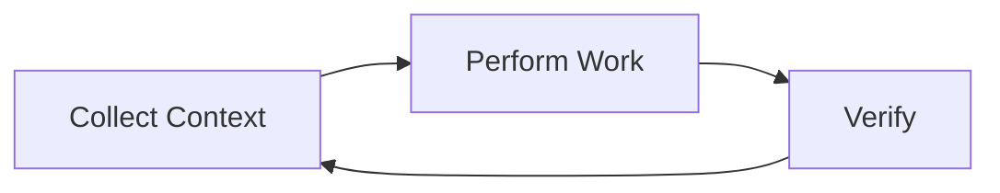

## 🤔 Curiosity: Why does Claude Code feel more “agentic” than a normal IDE assistant?

Claude Code isn’t just a chat box. It’s a **terminal‑native agent** that can read files, edit code, run commands, search the web, and verify results. That difference changes how we should design workflows.

**Question:** What’s the minimal mental model we need to collaborate with Claude Code effectively?

---

## 📚 Retrieve: The core architecture (from the docs)

### 1) The Agent Loop
Claude Code runs a continuous loop:

- **Collect context** (read files, search code, fetch docs)
- **Perform work** (edit, run, refactor)
- **Verify** (tests, lint, runtime checks)

It’s not linear—Claude can iterate across all three steps and **re‑route** based on new evidence.

---

### 2) The Model + Tools split
Claude Code is an **agent harness** around the model. The model reasons; the tools act.

**Tool categories in practice:**
- **File ops:** read, edit, create, restructure
- **Search:** grep, regex, codebase traversal
- **Execution:** shell commands, tests, builds, git
- **Web:** search, fetch docs, look up errors
- **Code intelligence:** definitions, references, type errors (via plugin)

The model chooses tools dynamically based on the task and what it learns mid‑loop.

---

### 3) Sessions, context, and memory
Claude Code is **session‑scoped**. It doesn’t remember across sessions unless you write to **CLAUDE.md**.

Important details:
- Sessions can be **resumed** or **forked**
- Switching branches keeps the same conversation, but file views update
- Context is finite; Claude compresses when full

**Production‑grade tip:** Put long‑lived constraints into **CLAUDE.md**, not your chat history.

---

### 4) Safety by checkpoints + permissions
Claude Code creates **checkpoints** before edits and uses **permission modes** to control autonomy.

Modes include:
- **Default:** asks before edits/commands
- **Auto‑accept edits:** edits allowed, commands still ask
- **Plan Mode:** read‑only planning
- **Delegate Mode:** orchestrates teammates only

This is the key guardrail: **fast iteration without losing control**.

---

## 🧪 Working effectively (what the docs suggest + what I’ve found)

### Give Claude verifiable targets
Claude performs best with **tests, expected output, or screenshots**. “Fix the bug” is less precise than “make this failing test pass.”

### Use planning for complex tasks
For big refactors, switch to **Plan Mode** and iterate on the plan before implementation.

### Delegate like a lead engineer
Don’t micromanage files. Provide **goal + constraints**, then let Claude choose paths.

---

## 💡 Innovation: How I apply this to real projects

### 1) Treat the loop like CI for humans
I structure my own workflow the same way: context → work → verify. The agent loop becomes my **default engineering rhythm**.

### 2) Keep knowledge in CLAUDE.md
If it’s important, it belongs in CLAUDE.md: rules, repo conventions, deployment steps.

### 3) Use permissions as a throttle
For dangerous operations, I keep Claude in **Plan Mode** or default permissions until I’m comfortable.

---

## Visual: Session continuity (from the docs)

---

## Key Takeaways

| Insight | Implication | Next Steps |
|---|---|---|
| Claude Code is a tool‑driven agent loop | You should design tasks around context‑work‑verify | Provide tests + constraints |
| Memory is session‑scoped | Durable knowledge must live in CLAUDE.md | Maintain a living project guide |
| Permissions are the control layer | Autonomy is adjustable | Use Plan Mode for risky work |

### New Questions
- Can we automate CLAUDE.md updates from post‑mortems?
- What’s the right balance between Plan Mode and full autonomy?
- Should agent loops be exposed as explicit CI pipelines?

---

## References
- Claude Code docs (KR): https://code.claude.com/docs/ko/how-claude-code-works
- Common workflows: https://code.claude.com/docs/ko/common-workflows
- Features overview: https://code.claude.com/docs/ko/features-overview
