## 🤔 Curiosity: Can you build real agent experiments on a throwaway device?

I love powerful rigs, but the most productive experiments often happen on **limited hardware**. A spare Android phone becomes a perfect sandbox: low risk, low cost, and surprisingly effective.

Ganesh Venkataraman’s write‑up on experimenting with OpenClaw on an old phone is a reminder that **resourcefulness beats scale**. The goal isn’t perfection—it’s learning fast and safely.

**Question:** What does a safe, repeatable OpenClaw setup look like when you’re just trying to explore agentic behavior?

---

## 📚 Retrieve: The experiment (what actually happened)

From the LinkedIn post:

### 1) The setup (old phone → AI playground)
- Used an **unused Android phone**
- Installed **Termux**
- Configured OpenClaw prerequisites
- Wired a **custom model provider**
- Took ~4 hours end‑to‑end

This isn’t enterprise infrastructure. It’s a **controlled sandbox** designed to minimize risk while still enabling real experiments.

### 2) The “aha” moment: Telegram bot integration
Once OpenClaw was connected to a Telegram bot, the system felt **alive**. It wasn’t just a server—it was a working agent you could talk to.

That’s the threshold: **interaction = experimentation**.

### 3) Next step: multi‑agent behaviors
The author’s next experiments:
- Add more agents
- Let them interact
- Observe emergent behavior
- Test task decomposition and negotiation

This is the real frontier: not single‑agent capability, but **multi‑agent dynamics**.

### 4) Why it matters (the builder’s mindset)
Key principles reinforced:
- Builders win over passive consumers
- You don’t need massive infrastructure
- Safe sandboxing is the best way to learn
- Agentic systems are no longer theoretical

---

## 💡 Innovation: A practical guide you can copy this weekend

Here’s how I’d structure the same experiment **as a repeatable workflow**.

### Step 1) Use a “sacrificial” device
- Old Android phone or spare laptop
- No sensitive accounts
- Separate Wi‑Fi if possible

### Step 2) Run a minimal OpenClaw instance
- Install Termux
- Install OpenClaw prerequisites
- Use the smallest safe model
- Disable any destructive tools

### Step 3) Add a communication surface
- Telegram bot is perfect (low friction)
- Start with a single command: “summarize status”

### Step 4) Instrument for learning
Track:
- Response latency
- Failure modes
- Token usage
- Common loops/behaviors

### Step 5) Move to multi‑agent experiments
Create scenarios:
- Parallel task breakdown
- Coordination conflicts
- Negotiation or handoff

---

## A minimal sandbox loop

```mermaid
graph TB
  A[Old Phone Sandbox] --> B[OpenClaw Setup]
  B --> C[Telegram Bot]
  C --> D[Single Agent Task]
  D --> E[Observation + Notes]
  E --> F[Add 2nd Agent]
  F --> G[Observe Multi‑Agent Dynamics]
```

---

## Key Takeaways

| Insight | Implication | Next Steps |
|---|---|---|
| Safe sandboxes accelerate learning | You can experiment without fear | Use old devices for agent tests |
| Interaction unlocks intuition | Chat interface makes it real | Add Telegram early |
| Multi‑agent dynamics are the real frontier | Not just “smart agents,” but coordination | Run controlled agent‑team tests |

### New Questions
- How do we measure emergent behavior objectively?
- What’s the minimum safe permission set for autonomous agents?
- When does a sandbox become “production‑ready”?

---

## References
- LinkedIn post: https://www.linkedin.com/pulse/experimenting-openclaw-old-android-phone-ganesh-venkataraman-3nxyc/
