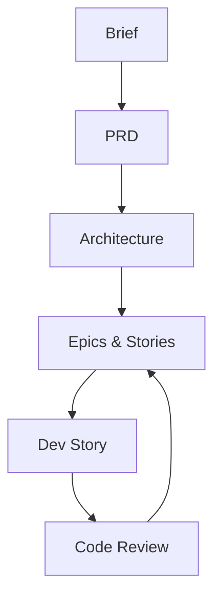

## 🤔 Curiosity: Can “agile” become a repeatable AI workflow?

Most teams talk about agile but implement it inconsistently. AI agents can speed up delivery, but without structure, they also amplify chaos.

**Question:** What if we gave agents a **full agile playbook**, not just tasks—so planning, architecture, and implementation stay coherent?

---

## 📚 Retrieve: What BMAD Method actually is

BMAD Method is an **AI‑driven agile development framework** with specialized agents, guided workflows, and scale‑adaptive planning. It’s open source and designed to work across multiple AI IDEs.

### 1) Structured workflows (end‑to‑end)
BMAD doesn’t start with code. It starts with **clarity**:

- /product-brief → problem framing + MVP scope
- /create-prd → requirements, personas, metrics, risks
- /create-architecture → technical design decisions
- /create-epics-and-stories → prioritized stories
- /sprint-planning → execution cadence
- /create-story → /dev-story → /code-review → repeat

This is a **full lifecycle loop**, not just prompt templates.

### 2) Specialized agents
The framework ships with **domain roles** (PM, Architect, Developer, UX, Scrum Master, QA). The idea is to simulate real collaboration with **role‑specific lenses**.

### 3) Scale‑adaptive intelligence
BMAD adapts based on project size and domain. A small bug fix doesn’t need the same planning depth as a safety‑critical system.

---

## Quick start (from the repo)

```bash
# install
npx bmad-method install

# non-interactive
npx bmad-method install --directory /path/to/project --modules bmm --tools claude-code --yes

# then in your IDE
/bmad-help
```

---

## 💡 Innovation: How I’d use BMAD in game teams

### 1) Fix the “vibe coding” problem
Game teams move fast, but systems can drift. BMAD enforces **thinking before output**.

### 2) Keep architecture explicit
With /create-architecture baked in, the system forces **explicit decisions**, not accidental ones.

### 3) Treat agents as roles, not autocomplete
This is the biggest shift: **agents become collaborators**, not just code generators.

---

## Practical tradeoffs

| Tradeoff | Impact | Mitigation |
|---|---|---|
| More upfront planning | Feels slower initially | Saves rework later |
| Heavier process for tiny tasks | Overkill for micro‑fixes | Use /quick-spec flow |
| Requires discipline | Not “fire‑and‑forget” | Make it part of team ritual |

---

## Mini workflow diagram



---

## Key Takeaways

| Insight | Implication | Next Steps |
|---|---|---|
| BMAD turns AI into a process, not a shortcut | Less chaos, more clarity | Adopt the full flow |
| Specialized agents simulate cross‑functional teams | Better decisions across domains | Use multi‑role planning |
| Scale‑adaptive workflows fit both small and large work | Flexible but structured | Start with /quick-spec |

### New Questions
- Can we measure “planning quality” in AI‑assisted sprints?
- How does BMAD compare to standard Scrum in cycle time?
- What guardrails keep it from becoming heavy process?

---

## References
- BMAD Method repo: https://github.com/bmad-code-org/BMAD-METHOD
- PyTorch Korea thread: https://discuss.pytorch.kr/t/bmad-method-ai-ai/7481
- Docs: http://docs.bmad-method.org
