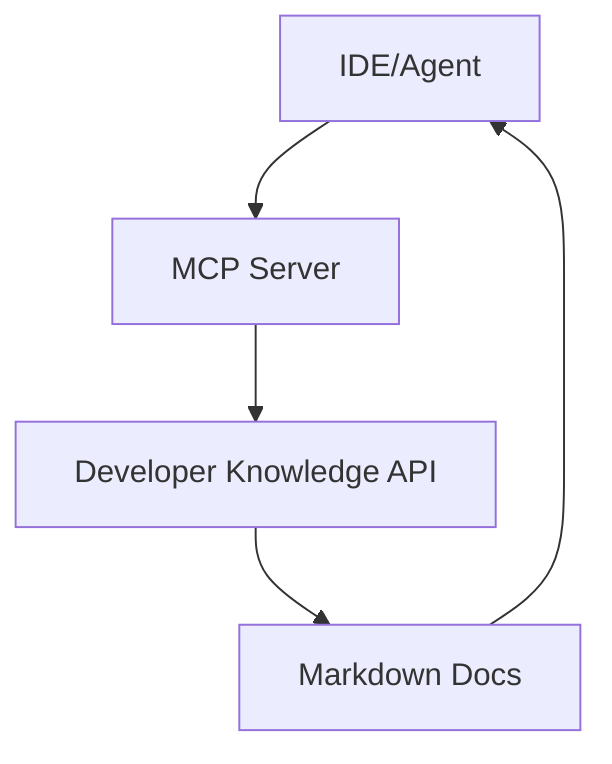

## 🤔 Curiosity: What happens when docs become live infrastructure?

Agentic tools are everywhere—but they still break on the most boring problem: **stale documentation**. If your assistant is trained on last quarter’s Firebase release, it will confidently generate yesterday’s code.

**Question:** Can we make documentation a *live* machine‑readable dependency, the same way we treat APIs or build artifacts?

---

## 📚 Retrieve: What Google launched (and why it’s different)

Google’s announcement introduces two pieces that work together:

### 1) Developer Knowledge API (the canonical source)
It’s a programmatic gateway to **official Google docs**—searchable and retrievable as Markdown.

**Key properties:**
- **Coverage:** Firebase, Android, Google Cloud, and more
- **Search + retrieve:** Find the right page, pull full Markdown
- **Freshness:** re‑indexed within ~24 hours of updates

This is the key shift: **no more scraping or relying on pretrained snapshots**.

### 2) MCP server (the agent integration layer)
MCP is an open standard for connecting assistants to external knowledge. The official MCP server lets tools query Google’s docs directly.

**What this enables:**
- Implementation guidance grounded in current docs
- Troubleshooting with canonical error references
- Service comparisons based on official sources

---

## How the pipeline works (practical model)



Think of it as a **doc retrieval chain** that’s as first‑class as your LLM call.

---

## ⚙️ Getting started (condensed)

```bash
# 1) Create an API key in Google Cloud
# 2) Enable MCP server
gcloud beta services mcp enable developerknowledge.googleapis.com --project=PROJECT_ID

# 3) Configure your tool
# (mcp_config.json or settings.json)
```

Docs:
- API: https://developers.google.com/knowledge/api
- MCP: https://developers.google.com/knowledge/mcp

---

## 💡 Innovation: Why this matters for real teams

### 1) “Freshness” becomes a capability, not a promise
Most AI tools *claim* accuracy. The API makes it **verifiable**.

### 2) Fewer hallucinations, more citations
If the tool can fetch current Markdown, it can **cite sources** and you can audit them.

### 3) A blueprint for other ecosystems
This is the real impact: **docs as infrastructure**. It sets a template for every major platform to follow.

---

## Practical usage scenarios

| Scenario | Old approach | With Developer Knowledge API |
|---|---|---|
| Firebase push notification setup | LLM guesses from memory | Query latest docs directly |
| Android API change check | Manual search | Automated retrieval + summarize |
| Cloud Run vs Cloud Functions | Blog summary | Official comparison via docs |

---

## Key Takeaways

| Insight | Implication | Next Steps |
|---|---|---|
| Live docs > pretrained memory | Accurate agent output | Route queries through MCP |
| Canonical APIs reduce risk | Less scraping / fewer hallucinations | Prefer official knowledge APIs |
| MCP standardizes access | Faster integration with tools | Add MCP configs to IDEs |

### New Questions
- How fast should “doc freshness” be for production safety?
- Can we auto‑test agent outputs against retrieved citations?
- Which ecosystems will standardize doc APIs next?

---

## References
- Announcement: https://developers.googleblog.com/introducing-the-developer-knowledge-api-and-mcp-server/
- Developer Knowledge API: https://developers.google.com/knowledge/api
- MCP server docs: https://developers.google.com/knowledge/mcp
