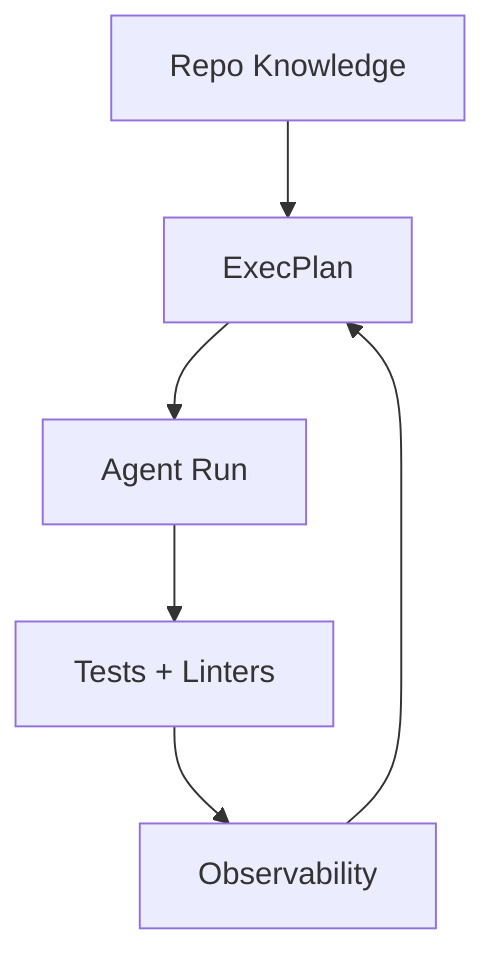

## 🤔 Curiosity: If agents write all the code, what do engineers do?

OpenAI just described a wild constraint: **no human‑written code**, only Codex agents. Starting in late Aug 2025, they grew an empty repo into **~1M lines**, shipping a real product with daily users—**~10× faster** than manual development.

The real takeaway isn’t “agents are smart.” It’s that **engineering becomes harness design**: the environment, constraints, and feedback loops that let agents work safely.

---

## 📚 Retrieve: The 5 harness principles (from OpenAI + references)

### 1) If the agent can’t see it, it doesn’t exist
Knowledge buried in Google Docs, Slack, or a human brain is invisible. The team pushed **all decisions into the repo**: markdown, schemas, and execution plans.

- ExecPlans live in **PLANS.md**
- Must be self‑contained, beginner‑readable
- Codex runs **7+ hours** off a single plan
- ARCHITECTURE.md is a map, not a manual

### 2) Don’t say “try harder”—ask “what capability is missing?”
When Codex was slow, the fix wasn’t prompts—it was **missing environment affordances**. They asked: what tool, abstraction, or evidence does the agent need to move?

Examples:
- Custom concurrency helper integrated with OpenTelemetry
- “Boring tech” is often better (stable APIs + clear training signal)

### 3) Consistency comes from mechanical constraints
Docs alone didn’t keep the codebase coherent. The team enforced **invariants** with linters and structure tests.

- Fixed layers per domain (Types → Config → Repo → Service → Runtime → UI)
- Dependency direction validated by CI
- Custom linters (written by Codex) fail builds on violations

### 4) Give agents eyes and observability
They wired **Chrome DevTools Protocol** into the agent runtime to inspect DOM, take screenshots, and compare states. Observability stacks were **ephemeral per worktree**, so each agent had its own logs/metrics.

- Agents query **LogQL** and **PromQL** directly
- Prompts like “startup < 800ms” become executable
- Single runs often last **6+ hours**

### 5) Give a map, not a 1,000‑page manual
Large monolithic AGENTS.md files fail. Context is scarce. The solution: **short map + structured knowledge base**.

- AGENTS.md = table of contents
- docs/ is the system of record
- Doc‑gardening agents keep it fresh
- Architectural invariants often defined by **absence**

---

## 💡 Innovation: What this changes for real teams

### 1) Engineering shifts from code to environment
Your main job becomes **constraints + feedback**. If your harness is weak, agents will drift. If it’s strong, they converge.

### 2) Make knowledge “repo‑native”
If it isn’t in the repo, the agent won’t learn it. This also mirrors onboarding: new hires can only use what’s visible.

### 3) Mechanical enforcement beats narrative guidance
Policies that fail the build are more reliable than documentation alone. This is the heart of harness engineering.

---

## A compact harness loop

---

## Key Takeaways

| Insight | Implication | Next Steps |
|---|---|---|
| Agents need a harness, not hero prompts | Environment design is the new craft | Build constraints + feedback loops |
| Repo‑native knowledge is non‑optional | Hidden docs don’t exist to agents | Move decisions into markdown + plans |
| Mechanical enforcement scales | Consistency beats micromanagement | Invest in linters + structural tests |

### New Questions
- Can harnesses keep 5‑year architectures coherent?
- What “minimum viable harness” works for small teams?
- How do we measure harness quality objectively?

---

## References
- OpenAI blog: https://openai.com/index/harness-engineering/
- ARCHITECTURE.md concept: https://matklad.github.io/2021/02/06/ARCHITECTURE.md.html
- ExecPlans (PLANS.md): https://developers.openai.com/cookbook/articles/codex_exec_plans
- “AI is forcing us to write good code”: https://bits.logic.inc/p/ai-is-forcing-us-to-write-good-code
