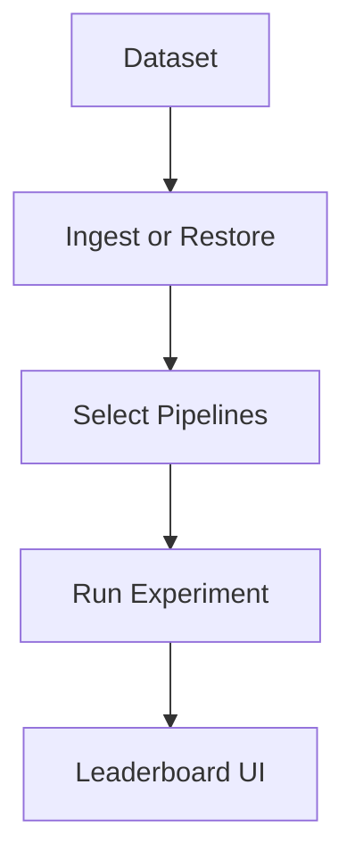

## 🤔 Curiosity: Why is RAG research still painful in 2026?

Even in the agent era, **RAG is still the backbone** for real‑world systems that need fresh, external knowledge. But the research workflow is messy:

- Every dataset uses a different format
- Every paper claims SOTA
- Re‑implementing baselines eats weeks

**AutoRAG‑Research** tries to fix this by turning RAG experiments into a standardized, repeatable pipeline.

---

## 📚 Retrieve: What AutoRAG‑Research actually provides

### 1) Unified datasets + pre‑computed embeddings
It normalizes formats and provides ready‑to‑run datasets (some with pre‑computed embeddings). Examples:

- **BEIR**, **MTEB**, **RAGBench**, **MrTyDi**, **BRIGHT** (text)
- **ViDoRe v1/v2/v3**, **VisRAG** (image)
- **Open‑RAGBench** (text + image)

### 2) Paper‑implemented SOTA pipelines
Instead of re‑building every baseline, you can run built‑in pipelines from papers:

**Retrieval**
- BM25, DPR, HyDE, Hybrid RRF, Hybrid CC

**Generation (end‑to‑end)**
- BasicRAG, IRCoT, ET2RAG, MAIN‑RAG, VisRAG

### 3) Metrics baked in
- Retrieval: **Recall/Precision/F1**, **nDCG/MRR/MAP**
- Generation: **BLEU/METEOR/ROUGE**, **BERTScore/SemScore**

### 4) Plugin system
You can add your own retrieval/generation pipeline or evaluation metric as a plugin, then run it **side‑by‑side** with baselines.

---

## 🔧 Quick workflow (as shipped)



```bash
# 1) See datasets
autorag-research show datasets

# 2) Ingest or restore
autorag-research ingest --name beir --extra dataset-name=scifact
# or
autorag-research data restore beir beir_arguana_test_qwen_3_0.6b

# 3) Run experiments
autorag-research run --db-name=beir_scifact_test

# 4) View results
python -m autorag_research.reporting.ui
```

---

## 💡 Innovation: Why this matters for production teams (and games)

### 1) RAG evaluation becomes *fast*, not heroic
Standardized datasets + built‑in baselines mean **faster iteration**. Teams can spend time on new ideas, not re‑implementing old ones.

### 2) Plugins make RAG research modular
If your studio has a custom retrieval trick or domain‑specific scorer, you can plug it in and compare **apples‑to‑apples**.

### 3) “Spec‑driven” RAG experiments
The project is essentially a **structured spec for RAG research**: dataset schemas, pipeline configs, metrics. This is exactly what agents need to run experiments reliably.

---

## A quick comparison table

| Problem | Old Workflow | AutoRAG‑Research |
|---|---|---|
| Dataset formats | Dozens of custom loaders | Unified schema + pre‑ingested DB |
| Baselines | Re‑implement per paper | Built‑in pipelines from papers |
| Metrics | Custom scripts | Standard metrics out of the box |
| Experiment tracking | Manual | Config‑driven + leaderboard UI |
| Extensibility | Fork & patch | Plugin system |

---

## Key Takeaways

1. **AutoRAG‑Research turns RAG research into a reproducible lab.**
2. **Baselines + metrics are built in**, so you can focus on new ideas.
3. **Plugin architecture is the leverage point** for real innovation.

### New questions I’m asking
- Can this become the *de facto* RAG benchmark harness?
- How will multimodal RAG evaluation evolve as image datasets explode?
- What’s the minimal agent harness needed to run AutoRAG‑Research hands‑free?

---

## References
- Hada News: https://news.hada.io/topic?id=26624
- GitHub: https://github.com/NomaDamas/AutoRAG-Research
- Documentation: https://nomadamas.github.io/AutoRAG-Research/
