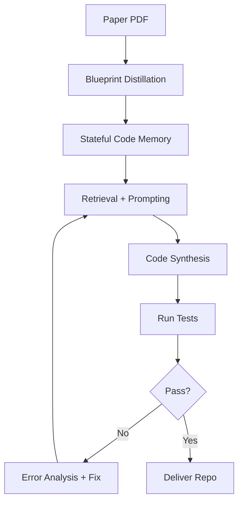

## 🤔 Curiosity: Can we ship production code from *papers* and *chat* without touching a laptop?

DeepCode positions itself as a **multi‑agent coding framework** that turns research papers and natural language into runnable projects. The twist: it also plugs into **nanobot**, letting you drive that workflow from **Telegram/Feishu**—basically *agentic coding from your phone*.

If this works at scale, the question becomes: **Is the primary dev interface shifting from IDE → CLI → chat?**

---

## 📚 Retrieve: What DeepCode + nanobot actually ship

### 1) The paper’s core idea: manage information flow
The DeepCode paper frames repository synthesis as a **channel optimization** problem: LLMs have tight context budgets, so we need to compress, index, retrieve, and correct information **systematically**.

DeepCode’s four operations:
1. **Blueprint distillation** (compress sources)
2. **Stateful code memory** (structured indexing)
3. **Conditional knowledge injection** (RAG)
4. **Closed‑loop error correction** (iterative fixes)

### 2) The product surface: Paper2Code / Text2Web / Text2Backend
From the repo and README, DeepCode ships three core workflows:

- **Paper2Code**: convert research papers into runnable algorithms
- **Text2Web**: generate frontend UI from descriptions
- **Text2Backend**: generate server‑side code from text prompts

### 3) The headline claim: SOTA on PaperBench
DeepCode reports **state‑of‑the‑art results** on OpenAI’s PaperBench benchmark, including:

- **75.9%** vs **72.4%** (top human PhD baseline)
- **84.8%** vs **~58.7%** (best commercial agents)

These numbers are from the repo’s benchmark section; treat them as author‑reported until independently verified.

> **Retrieve:** I’m treating these as *claims*, not ground truth, until broader replication lands.
{: .prompt-info}

### 4) The “phone coding” angle: nanobot integration
The repo highlights **nanobot**, a chatbot layer that lets you trigger DeepCode workflows from chat:

- “Just chat naturally with nanobot to handle coding tasks”
- One‑command deploy (`./nanobot/run_nanobot.sh`)
- Works through **Feishu** (and implied chat integrations)

This makes agentic coding feel like a **chat‑first dev interface** instead of a CLI‑only workflow.

---

## 💡 Innovation: Why this matters for real teams (and games)

### 1) Paper2Code is a production accelerant
If DeepCode’s “paper → repo” pipeline is reliable, it compresses the most painful step in applied research: **re‑implementing papers just to evaluate them**.

For game teams, this could mean:
- Faster prototyping of AI behaviors (navigation, planning, NPC dialogue)
- Quicker evaluation of new model architectures
- Shorter cycles from research idea → playable build

### 2) Chat‑first dev may become normal
The **nanobot** layer suggests a shift in how teams interact with code generation. If chat becomes the main interface, then:
- Spec quality becomes more important than keyboard speed
- Observability + traceability become core UI features
- “Where did this code come from?” becomes a **first‑class** question

### 3) The real bottleneck shifts to verification
DeepCode’s own framing is **information flow + error correction**. That implies the real leverage is in:

- Automated tests
- Reproducible environments
- Structured specs
- Verification pipelines

These are **production problems**, not model problems.

---

## 🧪 A minimal Paper2Code pipeline (conceptual)



```python
# Conceptual skeleton: paper -> code loop
from typing import List

class Paper2Code:
    def __init__(self, retriever, coder, tester):
        self.retriever = retriever
        self.coder = coder
        self.tester = tester

    def synthesize(self, paper_text: str) -> str:
        blueprint = self.distill(paper_text)
        memory = self.index(blueprint)

        while True:
            context = self.retriever.query(memory)
            repo = self.coder.generate(context)
            if self.tester.run(repo):
                return repo
            memory = self.update_memory(repo)

    def distill(self, paper_text: str) -> str:
        # compress paper into algorithmic blueprint
        return "blueprint"

    def index(self, blueprint: str):
        # create structured code memory
        return {"blueprint": blueprint}

    def update_memory(self, repo):
        # add failure signals into memory
        return {"blueprint": "updated"}
```

---

## 📊 Feature snapshot

| Capability | DeepCode Claim | Practical Value |
|---|---|---|
| Paper2Code | SOTA on PaperBench | Faster research reproduction |
| Text2Web | Full UI generation | Rapid frontend prototypes |
| Text2Backend | Server scaffolding | Faster API + infra bootstraps |
| nanobot | Chat‑first coding | Mobile / async workflows |

---

## Key Takeaways

1. **DeepCode is less about “better prompts” and more about “better information flow.”**
2. **nanobot hints at a chat‑first dev future** where specs and traceability matter more than IDE time.
3. If Paper2Code is real at scale, **research evaluation cycles shrink dramatically**.

### New questions I’m asking
- How reliable is Paper2Code under *real* production constraints (builds, tests, infra)?
- Will chat‑first workflows improve or **hurt** engineering clarity?
- What’s the minimum verification harness needed to trust agent‑generated repos?

---

## References
- GitHub: https://github.com/HKUDS/DeepCode
- Technical report (arXiv): https://arxiv.org/abs/2512.07921
