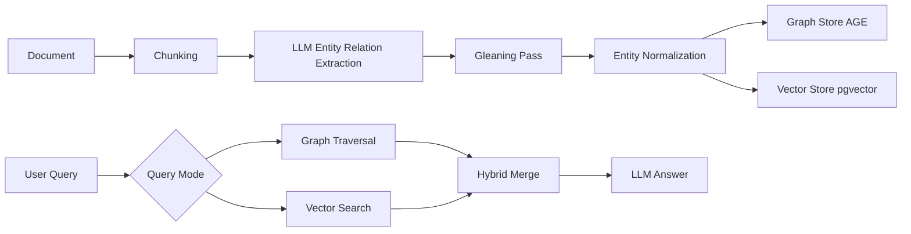

{: .light .w-75 .shadow .rounded-10 }

## 🤔 Curiosity: Why do graph‑aware RAG stacks keep winning?

In production RAG, I keep running into the same wall: **vector similarity alone struggles with multi‑hop reasoning**—“how does X relate to Y through Z?” EdgeQuake positions itself as a Graph‑RAG engine that keeps the *structure* of the document, not just its semantics. That immediately maps to how we build systems in games: **relationships matter** as much as facts.

---

## 📚 Retrieve: What EdgeQuake ships

EdgeQuake is a **high‑performance Graph‑RAG framework in Rust** that implements the **LightRAG algorithm**. The core idea is simple but powerful: **extract a knowledge graph during ingestion, then query that graph in addition to vector space.**

### Key capabilities (from the repo)

- **Knowledge Graph Extraction** (entities + relationships)
- **6 Query Modes** (naive → local → global → hybrid → mix → bypass)
- **Rust performance** (Tokio async + zero‑copy design)
- **REST API + SSE streaming** (OpenAPI 3.0)
- **React 19 UI** with Sigma.js graph visualization
- **MCP integration** for agent tooling

{: .light .shadow .rounded-10 }
{: .light .shadow .rounded-10 }
{: .light .shadow .rounded-10 }
{: .light .shadow .rounded-10 }

---

## 📚 Retrieve: How the LightRAG pipeline works

### Minimal API usage (ingest + query)

```bash
# Upload a document
curl -X POST http://localhost:8080/api/v1/documents/upload \
  -F "file=@your-document.pdf"

# Query the system
curl -X POST http://localhost:8080/api/v1/query \
  -H "Content-Type: application/json" \
  -d '{
    "query": "What are the main concepts?",
    "mode": "hybrid"
  }'
```

The ingestion pipeline (as described in README) is essentially:

1) **Chunk** documents
2) **Extract entities/relationships** with LLMs
3) **Glean** (multi‑pass extraction for recall)
4) **Normalize** entities (dedup)
5) **Embed** chunks/entities
6) **Store** in graph + vector backends (AGE + pgvector)

And at query time, you can pick modes depending on the question:

| Mode | Best for | Behavior |
|---|---|---|
| **Naive** | keyword‑like lookups | vector similarity only |
| **Local** | specific relationships | entity neighborhood traversal |
| **Global** | themes | community summaries |
| **Hybrid** | balanced | combines local + global |
| **Mix** | controlled weighting | blend naive + graph |
| **Bypass** | general queries | LLM only |



---

## 💡 Innovation: Why this matters for game‑scale RAG

### 1) Graph‑first retrieval matches game design
In narrative systems, **relationships are the content**. If we retrieve only by semantic similarity, we miss the *why* behind a fact. Graph‑RAG lets us answer:

- “Which factions influence this NPC?”
- “What events led to the quest chain?”

### 2) Multi‑mode querying is production leverage
I love that EdgeQuake exposes multiple query modes. We can map modes to UX flows:

| UX Flow | Query Mode | Rationale |
|---|---|---|
| Quick FAQ | Naive | speed > depth |
| World‑lore | Global | thematic coverage |
| Quest chain | Local | relationships matter |
| GM tools | Hybrid | balanced recall |

### 3) MCP makes it agent‑ready
EdgeQuake ships an MCP server. That’s immediate plug‑in to agent workflows without writing glue code.

---

## 💡 Innovation: What I’d ship first

1) **Internal lore QA tool** using Hybrid queries
2) **Live‑ops incident debugger** with graph traversal (root‑cause explanation)
3) **Narrative consistency checker** to validate quests against lore graph

### Practical evaluation checklist

- **Graph extraction quality** (precision/recall)
- **Query latency under load**
- **Memory footprint per doc**
- **Hybrid query gains vs naive**

---

## References

**Code & Docs**
- Repo: https://github.com/raphaelmansuy/edgequake
- LightRAG paper: https://arxiv.org/abs/2410.05779
- Docs index: https://github.com/raphaelmansuy/edgequake/tree/edgequake-main/docs

**MCP**
- MCP: https://modelcontextprotocol.io/
