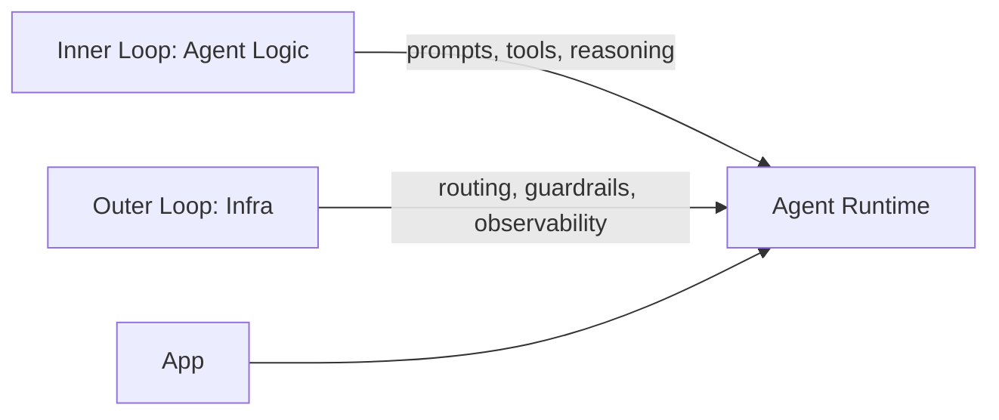

{: .light .w-75 .shadow .rounded-10 }

## 🤔 Curiosity: Are agents stuck at the “pre‑ONNX” stage?

Every platform goes through the same arc. First, we learn how to **build**. Then the constraint flips to **operate**. With neural networks, PyTorch/TensorFlow solved building, but deploying models across runtimes was messy—until ONNX standardized the “outer loop.”

Agents are at the same inflection point. Frameworks like LangGraph, CrewAI, and LlamaIndex make it easy to build. But **operating agents in production** is still the hard part:

- Which agent should handle this request?
- How do we enforce guardrails consistently?
- How do we swap models without refactoring everything?
- How do we connect observability to continuous improvement?

That’s not “agent logic.” That’s **infrastructure**.

---

## 📚 Retrieve: What Plano actually is

Plano is an **AI‑native proxy server + data plane** for agentic apps. It pulls out the outer‑loop plumbing—routing, orchestration, guardrails, and observability—so your application code stays clean and framework‑agnostic.

From the repo, the promise is explicit:

- **Orchestration** between agents without touching app code
- **Model agility** via routing by model name, alias, or preferences
- **Signals + tracing** with zero‑code instrumentation (OTEL)
- **Filter Chains** for guardrails and moderation

{: .light .w-75 .shadow .rounded-10 }

{: .light .w-75 .shadow .rounded-10 }

---

## 📚 Retrieve: Inner loop vs. outer loop (why this matters)

Here’s a clean mental model:



Most frameworks blur this boundary. Plano **separates** it.

### Example: declarative routing in config

```yaml
model_providers:
  - model: openai/gpt-4o
    access_key: $OPENAI_API_KEY
    default: true

routing_preferences:
  - name: complex_reasoning
    description: deep analysis & reasoning
    model: deepseek/deepseek-coder
```

Swapping models becomes config changes, not refactors.

---

## 💡 Innovation: Why this is ONNX‑like for agents

ONNX didn’t replace PyTorch or TensorFlow. It made them **portable**. Plano is doing the same for agents:

| Layer | Before | With Plano | Impact |
|---|---|---|---|
| Routing | Hard‑coded in app | Config‑driven | Safer rollouts |
| Guardrails | Per‑agent hacks | Filter Chains | Consistent safety |
| Observability | DIY OTEL | Built‑in Signals | Faster debugging |
| Model swaps | Refactor risk | Config‑only | More agility |

That means you can:
- keep agent business logic stable
- evolve infra separately
- standardize ops across frameworks

{: .light .w-75 .shadow .rounded-10 }

---

## 💡 Innovation: How I’d use Plano in production

1) **Game live‑ops routing** — prompt‑driven router decides which agent handles support, balancing, or fraud.
2) **Guardrail standardization** — one filter chain for all agents, no per‑service hacks.
3) **A/B model swaps** — test new models via routing preferences, zero code changes.

### What I’d evaluate first

- **Routing correctness vs latency** (router LLM quality)
- **Guardrail coverage** (what escapes filter chains)
- **Signal completeness** (trace quality across agents)
- **Failover behavior** (what happens when a model is down)

---

## 💡 New Questions

- Can we treat routing policies like feature flags?
- How do we benchmark router accuracy at scale?
- What’s the minimal infra layer that still provides full safety?

---

## References

**Code & Docs**
- Plano repo: https://github.com/katanemo/plano
- Plano docs: https://docs.planoai.dev
- Quickstart: https://docs.planoai.dev/get_started/quickstart.html

**Images**
- From Plano docs repo (see `/docs/source/_static/img/`)
