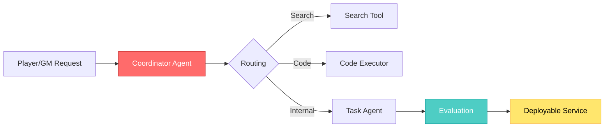

{: .light .w-75 .shadow .rounded-10 }

## 🤔 Curiosity: Can we treat agents like real software projects?

In production games, I’ve learned the hard way that **agent prototypes die the moment they can’t be tested, evaluated, or deployed reliably**. That’s why ADK (Agent Development Kit) caught my attention. It claims to make agent development feel like *software development*: code‑first, testable, deployable. The question I started with:

> **Can ADK give us an engineering‑grade path from prototype to production without losing iteration speed?**

---

## 📚 Retrieve: What ADK actually provides (and how it fits)

### 1) Code‑First by Default
ADK is a Python framework for building agents with explicit structure: **agents, tools, orchestration, evaluation, deployment**. If you live in Python/Unity toolchains, this is a natural fit.

```python
from google.adk.agents import Agent
from google.adk.tools import google_search

# A minimal agent you can ship and test
root_agent = Agent(
    name="search_assistant",
    model="gemini-2.5-flash",  # or your chosen model
    instruction="Answer questions using Google Search when needed.",
    description="A web-search assistant.",
    tools=[google_search]
)
```

### 2) Multi‑Agent Hierarchies
You can build **coordinator → worker** style setups. This is the pattern I’ve used in production to separate routing, task execution, and reporting.

```python
from google.adk.agents import LlmAgent

greeter = LlmAgent(name="greeter", model="gemini-2.5-flash")
task_executor = LlmAgent(name="task_executor", model="gemini-2.5-flash")

coordinator = LlmAgent(
    name="Coordinator",
    model="gemini-2.5-flash",
    description="Coordinates subtasks.",
    sub_agents=[greeter, task_executor]
)
```

{: .light .w-75 .shadow .rounded-10 }

### 3) Built‑in Tooling + Code Execution
ADK supports tools, OpenAPI specs, and external integrations. It also ships **CodeExecutor** support for executing agent‑generated code safely (critical when you need deterministic sandbox behavior).

{: .light .w-75 .shadow .rounded-10 }

### 4) Evaluation Is First‑Class
This is the most production‑relevant part: ADK treats evaluation as a core workflow (not an afterthought). You can score responses **and** execution trajectories.

```bash
adk eval \
  samples_for_testing/hello_world \
  samples_for_testing/hello_world/hello_world_eval_set_001.evalset.json
```

{: .light .w-75 .shadow .rounded-10 }

### 5) Dev UI + Web Debugging
There’s a built‑in dev UI for testing, debugging, and demonstrating agent flows—this is extremely useful for communicating with non‑engineers.

{: .light .w-75 .shadow .rounded-10 }

---

## 📚 Retrieve: Architecture view (what I would ship)



This mirrors how I’ve split **routing vs. execution** in live ops tools. The major win here: **evaluation is an explicit layer**.

---

## 💡 Innovation: How I’d use ADK for game production

### Practical use case: Live‑ops incident triage
- **Coordinator** routes alerts (payment, fraud, crash spikes)
- **Task agents** run search, analysis, or incident response
- **Evaluation** gates whether an agent action is allowed to ship

### What ADK enables (vs ad‑hoc scripts)

| Capability | Ad‑hoc scripts | ADK | Why It Matters in Games |
|---|---|---|---|
| Testability | ❌ | ✅ | Reliable regression checks before a live patch |
| Tool safety | ⚠️ | ✅ | Prevents accidental destructive actions |
| Multi‑agent routing | ⚠️ | ✅ | Clean separation of responsibility |
| Evaluation | ❌ | ✅ | You can define quality targets |
| Deployability | ⚠️ | ✅ | Production pipeline friendly |

### Key Takeaways

| Insight | Implication | Next Step |
|---|---|---|
| Evaluation‑first matters | Agents need tests like any service | Build eval sets for high‑risk actions |
| Code‑first scales better | Easier to version + review | Treat agents like backend services |
| Multi‑agent is a design pattern | Separates routing vs execution | Standardize coordinator/worker templates |

### New Questions I’m Asking
- How do we tune evaluation metrics to match *player trust*?
- What does “safe tool execution” look like at scale?
- Can we simulate player impact before we ship an agent?

---

## References

**Documentation & Guides**
- ADK Docs: https://google.github.io/adk-docs/
- ADK Python Repo: https://github.com/google/adk-python

**Related Projects**
- ADK Samples: https://github.com/google/adk-samples
- ADK Web UI: https://github.com/google/adk-web

**Community**
- ADK Community: https://groups.google.com/g/adk-community
