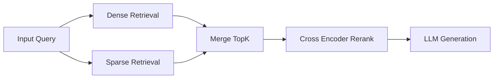

{: .light .w-75 .shadow .rounded-10 }

## 🤔 Curiosity: Do we really need a server for every RAG?

Every RAG stack I’ve built eventually asked the same question: **why are we spinning up a full vector database service just to search a few thousand vectors?** We don’t deploy Postgres when SQLite is enough—and Zvec feels like that moment for vector search.

Zvec is an **in‑process vector database** built on Alibaba’s Proxima engine. It runs inside your app, persists to disk, and removes the “deploy a vector DB first” tax. If you’re shipping agents, offline tools, or privacy‑first pipelines, that’s a big deal.

---

## 📚 Retrieve: What Zvec actually ships

### Key Features (from the repo)

- **Blazing Fast**: Searches billions of vectors in milliseconds.
- **Simple, Just Works**: `pip install zvec` and go.
- **Dense + Sparse Vectors**: One API handles both.
- **Hybrid Search**: Combine semantic similarity with structured filters.
- **Runs Anywhere**: In‑process for notebooks, servers, edge devices.

{: .light .shadow .rounded-10 }
{: .light .shadow .rounded-10 }
{: .light .shadow .rounded-10 }

### One‑Minute Example

```python
import zvec

schema = zvec.CollectionSchema(
    name="example",
    vectors=zvec.VectorSchema("embedding", zvec.DataType.VECTOR_FP32, 4),
)

collection = zvec.create_and_open(path="./zvec_example", schema=schema)

collection.insert([
    zvec.Doc(id="doc_1", vectors={"embedding": [0.1, 0.2, 0.3, 0.4]}),
    zvec.Doc(id="doc_2", vectors={"embedding": [0.2, 0.3, 0.4, 0.1]}),
])

results = collection.query(
    zvec.VectorQuery("embedding", vector=[0.4, 0.3, 0.3, 0.1]),
    topk=10
)

print(results)
```

### Performance at scale

{: .light .w-75 .shadow .rounded-10 }

---

## 📚 Retrieve: Why this is a big deal for games & agents

I see three production‑grade implications immediately:

1) **Local RAG by default** – no extra infra or network hops.
2) **Edge & offline support** – works on dev machines, kiosks, or devices with no outbound access.
3) **Privacy‑first retrieval** – embeddings never leave the machine.

Here’s a pragmatic retrieval stack that actually fits most game tools:



---

## 💡 Innovation: The SQLite analogy is real

The analogy holds because Zvec doesn’t try to replace Milvus/Qdrant. It **shrinks the default** so that simple pipelines can ship without infrastructure debt.

### Where I would deploy Zvec first

| Use Case | Why Zvec Works | Production Win |
|---|---|---|
| **On‑device RAG** | In‑process + persistence | No server, no latency |
| **Internal tooling** | Simple API | Faster prototypes |
| **Edge agents** | Runs anywhere | Offline fallback |
| **Privacy‑first apps** | Local retrieval | Compliance wins |

### What I’d evaluate before shipping

- **Index build time vs. update rate**
- **Memory footprint & warm‑cache behavior**
- **Hybrid scoring quality with your metadata**
- **Reranker gains vs. baseline top‑K**

### Key Takeaways

| Insight | Implication | Next Step |
|---|---|---|
| Zvec removes infra tax | RAG becomes a library call | Ship local RAG first |
| Hybrid search is native | Better recall for rare tokens | Add sparse vectors early |
| In‑process changes UX | Latency drops massively | Design for sub‑100ms search |

### New Questions I’m Asking

- How does Zvec scale in a multi‑process game server?
- What’s the optimal hybrid weighting for player‑authored content?
- Can we use it as a hot‑cache layer in front of a larger vector DB?

---

## References

**Code & Docs**
- Zvec GitHub: https://github.com/alibaba/zvec
- Zvec Docs: https://zvec.org/en/docs/
- Zvec Benchmarks: https://zvec.org/en/docs/benchmarks/

**Installation**
- PyPI: https://pypi.org/project/zvec/
- NPM: https://www.npmjs.com/package/@zvec/zvec
