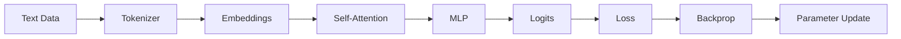

## 🤔 Curiosity: The Question

What if we could understand GPT **without** a framework, without hidden magic, and without any dependencies? I wanted a way to **see every moving part**—from tokens to attention to gradients—so I can explain it, teach it, and apply it in production when things break.

That curiosity led me to **MicroGPT**: the smallest complete GPT training and inference pipeline, written in pure Python.

---

## 📚 Retrieve: The Knowledge

### What MicroGPT Is (and Isn’t)

**MicroGPT** is a single‑file implementation that demonstrates the full GPT algorithm—from tokenization to training. It is not optimized for speed or scale. Instead, it is **optimized for learning**.

- **Code (source of truth):** https://gist.github.com/karpathy/8627fe009c40f57531cb18360106ce95
- **Colab (run it end‑to‑end):** https://colab.research.google.com/drive/1vyN5zo6rqUp_dYNbT4Yrco66zuWCZKoN?usp=sharing

### Core Concepts You’ll Actually Learn

1. **Tokenization** (character‑level)
2. **Embeddings** (token + position)
3. **Self‑Attention** (Q/K/V + softmax)
4. **MLP block** (non‑linear transform)
5. **Autograd** (chain rule in code)
6. **Training loop** (loss → backprop → Adam)

### Key Code Walkthrough (Core Blocks)

**1) Tokenizer + Vocabulary**
```python
uchars = sorted(set(''.join(docs)))
BOS = len(uchars)               # Beginning-of-sequence token
vocab_size = len(uchars) + 1
```

**2) Minimal Autograd (Value class)**
```python
class Value:
    __slots__ = ('data', 'grad', '_children', '_local_grads')
    def __init__(self, data, children=(), local_grads=()):
        self.data = data
        self.grad = 0
        self._children = children
        self._local_grads = local_grads

    def __add__(self, other):
        other = other if isinstance(other, Value) else Value(other)
        return Value(self.data + other.data, (self, other), (1, 1))

    def __mul__(self, other):
        other = other if isinstance(other, Value) else Value(other)
        return Value(self.data * other.data, (self, other), (other.data, self.data))

    def backward(self):
        topo, visited = [], set()
        def build(v):
            if v not in visited:
                visited.add(v)
                for c in v._children: build(c)
                topo.append(v)
        build(self)
        self.grad = 1
        for v in reversed(topo):
            for c, lg in zip(v._children, v._local_grads):
                c.grad += lg * v.grad
```

**3) Attention Core (Q/K/V + Softmax)**
```python
def softmax(logits):
    max_val = max(val.data for val in logits)
    exps = [(val - max_val).exp() for val in logits]
    total = sum(exps)
    return [e / total for e in exps]

# inside gpt(...)
q = linear(x, Wq)
k = linear(x, Wk)
v = linear(x, Wv)
attn_logits = [sum(qh[j] * kh[t][j] for j in range(head_dim)) / head_dim**0.5
               for t in range(len(kh))]
attn_weights = softmax(attn_logits)
head_out = [sum(attn_weights[t] * vh[t][j] for t in range(len(vh)))
            for j in range(head_dim)]
```

**4) Training Loop (Loss → Backprop → Adam)**
```python
for step in range(num_steps):
    doc = docs[step % len(docs)]
    tokens = [BOS] + [uchars.index(ch) for ch in doc] + [BOS]

    keys, values = [[] for _ in range(n_layer)], [[] for _ in range(n_layer)]
    losses = []
    for pos_id in range(n):
        token_id, target_id = tokens[pos_id], tokens[pos_id + 1]
        logits = gpt(token_id, pos_id, keys, values)
        probs = softmax(logits)
        loss_t = -probs[target_id].log()
        losses.append(loss_t)

    loss = (1 / n) * sum(losses)
    loss.backward()
    # Adam update follows...
```

### A Minimal GPT Pipeline (Concept Flow)



### Quick Guide: What to Read First

Start in this order inside the gist:

1. **Tokenizer setup** (vocab + BOS)
2. **Value class** (autograd engine)
3. **Parameters & model state**
4. **Attention block**
5. **Training loop**

---

## 💡 Innovation: The Insight

### What I Gained From This Approach

**MicroGPT is the fastest way I know to turn a “black box” into a mental model.**
When you build every part yourself, you stop memorizing and start understanding.

### Practical Learning Plan (1–2 Hours)

1. **Run Colab once** and confirm loss decreases.
2. **Trace a single token** through attention.
3. **Change `n_embd` or `block_size`** and observe behavior.
4. **Replace the dataset** with your own text.

### Key Takeaways

| Insight | Why it matters | Next action |
|---|---|---|
| GPT is just a pipeline of simple parts | You can debug and extend it safely | Re‑implement one block yourself |
| Attention is the core bottleneck | It dominates quality and compute | Focus your optimization here |
| Autograd is not magic | You can reason about gradients | Modify the Value class |

### New Questions This Raises

- How small can a GPT get before it stops generalizing?
- Can we use MicroGPT as a **teaching layer** inside production teams?
- What minimal changes make it "game‑ready" (latency, memory, control)?

---

## References

**Code & Implementation**
- MicroGPT (Karpathy Gist): https://gist.github.com/karpathy/8627fe009c40f57531cb18360106ce95
- Colab Notebook: https://colab.research.google.com/drive/1vyN5zo6rqUp_dYNbT4Yrco66zuWCZKoN?usp=sharing

**Related Reading**
- MicroGPT overview: https://karpathy.ai/microgpt.html
