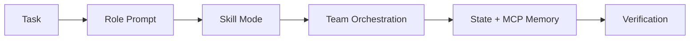

{: .light .w-75 .shadow .rounded-10 }

## 🤔 Curiosity: What if Codex CLI wasn’t a single agent?

Codex is powerful for direct tasks, but **multi‑step work needs coordination**—roles, workflows, memory, and operational control. OMX (oh‑my‑codex) is an orchestration layer that turns a single Codex session into a **multi‑agent team** with persistent state.

---

## 📚 Retrieve: What OMX ships

From the README and website, OMX adds:

- **Role prompts** via `/prompts:name`
- **Workflow skills** via `$name`
- **Team orchestration** in tmux (`omx team`, `$team`)
- **Persistent state + memory** through MCP servers
- **Hooks extension** (`omx hooks`) for plugin events

{: .light .shadow .rounded-10 }
{: .light .shadow .rounded-10 }
{: .light .shadow .rounded-10 }

### Quickstart (3 minutes)

```bash
npm install -g oh-my-codex
omx setup
omx doctor
```

Recommended launch profile:

```bash
omx --xhigh --madmax
```

---

## 📚 Retrieve: Core model and workflow

```text
User
  -> Codex CLI
    -> AGENTS.md (orchestration brain)
    -> ~/.codex/prompts/*.md (30 agent prompts)
    -> ~/.agents/skills/*/SKILL.md (40 skills)
    -> ~/.codex/config.toml (features, notify, MCP)
    -> .omx/ (runtime state, memory, plans, logs)
```



---

## 💡 Innovation: Why this matters for production agents

OMX feels like the “ops layer” that Codex CLI was missing. It doesn’t replace Codex; it **adds coordination**. That’s critical when tasks become long‑running or parallel.

### Where I’d use it first

| Use Case | Why OMX Works | Production Win |
|---|---|---|
| Large refactors | Team mode + staged pipeline | Faster, less error‑prone |
| QA/verification | Dedicated reviewer roles | Consistent quality |
| Multi‑module changes | Parallel workers | Shorter cycle time |

### Staged pipeline (plan → prd → exec → verify → fix)

This is the part I’d ship into my daily workflow. It aligns cleanly with how production teams already operate.

---

## 💡 New Questions

- How much team parallelism is “too much” for a repo?
- Can MCP‑backed memory reduce repeated context setup?
- What’s the right balance between human control and autopilot?

---

## References

- Repo: https://github.com/Yeachan-Heo/oh-my-codex
- Website: https://yeachan-heo.github.io/oh-my-codex-website/
- npm: https://www.npmjs.com/package/oh-my-codex
