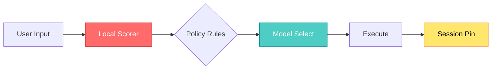

## 🤔 Curiosity: The Question

After surveying the **minimal OpenClaw ecosystem**, one question kept nagging me: *if the assistants are getting smaller, how should routing get smarter without getting heavier?* In production, routing isn’t just “which model?”—it’s latency, privacy, cost, and reliability all at once.

That’s where **ClawRouter** lands: a **local‑first router** designed for ultra‑lightweight assistants—aligned with the ecosystem I mapped in the earlier post.

{: .light .w-75 .shadow .rounded-10 }

---

## 📚 Retrieve: The Knowledge

### Context: the minimal ecosystem baseline

From the ecosystem snapshot (NanoBot → TinyClaw), we already saw a clear trend: **smaller stacks, higher ownership, less vendor dependency**. ClawRouter sits above that layer to decide *which model runs, when*—without external calls.

Here’s a quick reminder of the landscape:

{: .light .w-75 .shadow .rounded-10 }
{: .light .w-75 .shadow .rounded-10 }
{: .light .w-75 .shadow .rounded-10 }
{: .light .w-75 .shadow .rounded-10 }
{: .light .w-75 .shadow .rounded-10 }
{: .light .w-75 .shadow .rounded-10 }
{: .light .w-75 .shadow .rounded-10 }

### ClawRouter Features (Local‑First)

- **100% local routing** — 15‑dimension weighted scoring on‑device in <1ms
- **Zero external calls** — no API calls for routing decisions
- **30+ models** — OpenAI, Anthropic, Google, DeepSeek, xAI, Moonshot via one wallet
- **x402 micropayments** — pay‑per‑request with USDC on Base (no API keys)
- **Open source** — MIT licensed, inspectable routing logic

### ClawRouter Advanced Features

- **Agentic auto‑detect** — routes multi‑step tasks to Kimi K2.5
- **Tool detection** — switches when tool arrays are present
- **Context‑aware** — filters models that can’t handle your context size
- **Model aliases** — e.g., `/model sonnet`, `/model grok`
- **Session persistence** — pins a model for multi‑turn conversations
- **Free‑tier fallback** — keeps working when wallet is empty
- **Auto‑update check** — notifies when a new version is available

### Minimal routing flow

---

## 💡 Innovation: The Insight

### Why this matters for AI × Games

In game production, **routing is a budget line**. A tiny router that runs locally changes the economics:

- **Latency control** for live‑ops workflows
- **Cost predictability** for multi‑agent systems
- **Privacy guarantees** when internal data is involved

That’s why ClawRouter fits the minimal‑agent trend: it lets you keep the **decision layer small and local**, while still scaling across multiple models.

### What I’d test first

1) **Routing by task type** (analysis vs. content vs. tool‑heavy)  
2) **Fallback strategy** when wallet or rate limits hit  
3) **Session pinning** for long NPC dialogs or multi‑turn design tasks  

### New Questions This Raises

- Can local routers become *auditable compliance artifacts* in production pipelines?
- How do we benchmark routing quality vs. raw model benchmarks?
- What’s the right minimal schema for routing policies across teams?

---

## References

- Minimal OpenClaw ecosystem snapshot:  
  https://akillness.github.io/posts/build-your-own-ai-assistant-minimal-openclaw/
