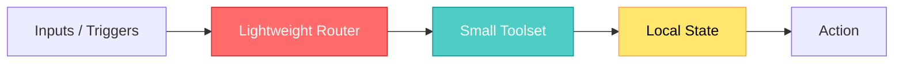

## 🤔 Curiosity: The Question

I keep asking the same thing every time I prototype a new agent: **why does personal AI feel so heavy?** OpenClaw is powerful, but for many workflows I want something smaller, faster, cheaper—something I can actually ship and control end‑to‑end.

The recent wave of **ultra‑lightweight OpenClaw‑inspired frameworks** is the first real answer I’ve seen. Different languages, different hardware, different tradeoffs—yet all aiming at the same target: **ownership**.

{: .light .w-75 .shadow .rounded-10 }

---

## 📚 Retrieve: The Knowledge

### What’s emerging in the ecosystem

Here’s the minimal‑agent lineup (all pulled from the linked repos). I’m attaching **all 7 images** explicitly so they render correctly:

### NanoBot (Python)
- Repo: https://github.com/HKUDS/nanobot  
- *Core agent functionality in ~4,000 LOC.*

{: .light .w-75 .shadow .rounded-10 }

### PicoClaw (Go)
- Repo: https://github.com/sipeed/picoclaw  
- *Ultra‑efficient, runs on tiny hardware.*

{: .light .w-75 .shadow .rounded-10 }

### ZeroClaw (Rust)
- Repo: https://github.com/zeroclaw-labs/zeroclaw  
- *Fast startup, zero‑overhead design.*

{: .light .w-75 .shadow .rounded-10 }

### NanoClaw (Claude Agents SDK + Containers)
- Repo: https://github.com/qwibitai/nanoclaw  
- *Container‑ready for personal workflows.*

{: .light .w-75 .shadow .rounded-10 }

### MimiClaw (C / ESP32‑S3)
- Repo: https://github.com/memovai/mimiclaw  
- *Runs on a $5 chip. No OS. No Node.*

{: .light .w-75 .shadow .rounded-10 }

### IronClaw (Rust, privacy‑first)
- Repo: https://github.com/nearai/ironclaw  
- *Encrypted local storage + sandboxing focus.*

{: .light .w-75 .shadow .rounded-10 }

### TinyClaw (Multi‑Agent Teams)
- Repo: https://github.com/TinyAGI/tinyclaw  
- *File‑queue multi‑agent teams on tiny infra.*

{: .light .w-75 .shadow .rounded-10 }

### Quick Comparison

| Project | Language | Goal | Signature Trait |
|---|---|---|---|
| NanoBot | Python | Minimal core agent | ~4K LOC, research‑friendly |
| PicoClaw | Go | Tiny hardware | Ultra‑low memory |
| ZeroClaw | Rust | Speed | ~10ms startup |
| NanoClaw | Containers | Personal workflows | Forkable + secure |
| MimiClaw | C / ESP32‑S3 | Embedded | No OS / No Node |
| IronClaw | Rust | Privacy‑first | Encrypted storage |
| TinyClaw | Multi‑agent | Teams | File‑based queue |

### Minimal agent architecture (shared pattern)



### Minimal example (concept‑level)

```python
# Tiny agent loop: enough for personal workflows
state = {}

def handle(input_text):
    intent = route(input_text)
    result = tools[intent](input_text, state)
    state['last'] = result
    return result
```

{: .light .w-75 .shadow .rounded-10 }

---

## 💡 Innovation: The Insight

### Why this matters for AI × Games

In production, it’s not just about model quality—**it’s about control**. When your tools are small, you can:

- deploy on your own hardware
- tune latency for live‑ops workflows
- ship private assistants without vendor lock‑in
- audit behavior with simple, readable codebases

That’s a big deal when you’re shipping AI systems inside game pipelines.

### What I’d build first

1) **NanoBot** as a research prototype  
2) **PicoClaw / MimiClaw** for embedded controllers  
3) **IronClaw** for anything privacy‑sensitive  

### New Questions This Raises

- Can we standardize a **minimal agent spec** across languages?
- What’s the smallest useful “production‑grade” agent size?
- How do we benchmark *ownership cost* vs *vendor convenience*?

---

## References

- NanoBot (Python) — https://github.com/HKUDS/nanobot
- PicoClaw (Go) — https://github.com/sipeed/picoclaw
- ZeroClaw (Rust) — https://github.com/zeroclaw-labs/zeroclaw
- NanoClaw (Claude SDK + Containers) — https://github.com/qwibitai/nanoclaw
- MimiClaw (C / ESP32‑S3) — https://github.com/memovai/mimiclaw
- IronClaw (Rust, Privacy) — https://github.com/nearai/ironclaw
- TinyClaw (Multi‑Agent Teams) — https://github.com/TinyAGI/tinyclaw
