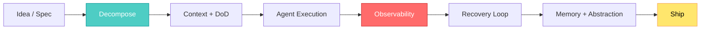

## 🤔 Curiosity: The Question

I’ve shipped AI features where **the bottleneck wasn’t model quality — it was coordination.**  
So when Flowkater framed “Agentic Engineering” as the new unit of engineering skill, I felt the tension immediately:

> **If agents can build 80% in minutes, why do the last 20% still take days?**

The answer isn’t “better prompts.” It’s a **skill stack** — and Flowkater’s “9 skills” are the cleanest map I’ve seen.

{: .light .w-75 .shadow .rounded-10 }

---

## 📚 Retrieve: The Knowledge

### Flowkater’s 9 skills (core list)

1. **Decomposition** — break work into agent‑sized tasks  
2. **Context Architecture** — give just enough context, not everything  
3. **Definition of Done** — explicit finish lines to prevent drift  
4. **Failure Recovery Loop** — iterative rollback / retry patterns  
5. **Observability** — visibility into what agents did and why  
6. **Memory Architecture** — what should be stored vs forgotten  
7. **Parallel Orchestration** — coordinating multiple agents safely  
8. **Abstraction Layering** — hide detail with stable interfaces  
9. **Taste** — judgment: what “good” looks like

### Why these feel true in production

In games, any AI feature becomes a pipeline problem:
- Narrative generation isn’t just a model call — it’s tooling, data, review, and integration.  
- NPC behavior isn’t just RL — it’s guardrails, tuning, and QA.  

These 9 skills align with **what actually breaks** when you try to ship.

### A minimal skill‑to‑pipeline map



### A simple “DoD” contract (example)

```python
# Retrieve: explicit Definition of Done for agent tasks
TASK = {
    "name": "NPC dialog generator",
    "inputs": ["lore.json", "npc_profile.md"],
    "outputs": ["dialogs.json"],
    "constraints": {
        "max_tokens": 160,
        "no_new_entities": True,
        "tone": "grounded"
    },
    "tests": ["schema_validate", "entity_check", "toxicity_check"],
    "done_if": "all tests pass"
}
```

### What breaks without these skills

| Skill missing | Failure mode | Cost |
|---|---|---|
| Decomposition | one agent runs wild | rework + QA time |
| Definition of Done | endless revisions | schedule slip |
| Observability | can’t debug | hidden regressions |
| Memory Architecture | stale or noisy context | inconsistent outputs |

---

## 💡 Innovation: The Insight

### How I’d apply this in a game studio today

**1) Build an “agentic pipeline checklist”**  
- Every task must include: *Context → DoD → Recovery plan*  
- No task ships without observability artifacts

**2) Treat memory like a system, not a prompt**  
- Store only decisions, constraints, and final outputs  
- Throw away intermediate noise  
- Version memory the same way you version code

**3) Parallelize on boundaries, not features**  
- Agents run in parallel only when they touch different interfaces

### Key Takeaways

| Insight | Implication | Next Step |
|---|---|---|
| “Taste” is the hidden multiplier | judgment > tooling | build review rituals |
| DoD is an agent’s compass | prevents drift | enforce templates |
| Context architecture is a skill | not just file dumps | design context packs |

### New Questions This Raises

- Can we **quantify “agent reliability”** per task type?  
- What’s the **minimal observability** that prevents 80% of failures?  
- How do we **teach taste** to junior teams in an AI‑first workflow?

---

## References

- Flowkater: https://flowkater.io/posts/2026-03-01-agentic-engineering-9-skills/  
- Karpathy on Agentic Engineering: https://x.com/karpathy/status/2019137879310836075
