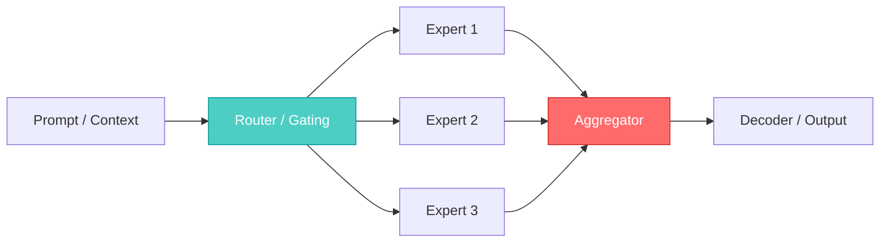

## 🤔 Curiosity: The Question

If open-source models can now **match or beat Sonnet‑class performance** on medium‑size hardware, what does that change for production teams?  
I’ve spent years shipping AI features where deployment cost dictated design. So the real question for me is:

> **Can local‑first, medium‑sized models actually collapse the gap between “prototype” and “ship”?**

{: .light .w-75 .shadow .rounded-10 }

---

## 📚 Retrieve: The Knowledge

### What Alibaba just released (Qwen3.5 Medium)

According to VentureBeat, Alibaba’s Qwen team released four models with **agentic tool calling**, strong benchmarks, and consumer‑grade deployment paths:

- **Qwen3.5‑35B‑A3B** (MoE; 35B total / 3B active)  
- **Qwen3.5‑122B‑A10B** (MoE; server‑grade)  
- **Qwen3.5‑27B** (dense)  
- **Qwen3.5‑Flash** (API‑only)

The headline: **Qwen3.5‑35B‑A3B reportedly beats GPT‑5‑mini and Claude Sonnet 4.5** on several benchmarks, while remaining deployable on local hardware.

### Why this matters technically

Three ideas show up repeatedly:

1. **MoE Efficiency** — A large parameter count, but only a *small slice* activates per token.  
2. **Quantization that holds accuracy** — 4‑bit weight + KV cache quantization brings huge VRAM savings.  
3. **Frontier‑scale context** — 800K–1M+ tokens on accessible hardware.

### Architecture snapshot (simplified)



### Benchmarks & deployment signals

| Model | Key claim | Deployment signal |
|---|---|---|
| **Qwen3.5‑35B‑A3B** | Sonnet‑class on benchmarks | Runs on 32GB VRAM (1M context) |
| **Qwen3.5‑27B** | Efficient dense option | Easier fine‑tuning |
| **Qwen3.5‑122B‑A10B** | Near‑frontier capability | Needs 80GB+ VRAM |
| **Qwen3.5‑Flash** | Strong API price/latency | Hosted only |

### Minimal MoE routing example (conceptual)

```python
# Retrieve: MoE routing selects top-k experts per token
import torch

def route_to_experts(hidden, router, k=2):
    # hidden: [batch, dim]
    scores = router(hidden)  # [batch, num_experts]
    topk = torch.topk(scores, k=k, dim=-1)
    return topk.indices  # expert ids

# Innovation: use routing to keep latency stable
# while scaling total parameters
```

---

## 💡 Innovation: The Insight

### What this changes for production (and games)

If Qwen3.5‑35B‑A3B really delivers Sonnet‑class quality locally, it reshapes what I can ship:

- **On‑device narrative systems** without constant API calls  
- **Fast iteration** because developers can test locally at near‑frontier quality  
- **Privacy‑safe pipelines** for user‑generated content or live ops data

### The most interesting production tradeoff

MoE + quantization is a classic **“latency vs. memory vs. quality”** triangle. If I were deploying this in a game pipeline, I’d bias toward:

1) **MoE models for heavy, offline content generation**  
2) **Dense models for real‑time inference**  
3) **Hybrid tool‑calling agents** (cheap model for tools + larger model for final response)

### Key Takeaways

| Insight | Implication | Next Step |
|---|---|---|
| MoE makes “big model” cost more elastic | Better local viability | Benchmark on 32GB VRAM |
| 1M context shifts RAG design | Long‑form world memory possible | Prototype lore‑DB injection |
| Open‑source parity with Sonnet | Model choice becomes infra choice | Build a router by cost/latency |

### New Questions This Raises

- What’s the **lowest‑cost GPU** that still preserves the claimed quality?  
- Can we do **mixed‑precision routing** per scene to reduce memory spikes?  
- How quickly can we build **pattern‑aware routing** for Qwen + smaller models?

---

## References

**News**
- VentureBeat: https://venturebeat.com/technology/alibabas-new-open-source-qwen3-5-medium-models-offer-sonnet-4-5-performance

**Models & Docs**
- Qwen collection on Hugging Face: https://huggingface.co/collections/Qwen/qwen35
- Qwen on ModelScope: https://modelscope.cn/collections/Qwen/Qwen35
- Alibaba Cloud Model Studio (Qwen3.5‑Flash): https://modelstudio.console.alibabacloud.com/ap-southeast-1/?tab=doc#/doc/?type=model&url=2840914_2&modelId=group-qwen3.5-flash
