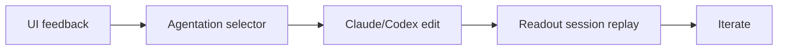

## 🤔 Curiosity: The Question

When I use **Claude Code or Codex for frontend work**, two things keep slowing me down:

1) *“Where exactly should the agent change?”*  
2) *“What did the agent actually do after the session ends?”*

I can live with imperfect models. **I can’t live with vague feedback and invisible history.**  
That’s why I installed two tools *the moment I saw them*.

{: .light .w-75 .shadow .rounded-10 }

---

## 📚 Retrieve: The Knowledge

### 1) Agentation — precise UI feedback for agents

Agentation turns *visual feedback* into **structured data**.  
Click the UI element → get **CSS selector + position + notes**.

Instead of: “the blue button in the sidebar…”  
You can pass: `.sidebar > button.primary`

**Why it matters:** Most UI fixes fail because the agent never edits the *right* spot.

**What stood out:**
- `npm i agentation` (React 18+, drop‑in component)  
- 4 output modes: Compact → Forensic  
- MCP Agent Sync for real‑time feedback loops  
- 170K npm downloads + viral tweet traction

> “Frontend bottleneck isn’t model intelligence — it’s feedback precision.”
{: .prompt-tip}

### 2) Readout — replay Claude Code sessions like video

Readout is a **macOS native** app that shows your agent environment and session history in one place.

**Most impressive feature:** **session replay**.  
You can scrub through the timeline and see prompts, tool calls, and file diffs unfold.

**What stood out:**
- Free download, local‑only (no account)  
- Playback speed control + step‑by‑step navigation  
- Codex support already shipped

### 3) Why these spread fast

Both tools were built by **Benji Taylor** (Coinbase Base design head).  
He’s not “full‑time dev tooling,” yet he solved the most painful UX issues first.

That pattern matters: **the best tools often come from practitioners, not vendors.**

---

## 💡 Innovation: The Insight

### How I’d use this in production

**Pipeline for UI work:**
1. Isolate components in Storybook  
2. Use Agentation to click + annotate UI issues  
3. Pass selectors + notes to Claude Code  
4. Use Readout to audit and replay the changes

This turns *front‑end tuning* into a **repeatable loop** instead of fuzzy instructions.

### Key Takeaways

| Insight | Implication | Next Step |
|---|---|---|
| UI feedback is the true bottleneck | Better feedback beats bigger models | Standardize selectors |
| Session replay enables trust | Debugging becomes systematic | Make replay part of review |
| Practitioners build sharper tools | UX pain → product | Encourage internal toolmaking |

### New Questions This Raises

- What’s the **minimum UI context** an agent needs to edit correctly?  
- Could we **auto‑generate UI diffs** from Agentation + Readout logs?  
- What other “invisible bottlenecks” are hiding in agent workflows?

---

## References

- Agentation: https://agentation.dev  
- Readout: https://readout.org  
- Demo post: https://lnkd.in/guKPyq_8
