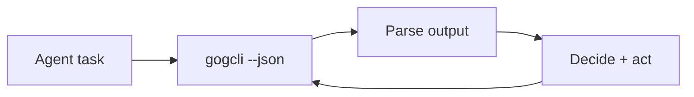

## 🤔 Curiosity: The Question

Most “agent tooling” fails because it can’t touch the tools we actually use.  
Gmail. Calendar. Drive. Docs. Tasks.

So when I saw **gogcli** — a fast, JSON-first Google Workspace CLI built for agents — I asked:

> **What happens when your agent can actually *operate* your workspace, not just read it?**

---

## 📚 Retrieve: The Knowledge

### What gogcli is

**gogcli** is a lightweight, agent‑friendly CLI that controls **Google Workspace from the terminal**:
- Gmail, Calendar, Drive, Docs, Sheets, Slides, Chat, Contacts, Tasks, Forms, Classroom, Apps Script
- JSON‑first output for automation
- Multiple accounts and OAuth clients

### The “why this matters” feature list

**Gmail**
- Search threads/messages, send mail, labels/filters, delegates, OOO settings
- Attachment views + Cloudflare Worker email open tracking

**Calendar**
- Create/edit events, manage invites, free/busy
- Supports *focus‑time*, *out‑of‑office*, *working‑location*

**Drive + Docs/Sheets/Slides**
- Search/upload/download, permissions, comments
- Export Docs/Slides/Sheets to PDF/DOCX/PPTX
- Markdown-based doc editing (sedmat)
- Spreadsheet automation (cell styles, row/col ops, comments)

**People/Groups**
- Directory access + contact CRUD

**Tasks / Forms / Apps Script / Classroom**
- Recurring tasks, form creation/response reads
- Apps Script execution and project management

### Automation & security design

- OAuth2 + domain‑wide delegation support
- Keychain or encrypted keyring storage
- Auto token refresh + readonly scopes
- `--json` and `--plain` output modes
- `allowlist` sandboxing + stderr separation for stable parsing

### Minimal agent loop example

---

## 💡 Innovation: The Insight

### Why I think this is a missing piece

Agentic workflows usually stall at “access.”  
gogcli turns **Workspace APIs into a deterministic CLI surface** — exactly what agents need.

This means:
- **No brittle UI scraping** for email or calendar
- **No custom glue code** for Drive/Docs
- **Real pipeline automation** with stable JSON outputs

### What I’d build with it (game/production angle)

1) **Playtest ops bot**  
   Auto‑schedule sessions → send invites → collect feedback → generate reports.

2) **Live‑ops incident responder**  
   Search incident threads + create calendar war room + push docs timeline.

3) **Producer inbox triage**  
   Classify, label, summarize, and auto‑follow‑up using deterministic CLI output.

### Key Takeaways

| Insight | Implication | Next Step |
|---|---|---|
| CLI surface beats UI scraping | Reliability ↑ | Build json‑first flows |
| Workspace is the real agent arena | More impact than model swaps | Automate real workflows |
| Security matters at scale | Least‑privilege by default | Use readonly scopes |

### New Questions This Raises

- What’s the best **agent task taxonomy** for Workspace automation?  
- How far can we go with **domain‑wide delegation** safely?  
- What should the **default audit trail** look like for agents?

---

## References

- Hada news: https://news.hada.io/topic?id=27179
