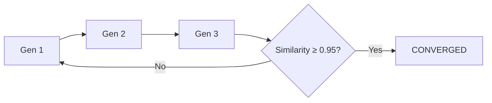

## 🤔 Curiosity: The Question

I’ve been building my harness **Ouroboros** for a while, dog‑fooding it in safe conditions.  
But at this year’s **Ralphthon**, I wanted to test it at the edge.

Two hypotheses:

1) **Practicality** — Does Ouroboros hold up when I *let it run all night*?  
2) **External dependency control** — Can Ralph still ship with **hardware + services** (camera, Discord) and *zero human intervention*?

**Result:** our team *사이좋은부부* took **1st place** and proved **HOTL → Human Outside the Loop** is real.

{: .light .w-75 .shadow .rounded-10 }

---

## 📚 Retrieve: The Knowledge

### 1) 7 hours → 100k LOC → 70k tests

Ralphthon rules were brutal:
- **First 4 hours**: humans can shape harness + specs  
- **After that**: hands off the keyboard  

While we slept, **Ralph + Ouroboros generated 100k+ LOC**, and **70k+ were tests**.  
Not just unit tests — **mocked external cameras + Discord APIs** to verify real hardware interactions.

By morning:
- Camera watched the kitchen and **rejected measurements when humans were present**  
- Discord bot **alerted cleaning needs**  
- The loop evolved *without us touching a key*

### 2) Harness design = survival skill

We’ve crossed from **HITL** to **HOTL**.  
That means *coding skill is no longer enough* — **harness design is the leverage point**.

Ralph loops are powerful but dangerous:
- Bad DoD → infinite loops  
- Mis‑specified end conditions → runaway cost (and **polar bear tears** 🐻‍❄️)

So I defined DoD as **evolutionary convergence**, not just “time spent.”

### 3) Ralph loop convergence logic

Ralph runs until **ontology similarity stabilizes**.

**Similarity formula:**

\[
\text{Similarity} = 0.5 \cdot \text{name\_overlap} + 0.3 \cdot \text{type\_match} + 0.2 \cdot \text{exact\_match}
\]

**Convergence rule:** stop when Similarity ≥ 0.95.

We also detect pathological cases:

- **Stagnation**: no changes for 3 generations  
- **Oscillation**: Gen N = Gen N‑2  
- **Repetitive feedback**: >70% repeated questions  
- **Wonder loop**: same curiosity never resolves

### 4) Socratic + Double Diamond = Ouroboros

Ouroboros applies Socratic reasoning to remove ambiguity:

\[
\text{Ambiguity} = 1 - \sum(clarity_i \cdot weight_i)
\]

The “serpent loop” is:

**Interview → Seed → Execute → Evaluate → Evolve**

This is grounded in the **Double Diamond** (Wonder → Ontology → Design → Evaluation).  
The philosophy is old — but now it compiles.

---

## 💡 Innovation: The Insight

### What I proved

- **HOTL is viable** when the harness defines convergence  
- External dependencies can be automated **if you spec the ontology**  
- Failure isn’t model weakness — it’s ambiguity leakage

### Practical implications

| Insight | Implication | Next Step |
|---|---|---|
| DoD must be mathematical | Stops infinite loops | Bake similarity gates |
| Ontology = shared meaning | Prevents drift across generations | Formalize specs early |
| External deps are testable | Mocks + eval gates scale | Standardize hardware adapters |

### New Questions This Raises

- Can convergence thresholds adapt per task domain?  
- What’s the *lowest‑cost* loop that still yields stable ontology?  
- How do we visualize “ontology drift” in real time?

---

## References

- Ouroboros GitHub: https://github.com/Q00/ouroboros
- PyPI: https://pypi.org/project/ouroboros-ai/
