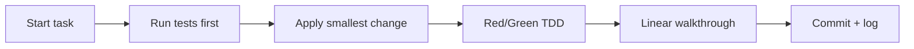

## 🤔 Curiosity: The Question

When I watch teams adopt Claude Code or Codex, the same thing happens:  
**we get speed, but we lose consistency.**

So the question isn’t “which model?” anymore.  
It’s:

> **What repeatable patterns actually make agents reliable enough to ship?**

Simon Willison’s *Agentic Engineering Patterns* is the most practical answer I’ve seen so far.

{: .light .w-75 .shadow .rounded-10 }

---

## 📚 Retrieve: The Knowledge

### What Simon’s guide actually gives you

It’s not a single essay. It’s a **pattern library** for working with coding agents:

**Principles**
- *Writing code is cheap now*  
- *Hoard things you know how to do*

**Anti‑patterns**
- What *not* to do when agents are in the loop

**Testing & QA**
- *Red/green TDD*  
- *First run the tests*

**Understanding code**
- *Linear walkthroughs*  
- *Interactive explanations*

**Annotated prompts**
- A real, end‑to‑end prompt example (GIF optimizer)

### Why I care (as a shipping engineer)

This library turns vague “be clear” advice into **repeatable procedures**.  
It reads like a checklist I can hand to a production team.

### Minimal operational loop (adapted)



### A lightweight “patternized” agent task

```python
# Retrieve: enforce patterns as guardrails
TASK = {
    "goal": "Fix login race condition",
    "rules": [
        "run tests first",
        "change the smallest possible scope",
        "leave a linear walkthrough"
    ],
    "deliverables": ["test output", "diff", "walkthrough.md"]
}
```

---

## 💡 Innovation: The Insight

### What I’d actually deploy

If I were running a game‑team codebase, I’d bake Simon’s patterns into three rules:

1) **Tests before edits** — no exceptions  
2) **Linear walkthroughs after edits** — make future agents (and humans) faster  
3) **A prompt registry** — “hoard things you know how to do” becomes a shared internal asset

### Key Takeaways

| Insight | Implication | Next Step |
|---|---|---|
| Patterns beat ad‑hoc prompting | Reliability goes up | Standardize checklists |
| QA is the real bottleneck | Test‑first wins | Require test logs |
| Knowledge hoarding compounds | Team velocity scales | Build a prompt vault |

### New Questions This Raises

- What patterns are **unique to game pipelines** (live‑ops, content, balance)?  
- Can we **automate walkthroughs** as part of PR checks?  
- What’s the minimum “pattern set” that moves reliability by 2×?

---

## References

- Simon Willison — Agentic Engineering Patterns: https://simonwillison.net/guides/agentic-engineering-patterns/
- Intro post: https://simonwillison.net/2026/Feb/23/agentic-engineering-patterns/
