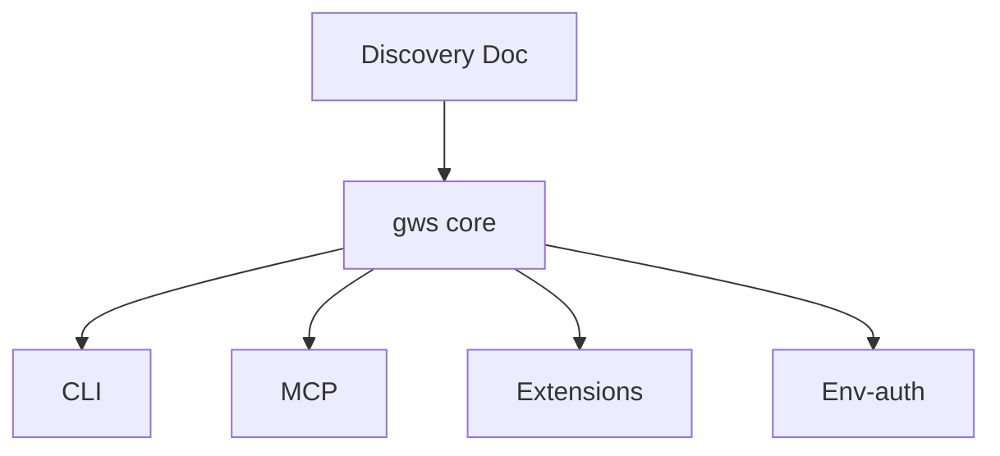

## 🤔 Curiosity: The Question

We keep telling agents to “use the CLI,” then act surprised when it fails.  
But **human‑first CLI design optimizes the wrong thing** for agents.

So the real question is:

> **What does an agent‑first CLI actually look like—and why does retrofitting usually fail?**

Justin Poehnelt’s write‑up and the Hada summary give the cleanest answer I’ve seen.

---

## 📚 Retrieve: The Knowledge

### 1) Human DX vs Agent DX (they are opposites)

- **Human DX** → discoverability + forgiveness  
- **Agent DX** → predictability + defense‑in‑depth  

Retrofitting a human‑first CLI for agents is usually a losing bet.

### 2) Raw JSON payloads beat bespoke flags

Humans love `--title "Q1 Budget"`.  
Agents need **full API payloads**:

```bash
# Human-first (lossy)
my-cli sheet create --title "Q1 Budget" --timezone "America/Denver"

# Agent-first (lossless)
gws sheets spreadsheets create --json '{"properties": {"title": "Q1 Budget", "timeZone": "America/Denver"}}'
```

**Pattern:** support *both* paths, but make JSON a first‑class citizen.

### 3) Schema introspection replaces documentation

Agents can’t afford to “google the docs.”  
Instead, the CLI must expose its schema at runtime:

```
gws schema drive.files.list
gws schema sheets.spreadsheets.create
```

The CLI becomes the **canonical source of truth**, not stale docs.

### 4) Context window discipline is a CLI feature

APIs return huge blobs. Agents pay per token.  
So the CLI should enforce:
- **Field masks** (`--params '{"fields": "id,name"}'`)  
- **NDJSON pagination** (stream results, no big arrays)

### 5) Input hardening against hallucinations

Agents hallucinate. CLIs must defend:
- Path traversal (`../../.ssh`)  
- Hidden control chars  
- Query params inside IDs (`fileId?fields=name`)  
- Double encoding (`%2e%2e`)  

**Rule:** Treat agent input like untrusted web input.

### 6) Ship skills, not just commands

Agents learn via injected context, not `--help`.  
So gws ships **100+ SKILL.md files** with rules like:
- “Always use --dry-run for mutating ops”  
- “Always confirm before delete”  
- “Always use field masks”

### 7) Multi-surface support (CLI + MCP + extensions)

One binary should serve:
- Human CLI
- MCP JSON‑RPC
- Gemini extensions
- Env‑var auth (headless)



---

## 💡 Innovation: The Insight

### The CLI is now an agent harness

Once you design for agents, the CLI becomes **the control layer**:
- Structured IO  
- Runtime schema  
- Hallucination guards  
- Context discipline  
- Verified outputs  

### What I’d ship first (practical path)

1) `--output json`  
2) Input validation (paths, IDs, encoding)  
3) `schema/describe` introspection  
4) Field masks + paging  
5) `--dry-run`  
6) Skills/CONTEXT.md  
7) MCP surface

### Key Takeaways

| Insight | Implication | Next Step |
|---|---|---|
| Agent DX ≠ Human DX | Retrofits fail | Design agent‑first |
| JSON payloads are the native interface | Less translation loss | Make JSON primary |
| Hardening is non‑optional | Hallucinations are input bugs | Validate like a web API |

### New Questions This Raises

- Will **agent‑first CLI** become the new standard SDK?  
- Can we benchmark “agent‑safe” CLIs like we benchmark models?  
- What’s the smallest set of guardrails that prevents 80% of failures?

---

## References

- Hada: https://news.hada.io/topic?id=27246
- Justin Poehnelt: https://justin.poehnelt.com/posts/rewrite-your-cli-for-ai-agents/
