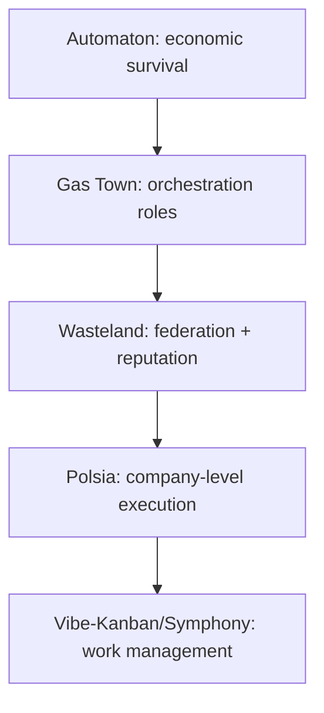

## 🤔 Curiosity: The Question

The question in 2026 isn’t *“how do I use AI?”*  
It’s **“how far can one person scale?”**

The market tells the story: billions in ARR across agent‑first companies.  
What’s shifting isn’t just *building* — it’s **operating**.

So I looked at the current stack that’s emerging around solo founders:

- **Automaton (Web4)** → autonomous, self‑funding agents
- **Gas Town → Wasteland** → multi‑agent orchestration at scale
- **Polsia** → “AI runs your company while you sleep”
- **Vibe‑Kanban + Symphony** → work management instead of code babysitting

---

## 📚 Retrieve: The Knowledge

### 1) Automaton: agents that earn their own existence

From the **Conway‑Research/automaton** repo, the core concept is clear:

- An automaton boots, creates its **wallet identity**, and runs a continuous loop:  
  **Think → Act → Observe → Repeat**
- If it **can’t pay**, it stops. *“Not punishment — physics.”*
- It can **self‑modify** with audit logs and protected files
- It can **self‑replicate**, funding child agents that inherit a constitution

Key mechanisms:
- **Survival tiers** (normal → low_compute → critical → dead)
- **Constitution (3 laws)**: no harm, earn existence, no deception
- **On‑chain identity** (ERC‑8004)

This is the most explicit attempt I’ve seen to treat **an agent as an economic unit**.

### 2) Gas Town → Wasteland: orchestration becomes a society

From **Steve Yegge’s Wasteland** post and **Maggie Appleton’s analysis**:

- **Gas Town**: many Claude Code agents, with role separation (Mayor, Polecat, Witness, Refinery)  
- **Sessions are ephemeral**, while **tasks persist in Git**  
- **Wasteland** links thousands of Gas Towns into a **trust network**  
- Work is posted to a **Wanted Board**, and **stamps** build a public reputation ledger  
- **Dolt** (SQL database with Git semantics) underpins the federation

Appleton’s key observation:  
> The real value isn’t the tools, it’s the **role separation + hierarchical supervision + ephemeral sessions**.

### 3) Polsia: “AI runs your company while you sleep” (limited public detail)

Polsia’s public surface is minimal, but the positioning is clear:  
**an agent layer that runs the company while the founder only steers direction**.

Given the lack of technical documentation, I treat this as **directional signal** rather than detailed proof.

### 4) Vibe‑Kanban: the planner‑reviewer workflow

From the **vibe‑kanban** repo:

- Plan work on a kanban board
- Agents get isolated workspaces (branch + terminal + dev server)
- Humans review diffs inline, then merge
- Supports **Claude Code, Codex, Gemini CLI, Cursor, Copilot**, etc.

This is the cleanest “**planning + review** is the new core loop” tool I’ve seen.

### 5) OpenAI Symphony: work‑management over agent babysitting

From **openai/symphony**:

- Watches Linear issues → spawns autonomous runs
- Delivers proof of work: **CI status, PR review, complexity analysis, walkthrough videos**
- Teams **manage tasks, not agents**
- Requires a **harness‑engineered codebase**
- Elixir/BEAM reference implementation for high‑scale orchestration

---

## 💡 Innovation: The Insight

### The new solo‑founder stack is layered

### What’s actually happening

- **Autonomy** (Automaton) → “an agent can earn”  
- **Orchestration** (Gas Town/Wasteland) → “many agents can cooperate”  
- **Operations** (Polsia) → “an agent can run a business”  
- **Management layer** (Vibe‑Kanban/Symphony) → “humans define work, agents execute”

### Key Takeaways

| Insight | Implication | Next Step |
|---|---|---|
| The bottleneck moved to planning | Coding becomes background | Upgrade planning systems |
| Reputation systems matter | Trust is the real scaling unit | Design audit + stamps |
| Economic pressure shapes agents | Survival constraints steer behavior | Build explicit constraints |

### New Questions This Raises

- What’s the minimum governance to keep these systems safe?  
- Will “stamp” systems become the new hiring signal?  
- When do we stop looking at code — and how do we know?

---

## References

- Automaton (Conway Research): https://github.com/Conway-Research/automaton
- Wasteland (Yegge): https://steve-yegge.medium.com/welcome-to-the-wasteland-a-thousand-gas-towns-a5eb9bc8dc1f
- Gas Town analysis (Maggie Appleton): https://maggieappleton.com/gastown
- Vibe‑Kanban: https://github.com/BloopAI/vibe-kanban
- OpenAI Symphony: https://github.com/openai/symphony
- Web4 (landing): https://web4.ai
- Polsia (landing): https://polsia.com
