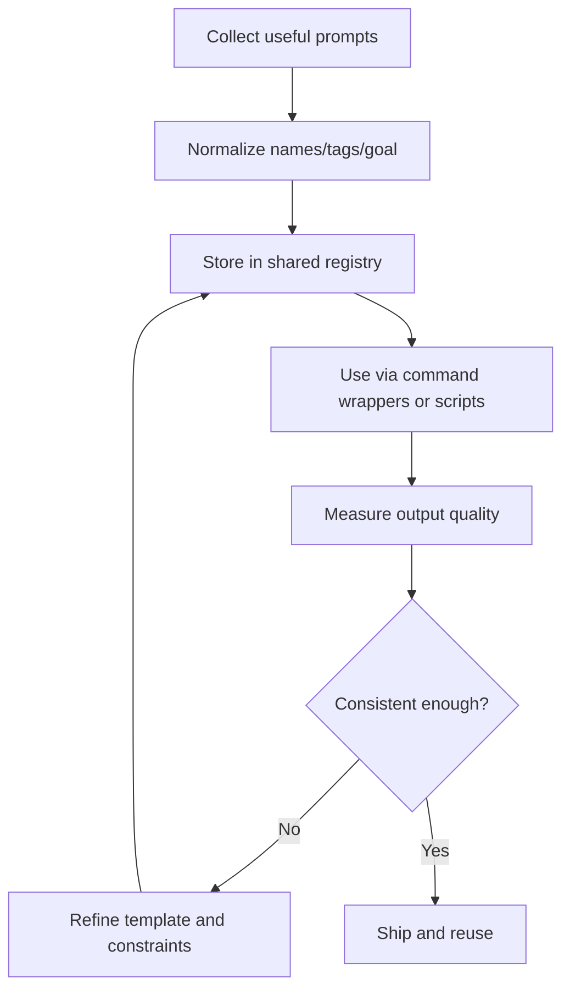

## 🤔 Curiosity: Why this topic now?

When AI tools improve, workflow problems don’t disappear — they just become louder.

I noticed one practical question after watching teams move fast with LLMs:

> **How do we stop copying prompts everywhere and start treating them as reusable infrastructure?**

I checked two concrete references today:

- **Digital Bourgeois post (2026-03-08, Korean):** https://digitalbourgeois.tistory.com/m/2846
- **Fabric repository:** https://github.com/danielmiessler/Fabric

The Korean post frames Fabric as a way to *systematize prompts* for day-to-day AI work, while the GitHub repo presents it as a **modular, reusable framework**. That overlap felt too good to ignore.

## 📚 Retrieve: What I pulled from each source

### 1) Fabric (Korean interpretation from the post)

From the post metadata and article framing, the key points are:

- **AI adoption is stuck on prompt drift** (same goal, many variants, no consistency).
- **Fabric** is positioned as an **open-source prompt operations layer**.
- The approach is to:
  1. Define reusable prompt patterns
  2. Organize by tasks (research, coding, writing, decision support)
  3. Reuse across models and contexts

That makes sense if you’re running many AI touchpoints.

{: .light .w-75 .shadow .rounded-10}

### 2) Fabric (GitHub)

From the repo metadata and structure, Fabric is described as:

- An **open-source framework** to augment humans with AI.
- A **modular** method for specific problem solving.
- A **curated, crowdsourced prompt set** that should be reusable across contexts.

{: .light .w-75 .shadow .rounded-10}

### Core insight from comparison

The two sources converge on one practical claim:

> AI work scales only when prompts are treated like code: versioned, named, reusable, and shareable.

## 💡 Innovation: What I’d do with this as a shipping pattern

I’ve always preferred practical systems, not abstract advice. So I tested this idea in structure form:

```python
# Example: lightweight prompt registry concept for a team workflow
from dataclasses import dataclass
from typing import Dict, List

@dataclass
class PromptBundle:
    name: str
    goal: str
    prompt_template: str
    constraints: List[str]

class PromptOps:
    def __init__(self):
        self.registry: Dict[str, PromptBundle] = {}

    def register(self, bundle: PromptBundle):
        self.registry[bundle.name] = bundle

    def build(self, name: str, context: Dict[str, str]) -> str:
        bundle = self.registry[name]
        prompt = bundle.prompt_template.format(**context)
        return "\n".join([
            f"Goal: {bundle.goal}",
            f"Context: {context}",
            f"Constraints: {', '.join(bundle.constraints)}",
            "---",
            prompt,
        ])

# register one reusable prompt pattern
ops = PromptOps()
ops.register(PromptBundle(
    name="fabric-style-content-summary",
    goal="Create concise summary for product/tech content",
    prompt_template="Summarize {topic} with 3 practical action points and risks.",
    constraints=["No hype", "English output", "Audience: developer", "<= 120 words"]
))

prompt_text = ops.build("fabric-style-content-summary", {"topic": "PromptOps workflow"})
print(prompt_text)
```

### Practical workflow I’d apply



### Why this matters beyond writing

In a game dev/AI context, this is just as important for:

| Area | Before | After |
|---|---|---|
| Quest/dialogue drafting | One-off prompt chaos | Reusable pattern library |
| Bug triage replies | Inconsistent phrasing | Reproducible playbook prompts |
| Experiment notes | Ad-hoc summaries | Structured analysis format |

## Key takeaways

- **Don’t chase the latest model; stabilize the prompt interface first.**
- **Treat prompts like production assets** (owned, reviewed, improved).
- **Use metadata + structure** (goal, constraints, examples) so reuse actually works.
- For a workflow blog, **pair each source with a concrete image artifact** so the reader can infer intent quickly.

## New questions

- What’s the minimum metadata needed for a reusable prompt set?
- How do we measure quality drift per model without manual audits?
- Can we ship a CI check for prompt drift in CI/CD style?

## References

- Fabric (Korean summary source): https://digitalbourgeois.tistory.com/m/2846
- Fabric (GitHub): https://github.com/danielmiessler/Fabric

