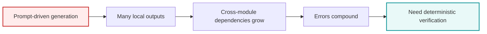

## 🤔 Curiosity: What actually separates the next generation of coding agents?

Most discussions about coding agents still orbit around the wrong variable.
We compare model families, benchmark scores, and UI polish. But once you try to generate or maintain a real backend, the more important question becomes much less glamorous:

Can the system guarantee consistency when the surface area becomes large?

That is why this AutoBE vs. Claude Code comparison is interesting. The original DEV post is not just another “tool A vs. tool B” roundup. It frames a deeper split in coding-agent design:

- Claude Code as a flexible, general-purpose software operator
- AutoBE as a schema-first backend generator with compiler-backed verification

I think that framing is directionally right.
And it matters because “write some code” and “ship a 50-table, 400-API backend without structural drift” are not the same problem at all.

> My read after going through the source article: this is less a battle of better prompts, and more a battle of where correctness lives.
{: .prompt-tip}

---

## 📚 Retrieve: What the source article actually argues

Source article:
- <https://dev.to/samchon/autobe-vs-claude-code-3rd-gen-coding-agent-developers-review-of-the-leaked-source-code-313b>

Related references mentioned in or useful alongside the article:
- AutoBE repo: <https://github.com/wrtnlabs/autobe>
- AutoBE examples: <https://github.com/wrtnlabs/autobe-examples>
- Function Calling Harness follow-up: <https://dev.to/samchon/qwen-meetup-function-calling-harness-from-675-to-100-3830>
- Claude Code docs: <https://code.claude.com/docs/en>

{: .light .shadow .rounded-10 w='1212' h='668' }

### 1) Claude Code is presented as the peak of the “human-led” coding agent

The article describes Claude Code as a 2nd-generation system built around:

- a long-running agent loop,
- broad tool autonomy,
- post-hoc context compression,
- and heavy safety engineering around shell/file execution.

That is a very recognizable philosophy: let the agent inspect, decide, act, recover, and keep moving.

For debugging, repo navigation, surgical edits, and open-ended engineering work, this is extremely strong. In practice, this is why Claude Code often feels less like autocomplete and more like a senior developer sitting beside you.

### 2) AutoBE is presented as the opposite bet: reduce freedom, increase guarantees

The article’s strongest claim is that AutoBE is not trying to be a universal coding assistant.
It is trying to make backend generation mechanically reliable by narrowing what the model is allowed to produce.

The key design pattern is:

- the model fills structured schemas rather than free-form code,
- compilers validate each stage,
- failed validation triggers self-correction loops,
- and the final output is shaped by type systems plus compiler gates.

That tradeoff is important. AutoBE gives up some generality so it can attack the hardest part of backend generation: consistency across many connected artifacts.

{: .light .shadow .rounded-10 w='1212' h='668' }

The first supporting figure in the original article makes that scope concrete. It shows four benchmark-style runs—Todo, Reddit, Shopping, and ERP—broken into Analyze, Database, Interface, Test, and Realize stages. The visual message is simple: once the project grows, runtime and token cost explode, and the expensive part is not a single file generation but the whole coordinated pipeline.

{: .light .shadow .rounded-10 w='1212' h='668' }

The next figure shows why the author keeps returning to compilers. AutoBE is framed as a layered system: a backend coding agent delegates to Analyze, Database, Interface, Test, and Realize stages, and each stage is tied to compiler feedback such as Prisma, OpenAPI, Test, or Hybrid compilation. That is a much more opinionated architecture than a general-purpose agent loop.

### 3) The article’s real thesis: 80→100 is an architecture problem

This was the most useful part of the source piece.
The author argues that many coding agents are excellent at getting from 0 to 80:

- scaffolding,
- writing isolated functions,
- rough API layers,
- initial file generation.

But 80 to 100 is different.
That last mile means:

- every type matches,
- every relation is coherent,
- every shared contract stays synchronized,
- every generated unit still compiles after the whole system is assembled.

That is not merely a “smarter model” problem.
It is a systems design problem.

### 4) Why the compound-effect argument matters

One of the article’s recurring points is that local correctness does not scale linearly.
If each individual generated artifact is “pretty good,” the total system can still collapse once dependencies stack up.

That logic is easy to underestimate in agent demos.
A coding agent can look amazing on:

- one file,
- one endpoint,
- one bugfix,
- one migration.

A full backend is different because correctness compounds negatively when each module depends on the others.

{: .light .shadow .rounded-10 w='1212' h='668' }

I also like that the article includes a leaderboard instead of pretending model choice does not matter. But the ranking itself reinforces the post’s main argument: even when strong models cluster near the top, the scores still vary by workload. In other words, raw model quality helps, but architecture decides whether those local wins survive system-wide integration.



### 5) The most practical contrast: flexibility vs verification location

Here is the comparison I would keep, stripped down to what actually matters:

| Dimension | Claude Code | AutoBE |
|---|---|---|
| Core role | General coding agent | Backend generation system |
| Default strength | Flexible open-ended task execution | Structured output consistency |
| Primary control surface | Tool loop + model judgment | Schema + compiler validation |
| Best use case | Debugging, editing, maintenance | Greenfield backend generation |
| Reliability source | Human review + agent iteration | Mechanical verification + correction |

I like this framing because it avoids the childish “which one wins?” question.
They are aiming at different failure modes.

### 6) A practical engineering example

Suppose you are building a commerce backend.

Case A: greenfield generation
- 50 tables
- 400 APIs
- lots of shared DTOs
- foreign keys, auth boundaries, and test scenarios

This is where a schema-first compiler pipeline has a real argument.
You need consistency more than creativity.

Case B: month 4 maintenance
- add coupon rules,
- modify payment retry logic,
- patch one analytics endpoint,
- fix an auth bug in two files.

This is where Claude Code-style flexibility is usually more valuable.
You need contextual adaptation more than rigid generation.

That is why I find the article’s coexistence thesis more believable than its rivalry framing.

---

## 💡 Innovation: The real lesson is to split “builder mode” from “maintainer mode”

If I were designing a serious coding-agent stack after reading this piece, I would not try to crown one universal winner.
I would separate the workflow into two operating modes.

### 1) Builder mode: use the model inside a narrow, verifiable corridor

When the task is large-scope generation, the agent should have fewer choices, not more.
That means:

- schema-first interfaces,
- limited output vocabularies,
- compiler gates,
- typed feedback,
- automatic correction loops.

This is the smarter place to be rigid.

### 2) Maintainer mode: use an agentic loop with rich tools and bounded scope

When the system already exists, flexibility becomes an asset.
Now you want:

- repo inspection,
- test execution,
- localized edits,
- context-aware debugging,
- and human-readable reasoning about tradeoffs.

This is where Claude Code-style tool orchestration shines.

### 3) The better architecture is hybrid, not ideological

The most practical outcome is:

1. Use a constrained generator to create the system skeleton
2. Verify it mechanically
3. Hand the verified codebase to a flexible maintenance agent
4. Keep CI and compiler gates as the long-term referee

That pattern feels much more durable than betting everything on either unrestricted prompting or fully rigid generation.


### 4) A compact implementation sketch

Below is not AutoBE source code. It is a simplified sketch of the design idea the article points toward: the model proposes structured output, and deterministic validators decide whether it survives.

{: .light .shadow .rounded-10 w='1212' h='668' }

This final diagram is the cleanest summary of the whole philosophy: LLM output should not be trusted directly. It should be parsed, validated, and if it fails, converted into targeted feedback and sent back into a repair loop.

```python
from dataclasses import dataclass
from typing import Any

@dataclass
class ValidationResult:
    ok: bool
    feedback: str | None = None


def llm_generate_schema(requirements: str) -> dict[str, Any]:
    """Model returns structured backend spec, not raw code."""
    return {
        "tables": ["users", "orders"],
        "apis": ["POST /orders", "GET /orders/:id"],
        "auth": "jwt"
    }


def compile_and_validate(spec: dict[str, Any]) -> ValidationResult:
    """Deterministic checks replace subjective prompt-only review."""
    if "orders" not in spec.get("tables", []):
        return ValidationResult(False, "Missing orders table")
    if "POST /orders" not in spec.get("apis", []):
        return ValidationResult(False, "Missing order creation endpoint")
    return ValidationResult(True)


def generate_with_repair(requirements: str, max_rounds: int = 4) -> dict[str, Any]:
    spec = llm_generate_schema(requirements)
    for _ in range(max_rounds):
        result = compile_and_validate(spec)
        if result.ok:
            return spec
        spec["repair_feedback"] = result.feedback
        spec = llm_generate_schema(requirements + f"\nFix: {result.feedback}")
    raise RuntimeError("Failed to converge to a valid backend spec")
```

The point is not the toy code itself.
The point is the control loop:

- generation is probabilistic,
- validation is deterministic,
- progress comes from routing uncertainty into a narrow repair cycle.

That is a much stronger production story than “the model usually does fine.”

### 5) What I would steal immediately from both sides

From the AutoBE side:
- constrain output through schemas, not negative prompting,
- make validation first-class,
- and optimize for system consistency rather than pretty single-file demos.

From the Claude Code side:
- rich tool use,
- strong recovery loops,
- practical repo awareness,
- and a workflow that actually helps on messy real codebases.

That combination is where the next serious developer stack will come from.

---

## Key Takeaways

| Insight | Why It Matters | Practical Move |
|---|---|---|
| 0→80 and 80→100 are different problems | Generation quality alone does not guarantee system reliability | Add deterministic verification layers |
| Claude Code optimizes for flexible maintenance | Most day-to-day engineering work is local and messy | Use it for debugging, edits, and repo tasks |
| AutoBE optimizes for structured generation | Large backend builds fail through cross-module inconsistency | Use schema and compiler gates for initial generation |
| The best stack is hybrid | One tool rarely dominates the full lifecycle | Split builder mode from maintainer mode |

### New Questions

- Which domains beyond backend generation can adopt the same “LLM fills forms, verifier guarantees output” pattern?
- How much agent autonomy should we allow before verification becomes too expensive to trust?
- Can coding agents eventually expose this split directly as product modes: Generate System vs Maintain System?

---

## References

- Source article: <https://dev.to/samchon/autobe-vs-claude-code-3rd-gen-coding-agent-developers-review-of-the-leaked-source-code-313b>
- AutoBE: <https://github.com/wrtnlabs/autobe>
- AutoBE examples: <https://github.com/wrtnlabs/autobe-examples>
- Function Calling Harness article: <https://dev.to/samchon/qwen-meetup-function-calling-harness-from-675-to-100-3830>
- Claude Code docs: <https://code.claude.com/docs/en>

> Note: this post is grounded primarily in the linked DEV article and its published claims. I treat the architectural framing as useful and practical, while avoiding overclaiming unverified leak details beyond what the source explicitly presents.
{: .prompt-warning}
