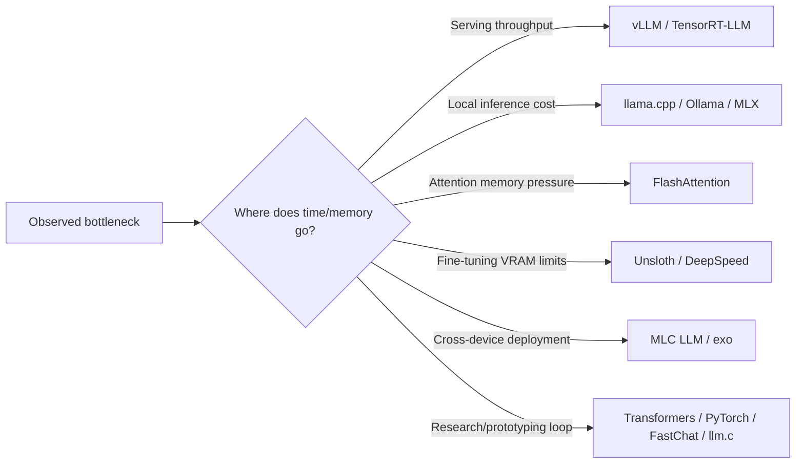

## 🤔 Curiosity: The Question

In production, I keep seeing the same anti-pattern: when latency spikes or GPU cost rises, teams buy more hardware first.

But what if the bigger win is not more compute, but a better serving stack?

I reviewed fifteen repositories often shared in AI engineering circles, traced their actual GitHub targets, and asked one practical question:

> Which tools directly improve throughput, latency, and memory efficiency before we scale GPU spend?

---

## 📚 Retrieve: The Knowledge

### The 15 repos (verified)

| # | Repo | What it is best for |
|---|---|---|
| 1 | [vllm-project/vllm](https://github.com/vllm-project/vllm) | High-throughput production serving via continuous batching |
| 2 | [ggml-org/llama.cpp](https://github.com/ggml-org/llama.cpp) | Local/edge inference in C/C++ with quantization support |
| 3 | [ollama/ollama](https://github.com/ollama/ollama) | Fast local model runtime and developer-friendly workflows |
| 4 | [huggingface/transformers](https://github.com/huggingface/transformers) | Canonical model/inference framework across architectures |
| 5 | [pytorch/pytorch](https://github.com/pytorch/pytorch) | Low-level control and custom optimization paths |
| 6 | [unslothai/unsloth](https://github.com/unslothai/unsloth) | Memory-efficient fine-tuning and RL workflows |
| 7 | [exo-explore/exo](https://github.com/exo-explore/exo) | Distributed inference across heterogeneous local devices |
| 8 | [lm-sys/FastChat](https://github.com/lm-sys/FastChat) | Open platform for training/serving/evaluating chat LLMs |
| 9 | [karpathy/llm.c](https://github.com/karpathy/llm.c) | Minimal C/CUDA implementation for learning performance internals |
| 10 | [mlc-ai/mlc-llm](https://github.com/mlc-ai/mlc-llm) | Cross-platform deployment via ML compilation |
| 11 | [Dao-AILab/flash-attention](https://github.com/Dao-AILab/flash-attention) | Fast, memory-efficient exact attention kernels |
| 12 | [ggml-org/whisper.cpp](https://github.com/ggml-org/whisper.cpp) | Efficient speech-to-text inference on local hardware |
| 13 | [NVIDIA/TensorRT-LLM](https://github.com/NVIDIA/TensorRT-LLM) | Peak inference optimization on NVIDIA GPU stacks |
| 14 | [ml-explore/mlx](https://github.com/ml-explore/mlx) | Apple Silicon-native array framework for LLM workloads |
| 15 | [deepspeedai/DeepSpeed](https://github.com/deepspeedai/DeepSpeed) | Large-scale distributed training/inference (ZeRO, etc.) |

### A practical way to map tool → bottleneck



### Quick selection matrix

| Scenario | Start here | Why |
|---|---|---|
| Production API at scale | vLLM, TensorRT-LLM | Best leverage on throughput and p95 latency |
| Local/offline development | llama.cpp, Ollama, MLX | Fast iteration on consumer or Apple hardware |
| Memory-constrained training | Unsloth, DeepSpeed | Better training efficiency per VRAM dollar |
| Kernel-level speedups | FlashAttention | Improves a core hot path in many stacks |
| Cross-platform delivery | MLC LLM, exo | Useful when infra is heterogeneous |

### Sample code + per-section images (from each repo link)

### 1) `vllm-project/vllm`
{: .light .w-75 .shadow .rounded-10 }
```bash
uv pip install vllm
```

### 2) `ggml-org/llama.cpp`
{: .light .w-75 .shadow .rounded-10 }
```bash
# Use a local model file
llama-cli -m my_model.gguf

# Or download and run a model directly from Hugging Face
llama-cli -hf ggml-org/gemma-3-1b-it-GGUF

# Launch OpenAI-compatible API server
llama-server -hf ggml-org/gemma-3-1b-it-GGUF
```

### 3) `ollama/ollama`
{: .light .w-75 .shadow .rounded-10 }
```bash
curl -fsSL https://ollama.com/install.sh | sh
```

### 4) `huggingface/transformers`
{: .light .w-75 .shadow .rounded-10 }
```bash
pip install "transformers[torch]"
```

### 5) `pytorch/pytorch`
{: .light .w-75 .shadow .rounded-10 }
```bash
$ source <CONDA_INSTALL_DIR>/bin/activate
$ conda create -y -n <CONDA_NAME>
$ conda activate <CONDA_NAME>
```

### 6) `unslothai/unsloth`
{: .light .w-75 .shadow .rounded-10 }
```bash
curl -fsSL https://unsloth.ai/install.sh | sh
```

### 7) `exo-explore/exo`
{: .light .w-75 .shadow .rounded-10 }
```bash
nix run .#exo
```

### 8) `lm-sys/FastChat`
{: .light .w-75 .shadow .rounded-10 }
```bash
pip3 install "fschat[model_worker,webui]"
```

### 9) `karpathy/llm.c`
{: .light .w-75 .shadow .rounded-10 }
```bash
chmod u+x ./dev/download_starter_pack.sh
./dev/download_starter_pack.sh
make train_gpt2fp32cu
./train_gpt2fp32cu
```

### 10) `mlc-ai/mlc-llm`
{: .light .w-75 .shadow .rounded-10 }
```bash
conda activate your-environment
python -m pip install --pre -U -f https://mlc.ai/wheels mlc-llm-nightly-cpu mlc-ai-nightly-cpu
python -c "import mlc_llm; print(mlc_llm)"
```

### 11) `Dao-AILab/flash-attention`
{: .light .w-75 .shadow .rounded-10 }
```bash
cd hopper
python setup.py install
```

### 12) `ggml-org/whisper.cpp`
{: .light .w-75 .shadow .rounded-10 }
```bash
git clone https://github.com/ggml-org/whisper.cpp.git
```

### 13) `NVIDIA/TensorRT-LLM`
{: .light .w-75 .shadow .rounded-10 }
```bash
trtllm-serve "TinyLlama/TinyLlama-1.1B-Chat-v1.0"
curl -X POST http://localhost:8000/v1/chat/completions \
  -H "Content-Type: application/json" \
  -H "Accept: application/json" \
  -d '{"model":"TinyLlama/TinyLlama-1.1B-Chat-v1.0","messages":[{"role":"user","content":"Where is New York?"}],"max_tokens":32}'
```

### 14) `ml-explore/mlx`
{: .light .w-75 .shadow .rounded-10 }
```bash
pip install mlx
```

### 15) `deepspeedai/DeepSpeed`
{: .light .w-75 .shadow .rounded-10 }
```bash
pip install deepspeed
```

---

## 💡 Innovation: The Insight

### What changed in my own deployment thinking

The strongest pattern is clear: **GPU budget burns fastest when architecture choices are delayed**.

In other words, optimization order matters:

1. Pick the right serving/runtime layer
2. Fix memory movement and batching behavior
3. Route workloads by task shape
4. Scale hardware only after software bottlenecks are addressed

### Production takeaway

If your team is struggling with LLM cost, ask this before requesting more GPUs:

- Are we using the right serving engine for our request pattern?
- Did we profile prefill vs. decode bottlenecks?
- Are we overusing one model where routing should split workloads?

In many cases, the 15 repos above provide enough leverage to improve real-world performance **without linear hardware spend**.

### New questions this raises

- Can we auto-route requests by inferred bottleneck (prefill-heavy vs decode-heavy) in real time?
- Which minimal benchmark suite best predicts production cost per successful task?
- How should we measure "agent productivity per GPU dollar" across mixed workloads?

---

## References

### Official repositories

- https://github.com/vllm-project/vllm
- https://github.com/ggml-org/llama.cpp
- https://github.com/ollama/ollama
- https://github.com/huggingface/transformers
- https://github.com/pytorch/pytorch
- https://github.com/unslothai/unsloth
- https://github.com/exo-explore/exo
- https://github.com/lm-sys/FastChat
- https://github.com/karpathy/llm.c
- https://github.com/mlc-ai/mlc-llm
- https://github.com/Dao-AILab/flash-attention
- https://github.com/ggml-org/whisper.cpp
- https://github.com/NVIDIA/TensorRT-LLM
- https://github.com/ml-explore/mlx
- https://github.com/deepspeedai/DeepSpeed

### Source list link redirects (as provided)

- https://lnkd.in/dv5Qt53g
- https://lnkd.in/dqPVimrQ
- https://lnkd.in/dbGG2xvR
- https://lnkd.in/dzMSUSdu
- https://lnkd.in/d5A3ESNn
- https://lnkd.in/dRs8gcmP
- https://lnkd.in/dwsTMMNn
- https://lnkd.in/dJnTsKr7
- https://lnkd.in/d89aJBW8
- https://lnkd.in/dtbkiQFX
- https://lnkd.in/dgBPj5wM
- https://lnkd.in/dVdmUzex
- https://lnkd.in/djerdbgN
- https://lnkd.in/d3vReKXd
- https://lnkd.in/dxXSyT8T
