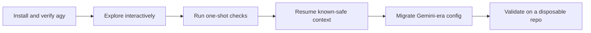

## 🤔 Curiosity: What happens when a daily AI CLI changes underneath us?

The uncomfortable part of AI tooling is not learning a new command.
It is discovering that a tool has become part of your daily engineering muscle memory, and then watching the runtime contract change.

That is why I wanted to unpack Goddaehee's Antigravity CLI guide. The original Korean post is practical: it starts from the Gemini CLI transition notice, then walks through `agy` basics, permission flags, aliases, and migration steps. My lens is slightly different. I care about what this means for teams that actually ship: game tooling, build automation, content pipelines, research prototypes, and agent-assisted refactors.

The production question is:

> Can we move from Gemini CLI habits to Antigravity CLI without losing safety, reproducibility, or local workflow speed?


## 📚 Retrieve: What the source page establishes

The source page is a hands-on guide to **Antigravity CLI**, whose terminal command is `agy`, not `antigravity`. It frames the transition around Google's announcement that affected Gemini CLI and Gemini Code Assist IDE extension request serving stops on **June 18, 2026**. The linked Google Developers announcement describes Antigravity CLI as the successor path for a more agent-first CLI platform.

The page's practical structure is useful:

| Topic | Source-page takeaway | Production interpretation |
|---|---|---|
| Naming | Run `agy`, not `antigravity` | The first failure mode is simply invoking the wrong binary |
| Interactive work | `agy` starts a continuing conversation | Good for exploration and project orientation |
| One-shot work | `agy -p` / print-style execution returns one result | Useful for scripts, CI helpers, and quick repo questions |
| Conversation resume | `agy -c` or `agy --conversation <ID>` resumes work | Useful only if the prior context is still safe and relevant |
| Permissions | `--dangerously-skip-permissions` auto-approves tool actions | Treat this as a high-risk mode, not a speed feature |
| Safer testing | `--sandbox` gives a middle path | Better default for experiments on unfamiliar repos |
| Migration | Back up `~/.gemini`, import Gemini plugin state, and check MCP config keys | Migration should be testable and reversible |

The linked sources from the page are:

- Goddaehee Antigravity installation guide: <https://goddaehee.tistory.com/antigravity-20-tutorial>
- Goddaehee IDE recovery guide: <https://goddaehee.tistory.com/antigravity-200-ide-fix>
- Antigravity CLI install section: <https://goddaehee.tistory.com/antigravity-20-tutorial#section6>
- Google Developers announcement: <https://developers.googleblog.com/an-important-update-transitioning-gemini-cli-to-antigravity-cli/>
- The Register coverage: <https://www.theregister.com/ai-ml/2026/05/20/bye-bye-gemini-cli-google-nudges-devs-toward-antigravity/5243605>
- Gemini CLI GitHub issue: <https://github.com/google-gemini/gemini-cli/issues/27304>
- Antigravity CLI docs: <https://antigravity.google/docs/cli-getting-started>
- Agentpedia migration guide: <https://agentpedia.codes/blog/gemini-cli-to-antigravity-cli-migration>

## What I downloaded from the source page

I saved the article media and code locally so this post does not depend on hotlinked Tistory assets. More importantly, I turned the command screenshots back into copyable snippets. Screenshots are good for visual context; they are bad as the only source of commands a developer needs to run.

Representative images:

{: .light .w-75 .shadow .rounded-10 }

{: .light .w-75 .shadow .rounded-10 }

{: .light .w-75 .shadow .rounded-10 }

{: .light .w-75 .shadow .rounded-10 }

Downloadable sample-code files:

- [Version check and first start](/assets/code/posts/2026-05-18-antigravity-cli/01-version-and-start.sh)
- [Interactive start](/assets/code/posts/2026-05-18-antigravity-cli/02-interactive-start.sh)
- [Print mode](/assets/code/posts/2026-05-18-antigravity-cli/03-print-mode.sh)
- [Continue conversation](/assets/code/posts/2026-05-18-antigravity-cli/04-continue-conversation.sh)
- [Alias definitions](/assets/code/posts/2026-05-18-antigravity-cli/05-aliases.sh)
- [Install aliases into zshrc](/assets/code/posts/2026-05-18-antigravity-cli/06-zshrc-alias-install.sh)
- [Alias run examples](/assets/code/posts/2026-05-18-antigravity-cli/07-alias-run-examples.sh)
- [Back up Gemini config](/assets/code/posts/2026-05-18-antigravity-cli/08-backup-gemini-config.sh)
- [MCP config key migration](/assets/code/posts/2026-05-18-antigravity-cli/09-mcp-config-migration.jsonc)
- [Find MCP config](/assets/code/posts/2026-05-18-antigravity-cli/10-find-mcp-config.sh)

### Copyable snippets from the source screenshots

Basic verification:

```bash
# 1) Check install/version
agy --version

# 2) Start an interactive session
agy
```

Interactive project orientation:

```bash
# Start an interactive session
agy

# Start with an initial prompt, then continue the conversation
agy -i "Explain this project structure before making changes."
```

One-shot print mode:

```bash
# Run one prompt and print the response
agy -p "List the three largest files in this directory and explain why they matter."
```

Resume an existing conversation:

```bash
# Continue the most recent conversation
agy -c

# Resume a specific conversation by ID
agy --conversation <conversation-id>
```

Alias definitions:

```bash
alias ag='agy'
alias ags='agy --sandbox'
alias agd='agy --dangerously-skip-permissions'
alias agr='agy --continue --dangerously-skip-permissions'
```

Install aliases in zsh:

```bash
cat >> ~/.zshrc <<'EOF'

# Antigravity CLI (agy) aliases
alias ag='agy'
alias ags='agy --sandbox'
alias agd='agy --dangerously-skip-permissions'
alias agr='agy --continue --dangerously-skip-permissions'
EOF

source ~/.zshrc
type ag ags agd agr
```

Back up Gemini-era configuration before migration:

```bash
ls -la ~/.gemini/
cp -r ~/.gemini ~/.gemini-backup-$(date +%Y%m%d)
```

Find MCP configuration files:

```bash
find ~ -name "mcp_config.json" 2>/dev/null
```

## The workflow model: explore, act, resume, migrate

For a production engineer, I would not treat `agy` as "just another chat CLI." I would treat it as a local agent runner with four modes of use:



### 1. Start with boring verification

The first test should not be clever. It should prove the binary exists and the shell can run it.

```bash
agy --version
agy
```

If this fails, do not debug agent behavior yet. Debug PATH, shell initialization, and installation first.

### 2. Separate interactive work from one-shot work

Interactive mode is good when I want the agent to learn the project shape:

```bash
agy
agy -i "Explain this project structure before making changes."
```

One-shot mode is better when I want a bounded answer:

```bash
agy -p "List the three largest files in this directory and explain why they matter."
```

That distinction matters in production. Exploration benefits from context accumulation. Automation benefits from bounded outputs and predictable failure modes.

### 3. Resume only when the old context is still valid

The source page highlights recent-conversation resume and ID-based conversation resume:

```bash
agy -c
agy --conversation <conversation-id>
```

I would use this only after checking whether the repo state has changed. In a game build pipeline or large codebase, stale agent context can be more dangerous than no context.

### 4. Treat permission bypass as a risk boundary

The biggest practical warning in the source page is `--dangerously-skip-permissions`. The name is accurate. This mode removes the normal human approval step for tool actions.

For real projects, my default rule would be:

| Mode | Where I would use it | Where I would avoid it |
|---|---|---|
| `agy` | Normal repo exploration and assisted edits | None; this is the baseline |
| `agy --sandbox` | Experiments, new tools, unknown repos | Tasks that need full host access |
| `agy --dangerously-skip-permissions` | Disposable directories only | Production repos, secrets, shared worktrees |

That is not conservatism for its own sake. Agentic tools can edit files, run commands, and call other tools. Removing prompts means your repo hygiene, sandboxing, backups, and git checkpoints must carry more of the safety burden.

## Alias design: fast should still communicate risk

The source page proposes three aliases:

```bash
alias ag='agy'
alias agd='agy --dangerously-skip-permissions'
alias agr='agy --continue --dangerously-skip-permissions'
```

I like the convenience, but I would add one team convention: dangerous aliases should look dangerous in docs and onboarding. A short name like `agd` is efficient, but it hides risk after the first week.

For my own team workflow, I would document aliases like this:

| Alias | Expands to | Team rule |
|---|---|---|
| `ag` | `agy` | Normal daily entry point |
| `ags` | `agy --sandbox` | Default for unfamiliar projects |
| `agd` | `agy --dangerously-skip-permissions` | Disposable directories only |
| `agr` | `agy --continue --dangerously-skip-permissions` | Resume only inside a disposable worktree |

The source page's shell setup block is attached as a local sample-code file. I would adapt it rather than paste it blindly, especially on shared machines.

## Migration checklist from Gemini CLI

The migration part of the original guide has a good shape: inspect, back up, import, then fix config differences.

My production version would look like this:

1. Inventory old state: check `~/.gemini/`, project-local `.gemini/`, and any MCP config files.
2. Back up before moving anything.
3. Run the Gemini import path only after `agy --version` works.
4. Move skills deliberately, not with a blind global copy.
5. Review MCP config keys, especially `url` versus `serverUrl`.
6. Validate on a throwaway repo before touching a real product repository.

The MCP key difference is small but operationally important:

```jsonc
// Gemini-style remote MCP server shape
"mcpServers": { "my-server": { "url": "http://localhost:3000" } }

// Antigravity-style remote MCP server shape
"mcpServers": { "my-server": { "serverUrl": "http://localhost:3000" } }
```

This is the kind of detail that breaks an agent workflow silently: the CLI starts, but the tool it needs is no longer reachable.

## 💡 Innovation: How I would ship this into a real workflow

If I were introducing Antigravity CLI to an AI/game engineering team, I would not start by telling everyone to replace their daily command overnight.

I would stage it like a runtime migration:

| Stage | Goal | Exit criteria |
|---|---|---|
| Lab | Confirm install, auth, and basic command behavior | `agy --version`, `agy`, and `agy -p` work on a scratch folder |
| Tooling repo | Test one-shot analysis and safe sandbox flows | No unexpected file edits; command outputs are reproducible |
| Migration dry run | Back up Gemini config and test import behavior | Skills/MCP servers are visible and documented |
| Production pilot | Use `agy` on a bounded non-critical task | Git diff is reviewable and validation commands pass |
| Team adoption | Document aliases and safety rules | Everyone knows when not to use dangerous mode |

For game production, this maps cleanly to real work:

- Use `agy -p` for quick asset-pipeline diagnostics.
- Use interactive `agy` to understand unfamiliar build scripts.
- Use sandbox mode when testing new automation around Unity, Unreal, or Python tools.
- Avoid permission bypass in repositories with credentials, generated asset caches, or platform signing material.

The insight is not "Antigravity CLI is better because it is new."
The insight is that CLI agents are becoming infrastructure. Infrastructure needs migration plans, safety boundaries, and rollback paths.

## Key takeaways

| Insight | Implication | Next step |
|---|---|---|
| `agy` is the daily command surface | Migration starts with shell and PATH reliability | Verify install before moving workflows |
| Gemini CLI transition has a hard date for affected users | Waiting until the last week creates avoidable risk | Back up config and test import early |
| Permission bypass changes the trust model | Speed moves risk from prompts into environment design | Use disposable directories or sandboxing |
| MCP config drift is easy to miss | Tool integrations may fail even when the CLI works | Audit config keys and server reachability |
| Aliases shape behavior | Short commands can normalize risky modes | Make dangerous aliases explicit in team docs |

The new question this raises for me is broader than Antigravity CLI:

> As AI CLIs become agent runtimes, should every team maintain an "agent migration checklist" the same way we maintain database and build-system migration checklists?

I think the answer is yes.

## References

- Source article: <https://goddaehee.tistory.com/608>
- Google Developers announcement: <https://developers.googleblog.com/an-important-update-transitioning-gemini-cli-to-antigravity-cli/>
- Antigravity CLI docs: <https://antigravity.google/docs/cli-getting-started>
- Gemini CLI GitHub issue: <https://github.com/google-gemini/gemini-cli/issues/27304>
- Agentpedia migration guide: <https://agentpedia.codes/blog/gemini-cli-to-antigravity-cli-migration>
