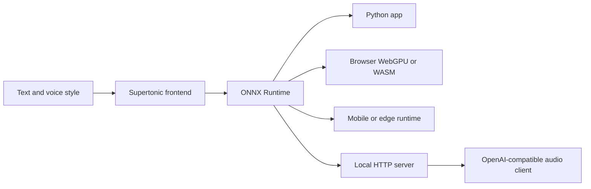

## Curiosity: Can speech become a local runtime feature?

When I build AI features for games or interactive systems, I keep coming back to the same uncomfortable question: what happens when a feature is technically impressive, but operationally too heavy to ship?

Text-to-speech is a good example. Cloud TTS is convenient, but production teams still have to account for latency, API cost, network availability, privacy boundaries, and platform-specific runtime behavior. Those constraints matter even more in games, digital humans, browser experiences, kiosks, and edge devices where speech is part of the interaction loop rather than a background batch job.

That is why the PyTorch Korea write-up on **Supertonic 3** caught my attention. The interesting claim is not only that it is a multilingual TTS model. The stronger claim is that the model, runtime examples, and ONNX assets are shaped like something a product team can actually embed.


## Retrieve: What the source page and links show

The PyTorch Korea discussion page frames Supertonic as an on-device, multilingual TTS system from **Supertone AI**. In the linked official repository, Supertonic is described as an ONNX Runtime-based system that runs locally with no cloud call in the inference path.

The current public signals I verified from the linked sources are:

| Area | What I found | Why it matters |
|---|---|---|
| Model size | Supertonic 3 is presented as an approximately 99M-parameter open-weight model | Small enough to make browser, desktop, mobile, and edge deployment more realistic |
| Languages | 31 supported languages, including Korean, Japanese, English, German, French, Spanish, Hindi, Vietnamese, and more | Useful for global content workflows without separate per-language products |
| Runtime contract | ONNX Runtime examples for Python, Node.js, browser WebGPU/WASM, Java, C++, C#, Go, Swift, iOS, Rust, and Flutter | The model is not locked to one application stack |
| Output | 44.1kHz 16-bit WAV | Production playback can start from a clean audio format |
| Expressive text | Inline tags such as `<laugh>`, `<breath>`, and `<sigh>` | Speech behavior can be controlled from text without a separate reference-audio workflow |
| Python SDK | PyPI reports `supertonic` version `1.3.1` | The SDK is not just a repo demo; it is packaged for normal Python installation |
| Local server | The May 18 update adds `supertonic serve` with native `/v1/tts` and OpenAI-compatible `/v1/audio/speech` endpoints | Existing agent tools, local apps, and OpenAI-style clients can swap base URLs |

The ONNX contract is the key design decision. Once the model assets and input/output conventions are stable, the product surface becomes much broader: a Unity tool can call a local service, a browser demo can use WebGPU or WASM, a Python pipeline can batch-generate voice lines, and a mobile build can reuse the same conceptual model path.



## The evidence: accuracy, size, and runtime footprint

The source page includes three useful visual anchors. I downloaded the original images so this post does not depend on remote onebox previews.

{: .light .w-75 .shadow .rounded-10 }

The first chart compares reading accuracy across languages. The practical takeaway is not that one chart settles all TTS quality questions. It is that a compact on-device model is being evaluated against larger open TTS systems with the right kind of metric pressure: word error rate and character error rate.

{: .light .w-75 .shadow .rounded-10 }

The second chart is the deployment story. Model size is not just an ML benchmark detail. It affects cold start, download friction, browser cache behavior, package size, memory pressure, and whether a feature survives contact with mid-range hardware.

{: .light .w-75 .shadow .rounded-10 }

The third chart is where my production instincts kick in. A CPU-friendly runtime footprint changes the default architecture discussion. Instead of starting from "Where is the GPU server?", a team can start from "Which local runtime is acceptable for this product surface?"

## Implementation notes: the sample code is the real story

I attached representative sample files from the official repository:

- [Python ONNX example](/assets/code/posts/2026-05-18-supertonic/example_onnx.py)
- [Node.js ONNX example](/assets/code/posts/2026-05-18-supertonic/example_onnx.js)
- [Browser WebGPU/WASM example](/assets/code/posts/2026-05-18-supertonic/web_main.js)

The quick Python SDK path is intentionally simple:

```python
from supertonic import TTS

tts = TTS(auto_download=True)
style = tts.get_voice_style(voice_name="M1")

text = "Supertonic is a lightning fast, on-device TTS system."
wav, duration = tts.synthesize(
    text=text,
    lang="en",
    voice_style=style,
    total_steps=8,
    speed=1.05,
)

tts.save_audio(wav, "output.wav")
print(f"Generated {duration[0]:.2f}s of audio")
```

For teams that want direct ONNX assets rather than the SDK abstraction, the repository flow is also clear:

```bash
git clone https://github.com/supertone-inc/supertonic.git
cd supertonic

git lfs install
git clone https://huggingface.co/Supertone/supertonic-3 assets

cd py
uv sync
uv run example_onnx.py
```

The May 18 SDK update is especially relevant for agentic and tool-heavy workflows:

```bash
pip install 'supertonic[serve]'
supertonic serve --host 127.0.0.1 --port 7788
```

That exposes a native `/v1/tts` endpoint and an OpenAI-compatible `/v1/audio/speech` endpoint. In practical terms, a local agent, Electron tool, browser extension, or internal build pipeline can treat local speech synthesis as a service without moving audio generation into the cloud.

## Innovation: Where I would use this in production

For games and interactive media, I would not start by asking whether Supertonic replaces every premium cloud voice product. That is the wrong first question.

I would ask where **local, fast, private, good-enough speech** unlocks a feature that was previously too expensive or too fragile:

| Use case | Why local TTS matters | First experiment |
|---|---|---|
| NPC bark generation in internal tools | Designers can preview lines without waiting on a service call | Add `supertonic serve` behind an editor button |
| Accessibility narration | Text-heavy interfaces can generate speech without sending player text out | Test latency and voice consistency on target hardware |
| Browser-based companion apps | WebGPU/WASM path keeps inference near the user | Prototype page narration with cached ONNX assets |
| Offline kiosks or exhibitions | Network independence is part of the product requirement | Package fixed voice styles with the app |
| Agent workflows | Agents can generate reviewable audio artifacts from local text | Use the OpenAI-compatible endpoint as a base-URL swap |

My main caution is the same one I apply to most AI runtime work: benchmark the real product path, not the README path. Voice quality, startup time, package size, browser support, threading behavior, and target-device thermals all matter. But the architecture is promising because it gives teams multiple ways to run the same capability.

## Link map from the PyTorch Korea page

Primary links:

- PyTorch Korea discussion: <https://discuss.pytorch.kr/t/supertonic-onnx-tts-feat-supertone-ai/10247>
- Supertone AI: <https://www.supertone.ai/>
- Supertonic Voice Builder: <https://supertonic.supertone.ai/voice_builder>
- Supertonic GitHub repository: <https://github.com/supertone-inc/supertonic>
- Supertonic Python SDK docs: <https://supertone-inc.github.io/supertonic-py/>
- Supertonic 3 Hugging Face model: <https://huggingface.co/Supertone/supertonic-3>
- Supertonic 3 Hugging Face Space: <https://huggingface.co/spaces/Supertone/supertonic-3>

Research links:

- SupertonicTTS: <https://arxiv.org/abs/2503.23108>
- Length-Aware Rotary Position Embedding: <https://arxiv.org/abs/2509.11084>
- Training Flow Matching Models with Reliable Labels via Self-Purification: <https://arxiv.org/abs/2509.19091>

Related PyTorch Korea reading:

- NeuTTS Air: <https://discuss.pytorch.kr/t/neutts-air-3-on-device-tts-text-to-speech/7928>
- Parlor: <https://discuss.pytorch.kr/t/parlor-ai/9599>
- Dia2: <https://discuss.pytorch.kr/t/dia2-nari-labs-tts-1b-2b/8349>
- Chatterbox: <https://discuss.pytorch.kr/t/chatterbox-resemble-ai-tts/7025>
- Fish Speech: <https://discuss.pytorch.kr/t/fish-speech-8-tts/5213>
- VibeVoice: <https://discuss.pytorch.kr/t/vibevoice-60-asr-tts-microsoft-ai/9536>
- PersonaPlex: <https://discuss.pytorch.kr/t/personaplex-nvidia/9613>

## Takeaways

| Insight | Implication | Next step |
|---|---|---|
| ONNX is the product contract | One model path can support many runtime surfaces | Test the same asset in Python, browser, and one native target |
| Small model size changes feasibility | Speech can move closer to the user and the device | Measure cold start and memory before debating architecture |
| The local server matters | Existing OpenAI-style clients can integrate with less glue code | Try a base-URL swap against `/v1/audio/speech` |
| Expressive tags are product controls | Designers can shape speech behavior directly in text | Build authoring guidelines for tags, speed, and language codes |

The new question this raises for me is simple: if speech synthesis becomes a local runtime primitive, what other "cloud-only" AI features should we start redesigning as device-native interaction systems?

## References

- PyTorch Korea source article: <https://discuss.pytorch.kr/t/supertonic-onnx-tts-feat-supertone-ai/10247>
- Official Supertonic repository: <https://github.com/supertone-inc/supertonic>
- Supertonic Python SDK documentation: <https://supertone-inc.github.io/supertonic-py/>
- `supertonic serve` documentation: <https://supertone-inc.github.io/supertonic-py/cli/serve/>
- Supertonic 3 model card: <https://huggingface.co/Supertone/supertonic-3>
- Supertonic 3 demo Space: <https://huggingface.co/spaces/Supertone/supertonic-3>
- SupertonicTTS paper: <https://arxiv.org/abs/2503.23108>
- LARoPE paper: <https://arxiv.org/abs/2509.11084>
- Self-Purifying Flow Matching paper: <https://arxiv.org/abs/2509.19091>
