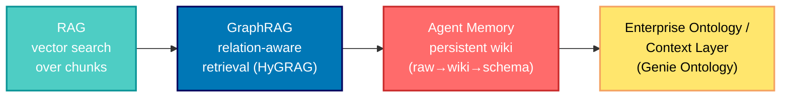

## 🤔 Curiosity: Why Did Three Different Teams Ship the Same Idea on the Same Day?

After 8 years shipping AI-powered games at NC SOFT and COM2US, I've developed a reflex: when an enterprise vendor, a foundation blog, and an academic paper all push in the same direction within 24 hours, that's not coincidence — that's a phase change.

On June 16, 2026, three things landed in my feed:

1. **Databricks announced Genie Ontology** — a "living context graph" that ties an enterprise's tables, dashboards, documents, apps, people, and metrics together so AI agents answer and *act* accurately.
2. **The Agentic AI Foundation reframed Karpathy's LLM Wiki as agent memory** — `raw sources → wiki → schema` as a practical long-term, entity, and procedural memory layer.
3. **A new GraphRAG paper (HyGRAG)** proposed context-aware *and* relation-aware retrieval that finds relationship paths instead of just nearest-neighbor chunks.

The question that hit me: **are these three separate trends, or three layers of the same emerging stack?** And if I'm building a game-facing agent — a quest director, a live-ops copilot, a player-support bot — which of these do I actually need?

> **Curiosity:** Is the industry quietly moving from "retrieve the right text" to "model the right *world*"?
{: .prompt-tip}

---

## 📚 Retrieve: The Three Signals, Decoded

### Signal 1 — Genie Ontology: the enterprise "living context graph"

Databricks' core argument is honest about *why* enterprise AI underperforms: the business context needed to use data is scattered across dashboards, queries, pipelines, wikis, tickets, documents, and chat threads. When the model can't find that context, it fills the gap with inference — and you get answers that are "generic at best and wrong at worst."

Their solution has three pieces, but the one that matters architecturally is **Genie Ontology**: an automatic context layer that extracts knowledge from tables, queries, dashboards, pipelines, and connected apps, then organizes it into a graph of *how the company works and what the data actually means* — metric definitions, business terms, unique calculations, and the relationships between concepts, metrics, tables, and teams.

The clever part is how it decides what to trust. Genie Ontology determines authority with a **PageRank-like approach**: it weighs where a definition came from, the authority of that source's author, how often people rely on it, how closely it ties to certified assets, and how fresh it is. It also enforces source-native permissions so you only see what you're authorized to.

{: .shadow .rounded-10 w='1212' h='623' }
_Databricks' Genie Ontology positions the ontology as the context layer powering Genie One and Genie Agents._

This is the same family as Palantir Ontology: model the *objects, relationships, permissions, and actions* of the business, not just the documents. Databricks' internal benchmark (a 28-question real-world data-analysis suite, June 2026) reports Genie answering **84.5%** correctly on the first attempt versus **52.4%** for the strongest general-purpose coding agent — at roughly **2× lower latency**. Treat vendor benchmarks with the usual skepticism, but the *direction* is the signal: structured context beats raw retrieval on enterprise tasks.

{: .shadow .rounded-10 w='1212' h='515' }
_Permissions are enforced on every answer through source-native ACLs or Unity Catalog._

### Signal 2 — LLM Wiki as agent memory

Angie Jones (VP of Developer Experience, Agentic AI Foundation) makes a deceptively simple observation: Karpathy's **LLM Wiki** — a collection of interlinked markdown files an LLM maintains — maps almost perfectly onto the taxonomy of agent memory.

The architecture is three layers:


```text
raw sources → wiki → schema (AGENTS.md)
```


- **Raw sources** — immutable input (documents, articles, notes). The agent reads and cites them but never edits them. This is the *evidence* layer.
- **Wiki** — the structured markdown knowledge base the LLM maintains, plus two special files: `index.md` for navigation and `log.md` for a chronological activity record.
- **Schema (`AGENTS.md`)** — the instruction layer telling the agent how to maintain the wiki: conventions, workflows, structure.

What makes this click is the mapping to memory *types*:

| Memory type | Where it lives in the wiki | What it stores |
|:--|:--|:--|
| **Semantic** | `topics/`, `trends/` | Durable facts and synthesized meaning across many sources |
| **Entity** | `speakers/`, `sessions/`, `events/` | Facts about specific named things and their relationships |
| **Episodic** | `log.md`, dated refresh pages | What happened, when, what changed |
| **Summary** | source/session/speaker pages | Compressed representations of larger evidence sets |
| **Procedural** | `AGENTS.md` | How to merge, update, decay, and de-duplicate knowledge |
{: .shadow .rounded-10 w='1212' h='665' }
_The `raw sources → wiki → AGENTS.md schema` layering maps cleanly onto semantic, entity, episodic, summary, and procedural memory._

The honest caveat she raises: the wiki pattern has *not* replaced **conversational** or **working** memory for her — those stay short-lived and in-session. The wiki shines for *persistent* memory. That tradeoff matters.

### Signal 3 — HyGRAG: context-aware *and* relation-aware GraphRAG

The arXiv paper ([2606.18075](https://arxiv.org/abs/2606.18075), accepted at WWW '26) names the exact limitation I keep hitting with naive GraphRAG. Existing graph methods split into two camps:

- **Entity-centric** approaches connect logically related content but retrieve through similarity search.
- **Chunk-centric** approaches preserve context but also retrieve separately.

Both "operate on representations anchored to original text without true knowledge fusion" — they miss the *emergent* understanding that comes from synthesizing context and relations together.

**HyGRAG** (hierarchical graph RAG) addresses three challenges:

1. Build summaries that genuinely integrate contextual *and* relational information.
2. Use those synthesized representations to access emergent knowledge at retrieval time.
3. Update hierarchical structures efficiently for dynamic corpora — via attachment-based algorithms with only *local* re-summarization.

Mechanically: hierarchical index structures over hybrid graphs with both chunk and entity nodes, iteratively clustered with LLM-generated summaries, then context- and relation-aware retrieval that searches across all abstraction levels while expanding through community membership. Reported result: **+9.7% average accuracy on multi-hop reasoning** at reasonable efficiency.

{: .shadow .rounded-10 w='1212' h='808' }
_HyGRAG fuses chunk and entity nodes into a hierarchy of community summaries, traversing relation paths instead of isolated nearest neighbors._

### The pattern underneath

Put the three side by side and the trajectory is unmistakable:



Each step adds something the previous one lacked: GraphRAG adds **relations**, agent memory adds **persistence and procedure**, and the ontology adds **objects, permissions, actions, and audit**. We're moving from "retrieve the right text" to "model the right world."

---

## 💡 Innovation: What This Means for Games (and Any Real Product)

Here's where my production lens kicks in. In live games, the "context problem" is *brutal*: player state, inventory, guild relationships, season metadata, balance patches, support tickets, and design docs all live in different systems. A support or live-ops agent that only does vector search over a help-center will hallucinate the moment a question crosses two systems — exactly the Databricks failure mode.

### A concrete mapping for a game live-ops agent

| Layer | Generic stack | Game live-ops equivalent |
|:--|:--|:--|
| **Evidence (raw)** | docs, tickets | patch notes, design docs, telemetry exports, support transcripts |
| **GraphRAG** | chunk+entity graph | items ↔ skills ↔ encounters ↔ economy nodes with relation edges |
| **Agent memory** | LLM wiki | maintained pages per season, per feature, per cohort + `log.md` of balance changes |
| **Ontology** | business objects | Player, Guild, Item, Match, Ticket objects with permissions + *actions* (refund, grant, ban) + audit log |

The jump from a chatbot to this stack is the jump from "answers about the game" to "**operations on the game**, governed and audited." That last clause — permissions, actions, audit log — is what separates a demo from something you'd actually let touch a live economy.

### What I'd build first (and the honest tradeoffs)

I wouldn't start by buying an enterprise ontology. I'd start small and let the structure earn its complexity:

```python
# Curiosity: can a markdown wiki + a relation index beat a vector-only bot
#            for cross-system game questions, before we commit to an ontology?
from pathlib import Path
from dataclasses import dataclass, field

@dataclass
class GameAgentMemory:
    """
    Retrieve: raw sources -> maintained wiki -> schema, with a thin relation
              index so multi-hop questions ('which items broke after patch X?')
              traverse edges instead of guessing from nearest-neighbor chunks.
    Innovation: persistent, auditable memory before paying for a full ontology.
    """
    root: Path
    # entity_id -> set of related entity_ids (the cheap 'graph' layer)
    relations: dict[str, set[str]] = field(default_factory=dict)

    def ingest(self, source_path: Path) -> Path:
        """Raw sources are immutable; we only ever derive from them."""
        assert source_path.is_relative_to(self.root / "raw"), "raw is read-only truth"
        wiki_page = self._summarize_to_wiki(source_path)   # summary memory
        self._append_log(f"ingested {source_path.name} -> {wiki_page.name}")  # episodic
        return wiki_page

    def link(self, a: str, b: str) -> None:
        """Entity memory: relationships are first-class, both directions."""
        self.relations.setdefault(a, set()).add(b)
        self.relations.setdefault(b, set()).add(a)

    def multi_hop(self, start: str, hops: int = 2) -> set[str]:
        """Relation-aware retrieval, HyGRAG-lite: expand along edges."""
        frontier, seen = {start}, {start}
        for _ in range(hops):
            nxt = {n for e in frontier for n in self.relations.get(e, set())}
            frontier = nxt - seen
            seen |= nxt
        return seen - {start}

    def _summarize_to_wiki(self, src: Path) -> Path: ...   # LLM summarization
    def _append_log(self, msg: str) -> None: ...           # to wiki/log.md
```

**The tradeoffs I'd be honest about:**

- A markdown wiki + relation index is *cheap and inspectable*, but it won't auto-resolve authority like Genie Ontology's PageRank-style weighting. You'll hand-curate trust early.
- GraphRAG's multi-hop accuracy gain (~+9.7% in HyGRAG) is real but comes with **index maintenance cost** — the paper's whole third contribution is making updates *local*, because naive re-summarization of a dynamic corpus is a killer for live games that patch weekly.
- Permissions and audit are not a "phase 2" nice-to-have. The moment an agent can take an *action* (refund, grant, ban), source-native ACLs and an audit trail become the feature, not the chrome.

### Key takeaways

| Insight | Implication | Next step |
|:--|:--|:--|
| RAG → GraphRAG → Memory → Ontology is one trajectory, not four trends | Don't over-invest in vector-only retrieval for cross-system questions | Add a thin relation index before scaling embeddings |
| The LLM Wiki *is* agent memory | You can get persistent, entity, and procedural memory from markdown + a schema | Adopt `raw → wiki → schema`; keep `log.md` for episodic/audit |
| Ontologies model objects, permissions, *and actions* | Chatbots answer; ontologies operate | Define your Player/Item/Match objects and their allowed actions early |
| Authority is a retrieval problem | Freshness + source weight beats "most similar chunk" | Borrow PageRank-style trust scoring for your own sources |

> **Innovation:** The cheapest version of this stack — immutable raw sources, an LLM-maintained markdown wiki, a thin relation index, and explicit object/action/permission definitions — gets you 80% of the architectural value before you ever buy an enterprise ontology.
{: .prompt-warning}

### New Questions This Raises

- **Can HyGRAG's local re-summarization keep up with a weekly game patch cadence**, where balance changes ripple across hundreds of related entities?
- **Where's the line between agent memory and ontology?** If my LLM Wiki gains a permission model and action handlers, did it just *become* a lightweight ontology?
- **How do you evaluate a context layer?** Databricks reports first-attempt accuracy, but for games I care about *action safety* — how do we benchmark "did the agent take the right governed action," not just "did it answer right"?

---

## References

**Primary Sources:**
- [Introducing Genie One, Genie Agents, and Genie Ontology — Databricks Blog](https://www.databricks.com/blog/introducing-genie-one-genie-ontology-and-genie-agents)
- [Karpathy's LLM Wiki as Agent Memory — Agentic AI Foundation (Angie Jones)](https://aaif.io/blog/karpathys-llm-wiki-as-agent-memory/)
- [A Unified Framework for Context-Aware and Relation-Aware Graph Retrieval-Augmented Generation (HyGRAG) — arXiv:2606.18075](https://arxiv.org/abs/2606.18075)

**Related Work:**
- [Palantir Ontology](https://www.palantir.com/platforms/foundry/ontology/) — the enterprise-ontology lineage Genie Ontology echoes
- [Microsoft GraphRAG](https://github.com/microsoft/graphrag) — community-summary GraphRAG that HyGRAG builds beyond
- [AGENTS.md](https://agents.md/) — the schema/instruction-layer convention used by the LLM Wiki pattern

**Standards & Tooling:**
- [Unity Catalog](https://www.databricks.com/product/unity-catalog) — governance/ACL layer cited for Genie permissions
- [Model Context Protocol (MCP)](https://modelcontextprotocol.io/) — the integration surface Genie Agents use for actions
